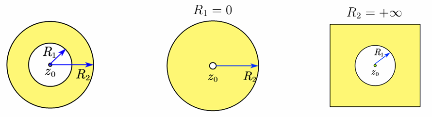

# 4.1 复数项级数
## 4.1.1 复数列的极限
## 4.1.2 复数项级数
# 4.2 幂级数
## 4.2.1 幂级数的收敛性
## 4.2.2 幂级数的收敛圆与收敛半径
## 4.2.3 幂级数的运算性质
# 4.3 泰勒级数
## 4.3.1 解析函数的泰勒展开定理

## 4.3.2 求解析函数泰勒展开式的方法
# 4.4 洛朗级数
## 4.4.1 解析函数的洛朗展开定理
### 双边幂级数
定义：$z_{0}\in \mathbb C,\beta_{n},c_{n}\in \mathbb C$. 称级数
$$
\sum^{\infty}_{n=0}\beta_{n}(z-z_{0})^n+\sum^{\infty}_{n=1} \frac{c_{n}}{(z-z_{0})^n}
$$
为中心在 $z_{0}$ 的双边幂级数。当两个级数都收敛时，称该双边幂级数收敛
令 $\alpha_{n}=\begin{cases}
  \beta_n,&n \geq 0,\\  
  c_{-n},&n \leq -1.
\end{cases}$
双边幂级数记为
$$
\sum^{+\infty}_{n=-\infty}\alpha_{n}(z-z_{0})^n
$$
### 双边幂级数的收敛问题
$$
\sum^{+\infty}_{n=-\infty}\alpha_{n}(z-z_{0})^n=\sum^{-\infty}_{n=-1}\alpha_{n}(z-z_{0})^n+\sum^{+\infty}_{n=0}\alpha_{n}(z-z_{0})^n
$$
- 正次幂级数部分
	- 记 $R_{2}=\frac{1}{\lim_{ n \to +\infty }}\sqrt[n]{|\alpha_{n}|}$
	- 在 $|z-z_{0}|\lt R_{2}$ 内收敛到一解析函数
- 负次幂级数部分
	- 令 $\omega = \frac{1}{(z-z_{0})}$. 作为 $\omega$ 的正次幂级数在 $|\omega|\lt \frac{1}{\lim_{ n \to +\infty }}\sqrt[n]{ |\alpha_{n}| }$ 时收敛到一解析函数
	- 记 $R_{1}=\lim_{ n \to +\infty }\sqrt[n]{ |\alpha_{-n}| }$. 作为 $z$ 的负次幂级数在 $|z-z_{0}| \gt R_{1}$ 时收敛到一解析函数

定理
对双边幂级数 $\sum^{+\infty}_{n=-\infty} \alpha_{n}(z-z_{0})^n$，记
$$
R_{1}=\lim_{ n \to +\infty } \sqrt[n]{ |\alpha_{-n}| }, \quad R_{2}=\frac{1}{\lim_{ n \to +\infty } \sqrt[n]{ |\alpha_{n}| }}
$$
当 $R_{1}\lt R_{2}$ 时，该级数在圆环 $R_{1}\lt |z-z_{0}| \lt R_{2}$ 上收敛，其和函数为解析函数，且可逐项求导、逐项积分
### 双边幂级数的收敛圆环

### 解析函数双边幂级数展开：系数

## 4.4.2 求圆环域内解析函数洛朗展开式的方法