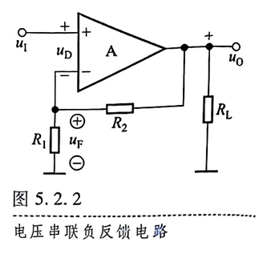
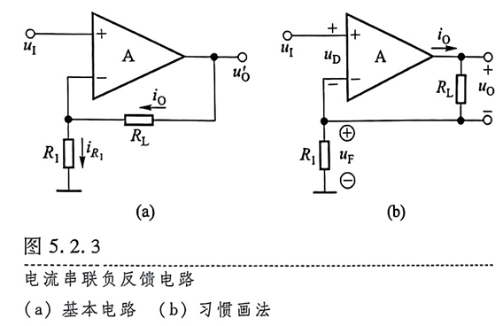
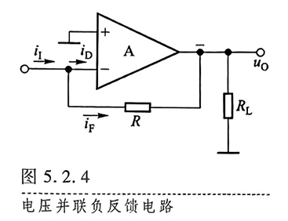
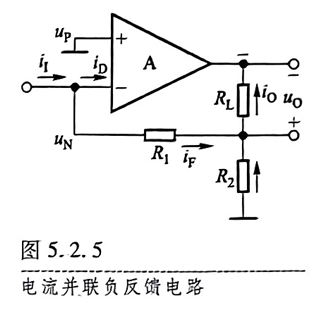

# 4.1 频率响应概述
## 一、反馈的基本概念
- 什么是反馈
	- 放大电路输出量的一部分或全部通过一定的方式引回到输入回路，影响输入，称为反馈
### 正反馈和负反馈
- 正反馈：使基本放大电路净输入量增大的反馈
- 负反馈：使基本放大电路净输入量减小的反馈
- 反馈的结果使输出量的变化增大的为正反馈，使输出量的变化减小的为负反馈。
### 直流反馈和交流反馈
- 直流反馈：直流通路中存在的反馈
- 交流反馈：交流通路中存在的反馈
### 局部反馈和级间反馈
- 局部反馈：
- 级间反馈：
## 二、交流负反馈的四种组态
### 1. 电压反馈和电流反馈
- 电压反馈：将输出电压的一部分引回到输入回路来影响净输入量
### 2. 串联反馈和并联反馈
描述输入量、反馈量、净输入量的叠加关系
$$
\dot{U_{i}'}=\dot{U_{i}}-\dot{U_{f}}
$$
$$
\dot{I_{i}'}=\dot{I_{i}}-\dot{I_{f}}
$$
### 3. 四种反馈组态

## 三、反馈的判断
### 1. 有无反馈的判断
- 形式上：输入回路与输出回路有联系
- 本质：引回输出量，影响净输入量
### 2. 直流反馈和交流反馈的判断
### 3. 正、负反馈（反馈极性）的判断
- 看反馈的结果：净输入量是被增大还是被减小
- 瞬时极性法：给定 $\dot{X_{i}}$ 的瞬时极性，并以此为依据分析放大电路中各电流、电位的极性，从而得到 $\dot{X_{o}}$ 的极性
### 4. 电压反馈和电流反馈的判断

### 5. 串联反馈和并联反馈的判断