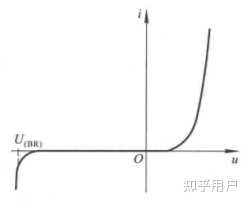

# 2.1 概述
可应用于实际的功率半导体器件，可按可控程度分为以下三类：
1. 功率二极管：导通和关断均由电路潮流决定
2. 晶闸管：在器件承受正向电压时，由控制信号控制器件的导通，而关断状态由电路潮流决定
3. 可控开关：由控制信号控制器件的导通和关断
# 2.2 功率二极管
## 2.2.1 功率二极管的基本特性

功率二极管的伏安特性可被理想化，用于分析变流器拓扑结构，但不能用于实际应用
功率二极管处于导通状态时，因其导通速度很快，故可当作理想开关
# 2.2.2 功率二极管的主要参数
### 正向平均电流 $I_{F(AV)}$
正向平均电流是指功率二极管长期运行时，在指定的管壳温度和散热条件下，其允许通过的最大工频正弦半波电流的平均值
设正弦斑驳电流的峰值为 $I_{m}$，则额定电流（平均电流）为
$$
I_{F(AV)}=\frac{1}{2\pi}\int^{\pi}_{0}I_{m}\sin \omega t\mathrm{d}(\omega t)=\frac{I_{m}}{\pi}
$$
额定电流有效值为
$$
I_{F}=\sqrt{ \frac{1}{2\pi}\int^{\pi}_{0}(I_{m}\sin \omega t)^2\mathrm{d}(\omega t) }=\frac{I_{m}}{2}
$$
定义电流的波形系数 $K_{f}$ 为该电流波形的有效值与其平均值的比，则
$$
K_{f}=\frac{\text{电流有效值}}{\text{电流平均值}}
$$
正弦半波的波形系数 $K_{f}=\frac{I_{F}}{I_{F(AV)}}=\frac{\pi}{2}\approx 1.57$
### 正向压降 $U_{F}$
功率二极管在指定温度下，流过某一指定的稳态正向电流时对应的正向压降
### 反向重复峰值电压 $U_{RRM}$
反向重复峰值电压是指对功率二极管所能重复施加的反向最高峰值电压，通常是其雪崩击穿电压 $U_{B}$ 的 $\frac{2}{3}$
### 反向电流 $I_{RR}$
反向电流是指功率二极管对应于反向重复峰值电压时的反向电流
### 最高工作结温 $T_{JM}$
最高工作结温是指管芯 PN 结的平均温度，它是在 PN 结不至损坏的前提下所能承受的最高平均温度
### 反向恢复时间 $t_{rr}$
反向恢复时间是指在功率二极管从导通到阻断的过程中，二极管会流过一定的负电流，从功率二极管电流下降到零开始，直至再次回到零所需的时间称为反向恢复时间
### 浪涌电流 $I_{FSM}$
浪涌电流是指功率二极管所能承受的最大堆连续一个或几个工频周期的过电流，反映二极管抵抗短路冲击电流的能力
## 2.2.3 几种常用的功率二极管
1. 肖特基二极管：多用于正向压降较低的低压输出电路
2. 快恢复二极管：
3. 工频二极管：
# 2.3 晶闸管
## 2.3.1 晶闸管的基本特性
## 2.3.2 晶闸管的主要参数
### 1. 晶闸管的电压参数
#### 断态不重复峰值电压 $U_{DSM}$
在门极断路时，允许重复加在晶闸管上的最大正向峰值电压。此电压不允许重复施加，测试条件为 $T_{J}​=T_{JM}​$ ，施加时间 <10ms
#### 断态重复峰值电压 $U_{DRM}$
在门极断路及额定结温下，允许重复加在晶闸管上的最大正向峰值电压。通常为  $U_{DSM}$ ​ 的 80% ：  $U_{DRM}$ ​=0.8 $U_{DSM}$ ​
#### 反向不重复峰值电压 $U_{RSM}$
在门极断路时，允许不重复加在晶闸管上的最大反向峰值电压。施加条件同  $U_{DSM}$
#### 反向重复峰值电压 $U_{RRM}$
在门极断路及额定结温下，允许重复加在晶闸管上的最大反向峰值电压： $U_{RRM}$ ​=0.8 $U_{RSM}$
#### 额定电压 $U_{R}$
取 $U_{DRM}$ 和 $U_{RRM}$ 中的较小值，按标准电压等级取整（如 $100\,\text{V}, 200\,\text{V}, \ldots, 3000\,\text{V}$）。选用时应留裕量：
$$U_R = (2\sim 3) \times \text{实际工作峰值电压}$$

### 2. 晶闸管的电流参数

#### 通态平均电流 $I_{T(AV)}$
在环境温度为 $+40^\circ\text{C}$、规定冷却条件下，晶闸管在电阻性负载的单相工频正弦半波整流电路中，当结温稳定且不超过额定结温时，所允许通过的最大平均电流。

与正弦半波电流峰值 $I_m$ 的关系：
$$I_{T(AV)} = \frac{1}{2\pi}\int_0^\pi I_m\sin\omega t \,\mathrm{d}(\omega t) = \frac{I_m}{\pi}$$

对应的电流有效值：
$$I_T = \sqrt{\frac{1}{2\pi}\int_0^\pi (I_m\sin\omega t)^2 \,\mathrm{d}(\omega t)} = \frac{I_m}{2}$$

波形系数：
$$K_f = \frac{I_T}{I_{T(AV)}} = \frac{\pi}{2} \approx 1.57$$

**选用原则**：根据实际电流波形有效值相等原则选择，即 $I_{T(AV)\text{额定}} \geq \frac{I_{\text{实际有效值}}}{1.57}$

#### 维持电流 $I_H$
在室温和门极断路时，晶闸管从较大的通态电流降至刚好能保持导通的最小通态电流。一般为几十到几百毫安。

**物理意义**：表征晶闸管维持导通的能力，$I_{AK} < I_H$ 时器件关断。

#### 擎住电流 $I_L$
晶闸管刚从断态转入通态并移除触发信号后，能维持导通所需的最小通态电流。

**与维持电流的关系**：
$$I_L = (2\sim 4) \times I_H$$

**物理意义**：门极触发导通后，阳极电流必须达到 $I_L$ 以上才能维持导通，否则触发信号消失后器件重新关断。

#### 浪涌电流 $I_{TSM}$
在规定条件下，晶闸管在工频正弦半周期内所能承受的最大过载峰值电流。反映器件抗短路冲击能力，通常给出对应不同持续时间（$10\,\text{ms}, 8.3\,\text{ms}$ 等）的浪涌电流值。

---

### 3. 晶闸管的动态参数

#### 断态电压临界上升率 $\mathrm{d}u/\mathrm{d}t$
在额定结温和门极断路条件下，不导致晶闸管从断态转入通态的最大阳极电压上升率。

**物理机制**：J 2 结存在结电容 $C_j$，$\mathrm{d}u/\mathrm{d}t$ 产生位移电流：
$$i_{位移} = C_j \frac{\mathrm{d}u}{\mathrm{d}t}$$

当 $i_{位移}$ 足够大时，等效于门极触发电流，导致误开通。典型值：$20\sim 1000\,\text{V}/\mu\text{s}$。

**抑制措施**：阳极并联 RC 缓冲电路（Snubber）。

#### 通态电流临界上升率 $\mathrm{d}i/\mathrm{d}t}
晶闸管在规定条件下，能承受而无有害影响的最大通态电流上升率。

**限制原因**：导通初期仅在门极附近小区域导通，$\mathrm{d}i/\mathrm{d}t$ 过大会导致局部电流密度过大、结温过高而损坏。典型值：$20\sim 500\,\text{A}/\mu\text{s}$。

**抑制措施**：阳极串联小电感。

#### 开通时间 $t_{on}$
从门极触发脉冲施加瞬间到阳极电流达到稳态值的 $90\%$ 所需时间：
$$t_{on} = t_{gd} + t_r$$

其中：
- 延迟时间 $t_{gd}$：从触发脉冲到阳极电流上升至 $10\%$ 的时间
- 上升时间 $t_r$：阳极电流从 $10\%$ 升至 $90\%$ 的时间

典型值：$t_{on} = 1\sim 6\,\mu\text{s}$（普通晶闸管），高频晶闸管可达 $0.5\,\mu\text{s}$ 以下。

#### 关断时间 $t_{off}$
从阳极电流降至零到晶闸管恢复正向阻断能力所需的最小时间：
$$t_{off} = t_{rr} + t_{gr}$$

其中：
- 反向恢复时间 $t_{rr}$：少数载流子复合时间
- 门极恢复时间 $t_{gr}$：J 2 结耗尽层建立时间

典型值：$t_{off} = 40\sim 400\,\mu\text{s}$（普通晶闸管）。

**应用要求**：实际电路中，阳极反向电压持续时间必须大于 $t_{off}$。

---

### 4. 门极额定参数

#### 门极触发电流 $I_{GT}$
在室温且阳极施加 $6\,\text{V}$ 直流电压时，使晶闸管从断态转入通态所需的最小门极直流电流。

典型值：$I_{GT} = 5\sim 500\,\text{mA}$（视额定电流而定）。

#### 门极触发电压 $U_{GT}$
对应于 $I_{GT}$ 的门极直流电压，即产生 $I_{GT}$ 所需的最小门极电压。

典型值：$U_{GT} = 1\sim 5\,\text{V}$。

**使用注意**：
- 实际触发电路应提供 $I_G = (2\sim 5) \times I_{GT}$ 的裕量
- 温度升高时，$I_{GT}$ 和 $U_{GT}$ 降低；温度降低时，触发灵敏度下降

---

### 5. 温度特性

#### 结温 $T_{JM}$
晶闸管正常工作时 PN 结允许的最高平均温度。

典型值：
- 普通晶闸管：$T_{JM} = +125^\circ\text{C} \sim +175^\circ\text{C}$
- 高温晶闸管：可达 $+200^\circ\text{C}$ 以上

#### 结壳热阻 $R_{JC}$
从管芯 PN 结到管壳的热阻，表征散热能力：
$$R_{JC} = \frac{T_J - T_C}{P_{AV}} \quad [^\circ\text{C}/\text{W}]$$

其中 $T_J$ 为结温，$T_C$ 为壳温，$P_{AV}$ 为平均耗散功率。

**总热阻模型**：
$$T_J - T_A = P_{AV} \times (R_{JC} + R_{CS} + R_{SA})$$

其中：
- $R_{CS}$：接触热阻（壳到散热器）
- $R_{SA}$：散热器热阻（散热器到环境）
