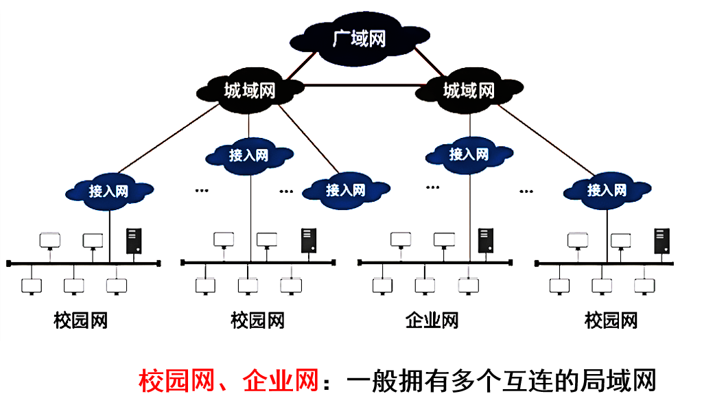
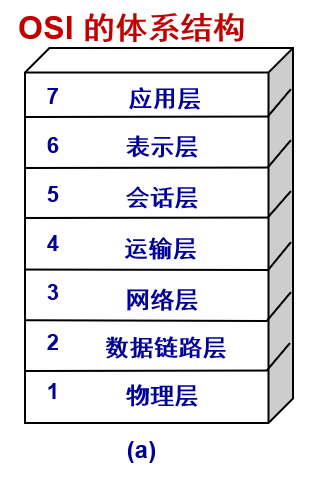
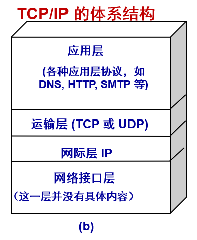
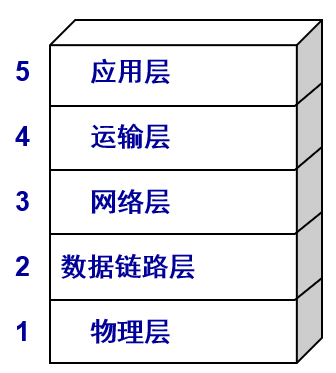
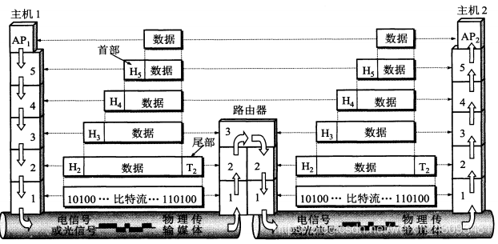
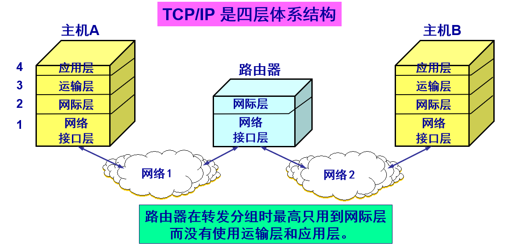
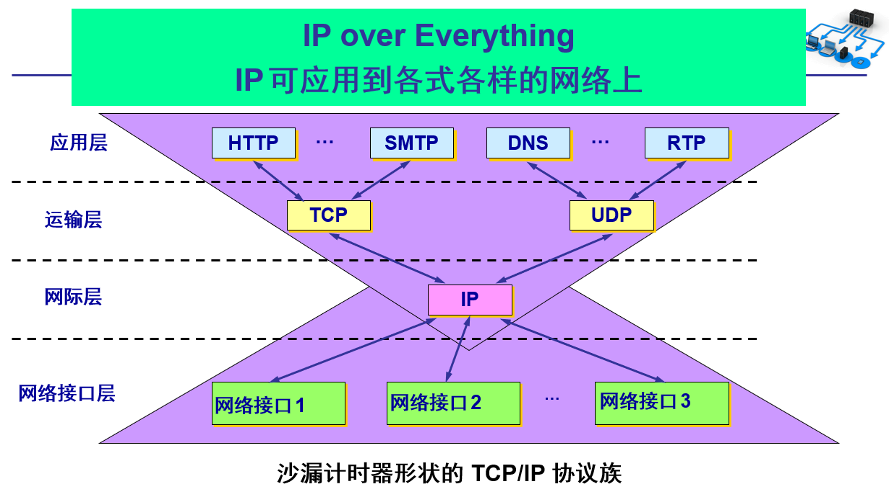

# 1.1 计算机网络在信息时代中的作用

互联网基本特点：

连通性：互联网上用户不管距离多远，都能通信，就像这些用户终端都彼此连通

共享性：指资源共享，包含信息、软件、硬件等共享，就像资源在用户身边

计算机网络 (网络) 的组成：由若干结点和连接这些结点的链路组成；结点可以是计算机、集线器、交换机、路由器等

互连网：网络之间通过路由器连接，构成更大的网络，就是互连网，是网络的网络

主机 (host)：与网络相连的计算机

# 1.2 互联网概述

## 1.2.1 互联网的结构

1. 由若干**结点(node)**和连接这些结点的链路(link)组成
2. 可以通过**路由器**把网络互连起来，这就构成了一个覆盖范围更大的计算机网络，称之为互连网 (网络的网络)
从其工作方式上，分成两大部分：

边缘部分：由互联网上的主机组成，是用户直接使用的部分，用来进行通信和资源共享

核心部分：由大量网络和连接这些网络的路由器组成，是为边缘部分提供服务的，提供连通性和交换

| 对比维度   | 互联网 (Internet)                                                                 | 互连网 (internet)                                               |
|------------|---------------------------------------------------------------------------------|----------------------------------------------------------------|
| 定义       | 特指遵循 TCP/IP 标准、用路由器将各种计算机网络互连起来而形成的、一个覆盖全球的、特定的互连网 | 泛指由多个不同类型计算机网络互连而成的网络                     |
| 协议       | 使用 TCP/IP                                                                     | 除 TCP/IP 外，还可以使用其他协议                               |
| 名词性质   | 是一个专用名词                                                                  | 是一个通用名词                                                 |
| 相似之处   | 网络的网络                                                                      | 网络的网络                                                     |
## 1.1.2 互联网基础结构发展的三个阶段

1. 第一阶段：从单个网络 （ 例如：美国国防部创建的ARPANET，互联网的前生 ） 向互连网发展的过程）
	   - 1983 年， ARPANET使用TCP/IP 标准协议，使得所有使用该协议的计算机都能利用互联网相互通信
	   - 人们把 **1983** 年作为互联网的**诞生时间**
2. 第二阶段：建成了三级结构的互联网 （美国国家基金会建立，覆盖全美主要大学和研究所）
	   - 它是一个三级计算机网络，分为主干网、地区网和校园网（或企业网） ，覆盖了全美国主要的大学和研究所
	    
    
3. 第三阶段：随着商业化，逐渐形成了多层次 ISP (Internet Service Provider) 结构的互联网
	   - 出现了互联网服务提供者 ISP ，如中国电信、中国移动、中国联通
	   - 任何机构和个人只要向某个 ISP 交纳规定的费用，就可从该 ISP 获取所需 IP 地址的使用权，并可通过该 ISP 接入到互联网
	   - 根据提供服务的覆盖面积大小以及所拥有的 IP 地址数目的不同，ISP 也分成为**不同层次的 ISP**：**主干 ISP**、**地区 ISP** 和 **本地 ISP**
		
	- IXP：互联网交换点，允许两个网络直接相连并交换分组,由工作在数据链路层的交换机组成
## 1.2.3 互联网协议

**网络协议（network protocol）**,简称为协议，是为进行网络中的数据交换而建立的规则、标准或约定

协议规定了通信实体之间所交换的消息的格式、意义、顺序以及针对收到的信息或发生的事件所采取的“动作”（actions）

### 协议三要素

1. 语法（Syntax）
	   - 数据与控制信息的结构或格式
	   - 信号电平
2. 语义（Semantics）
	   - 需要发出何种控制信息
	   - 完成何种动作以及做出何种响应
	   - 差错控制
3. 时序（Timing）
	   - 时间顺序（事件实现顺序的详细说明）
	   - 速度匹配

### 互联网的标准化工作
>  互联网的标准化工作对互联网的发展起到了非常重要的作用


成为互联网正式标准要经过三个阶段：
>  所有互联网标准都以 RFC（Request For Comments ） 的形式在互联网上发表

- **互联网草案 (Internet Draft)** ——有效期只有六个月。在这个阶段还不是 RFC 文档
- **建议标准 (Proposed Standard)** ——从这个阶段开始就成为 RFC文档
- **互联网标准 (Internet Standard)** ——达到正式标准后，每个标准就分配到一个编号 STD xx。 一个标准可以和多个 RFC 文档关联

# 1.3 互联网的组成
> 互联网的组成: 边缘+核心


1. 边缘部分： 由所有连接在互联网上的主机组成。这部分是用户直接使用的，用来进行通信（传送数据、音频或视频）和资源共享
2. 核心部分：由大量网络和连接这些网络的路由器组成。这部分是为边缘部分提供服务的（提供连通性和交换）
   
## 1.3.1  互联网的边缘部分

- 处在互联网边缘的部分就是连接在互联网上的所有的主机。这些主机又称为端系统 (end system)

- 端系统在功能上可能有很大的差别
	- 小的端系统可以是一台普通个人电脑，具有上网功能的智能手机，甚至是一个很小的网络摄像头
	- 大的端系统则可以是一台非常昂贵的大型计算机
	- 端系统的拥有者可以是个人，也可以是单位（如学校、企业、政府机关等），当然也可以是某个 ISP
	  
### 端系统之间通信的含义

“主机 A 和主机 B 进行通信实际上是指：“运行在主机 A 上的某个程序和运行在主机 B 上的另一个程序进行通信”
即“主机 A 的某个进程和主机 B 上的另一个进程进行通信”。
简称为“计算机之间通信”。

### 端系统之间的两种通信方式

端系统之间的通信方式通常可划分为两大类：
1.  **客户-服务器方式**（C/S 方式）
	  即Client/Server方式，简称为 C/S 方式
	  - 客户 (client) 和服务器 (server) 都是指通信中所涉及的**两个应用进程**
	  - 客户—服务器方式所描述的是进程之间服务和被服务的关系
	  - 客户是**服务的请求方**，服务器是**服务的提供方**
	    `服务请求方和服务提供方都要使用网络核心部分所提供的服务。例如，上网发送电子邮件或在网站上查找资料`
	  - 
	  - 客户软件的特点：
		  - 被用户调用后运行，在打算通信时主动向远地服务器发起通信（请求服务）。**因此，客户程序必须知道服务器程序的地址**
		  - 不需要特殊的硬件和很复杂的操作系统 （例如**浏览器**就是一个常用的客户端软件）
	  - 服务器软件的特点
		  - 一种专门用来提供某种服务的程序，可同时处理多个远地或本地客户的请求
		  - 系统启动后即自动调用并一直不断地运行着，被动地等待并接受来自各地的客户的通信请求。**因此，服务器程序不需要知道客户程序的地址**
		  - 一般需要强大的硬件和高级的操作系统支持
		客户与服务器的通信关系建立后，通信可以是**双向的**，客户和服务器都可发送和接收数据
	- 服务器软件举例
		- 文件服务器：NetWare
		- 数据库服务器： MySQL等
		- 邮件服务器：Sendmail 等
		- 网页服务器：Apache 等
		- FTP服务器： Pureftpd 等
2.  **对等方式**（P2P 方式）
	  即 Peer-to-Peer方式，简称为 P2P 方式
	- 对等连接 (peer-to-peer，简写为 P2P) 是指两个主机在通信时并不区分哪一个是服务请求方还是服务提供方
	- 只要两个主机都运行了**对等连接软件** (P2P 软件：BT等) ，它们就可以进行**平等的、对等连接通信**
	- 双方都可以下载对方已经存储在硬盘中的共享文档
	  `网络上许多服务可以归入P2P的行列。即时讯息系统譬如微软的MSN Messenger以及国内的腾讯QQ等是最流行的P2P应用。它们允许用户互相沟通和交换信息、交换文件。用户之间的信息交流不是直接的，需要有位于中心的服务器来协调`
	- 常用的P2P软件：
		- Bitcomet 、[比特精灵](https://baike.baidu.com/item/%E6%AF%94%E7%89%B9%E7%B2%BE%E7%81%B5?fromModule=lemma_inlink)、μTorrent  、PPLive 、PPStream 、QQ直播、[迅雷](https://baike.baidu.com/item/%E8%BF%85%E9%9B%B7/33354?fromModule=lemma_inlink) 、[酷狗](https://baike.baidu.com/item/%E9%85%B7%E7%8B%97/98649?fromModule=lemma_inlink)(KuGoo) 、PP点点通、百度[贴吧](https://baike.baidu.com/item/%E8%B4%B4%E5%90%A7/122101?fromModule=lemma_inlink) 等
	- 对等连接方式的特点：
		- 对等连接方式从本质上看仍然是使用客户服务器方式，只是对等连接中的每一个主机**既是客户又是服务器**
		- 例如主机 C 请求 D 的服务时，C 是客户，D 是服务器。但如果 C 又同时向 F 提供服务，那么 C 又同时起着服务器的作用
	  

## 1.3.2 互联网的核心部分

- 网络核心部分是互联网中最复杂的部分
- **网络中的核心部分要向网络边缘中的大量主机提供连通性**，使边缘部分中的任何一个主机都能够向其他主机通信（即传送或接收各种形式的数据，也就是进行**数据交换**）
- 在网络核心部分实现数据交换的关键构件是**路由器 (router)**，其任务是**转发收到的分组数据**

### 数据交换的类型

#### 1. 电路交换

工作方式：在两用户端间建立一条专用的物理通路，保证了双方通信所需的通信资源，而这些资源在双方通信时也不会被其他用户占用

三个步骤：建立连接(占用通信资源)->通话(一直占用通信资源)->释放连接(归还通信资源)

重要特点：在通话的全部时间内，通话的两个用户始终占用端到端的通信资源

优点：
- 时延小
- 时间性强
- 无失序
- 适用面广
- 控制简单
缺点：
- 信道利用率低
- 终端要求规格相同

#### 2. 报文交换

报文交换采用**存储转发**技术，发送端将报文发送到邻居节点（例如：路由器），通过查找表转发报文

1. 基本原理：
    - 源主机将完整的 “报文”（如一个大文件、一封长邮件）直接发送到核心网络，报文首部包含目的地址等控制信息（无分片，报文长度不固定，可能很大）。
    - 路由器接收报文后，先将整个报文存储在内存中，检查首部的目的地址，查询路由表后，将完整报文转发到下一跳路由器，重复 “存储 - 转发” 过程，直到报文到达目的主机。
2. 优缺点：
    - 优点：
        - ⽆需建⽴连接，⽤户随时发送报⽂
        - 不同时间⼀段⼀段地占⽤通信线路，通信线路利⽤率
    - 缺点：
        - 报⽂交换的时延较⻓，实时性差；
        - 只适⽤于数字信号
        - 报⽂⻓度没有限制，中间转发结点存储空间消耗⼤
- 适用场景：
    早期的电报系统、某些特定的低速数据传输场景，目前在互联网中应用较少。    

#### 3. 分组交换

分组交换是**互联网核心部分采用的主流交换方式**，解决了电路交换资源利用率低的问题，核心思路是采用**存储转发技术**，在发送端，先把较长的报文划分成**较短的、固定长度数据段**，无需预先建立专用通路。

1. 基本原理：
    分组交换的流程可分为 “分组封装” 和 “存储 - 转发” 两步：
    - 步骤 1：分组封装（数据分片）：
        源主机将需要传输的 “报文”（如一个文件、一段视频数据）分割成若干个**固定长度的分组（Packet）**（互联网中分组长度通常为几百字节到几千字节）。每个分组由两部分组成：
        
        - **首部（Header）**：包含控制信息，核心是 “源 IP 地址” 和 “目的 IP 地址”（用于路由器转发），还包括分组序号（用于目的主机重组）、校验和（用于差错检测）等。
            
        - 数据部分（Payload）：从原始报文中分割出来的部分数据。
            
            例如，一个 10MB 的文件，若每个分组长度为 1KB，则会被分割成 10240 个分组，每个分组都带有独立的首部。
            
    - 步骤 2：存储 - 转发（独立转发）：
			每个分组通过核心网络时，采用 “存储 - 转发（Store-and-Forward）” 机制：
		关键特点：
	        每个分组独立选择路由
	        —— 由于网络流量动态变化，不同分组可能经过不同的路由到达目的主机（例如，第一个分组走 “路由器 A→路由器 B”，第二个分组走 “路由器 A→路由器 C→路由器 B”），但目的主机可通过序号重组，不影响最终数据完整性。
	        
		1. 分组到达某台路由器后，路由器先将分组 “存储” 在内存中（暂存），并检查分组首部的目的 IP 地址。
	            
		2. 路由器查询自身的 “路由表”，确定该分组下一步应转发到的下一个路由器（下一跳）。
			
		3. 路由器等待当前链路空闲时，将分组 “转发” 到下一跳路由器，重复此过程，直到分组到达目的主机。
	            
		4. 目的主机接收所有分组后，根据分组首部的 “序号” 将分组重组为原始报文，完成数据传输。
            
2. 优缺点：
    
    - 优点：
        - 高效：在分组传输的过程中动态分配传输带宽，对通信链路是逐段占用。
        - 灵活：为每一个分组独立地选择最合适的转发路由。
        - 迅速：以分组作为传送单位，可以不先建立连接就能向其他主机发送分组。
        - 可靠：保证可靠性的网络协议；分布式多路由的分组交换网，使网络有很好的生存性。
    - 缺点：
        - 分组在各路由器存储转发时需排队，这会造成一定的时延
        - 分组必须携带的首部（里面有必不可少的控制信息）也造成了一定的开销。
        - 当分组交换采⽤数据报服务时，可能出现失序、丢失或重复分组。

- 适用场景：
    
    互联网的绝大多数数据传输，如网页浏览（HTTP）、文件传输（FTP）、电子邮件（SMTP）、视频点播（非实时）等，是目前互联网核心交换方式的绝对主流。


### 分组交换成为互联网核心的原因

1. 适应突发数据：互联网中大部分数据（如浏览、下载）是间歇性的，分组交换的 “按需转发” 特性可灵活应对。
    
2. 可靠性高：分组独立选路，某条链路故障时，其他分组可通过备用路由传输，提升了网络的抗故障能力。
    
    尽管分组交换存在延迟不固定、需处理分组重组等问题，但通过后续的 “传输控制协议（TCP）”（解决可靠性、失序问题）和 “服务质量（QoS）” 技术（优化实时业务延迟），这些问题已得到有效缓解，使其成为互联网核心交换方式的不二之选。

# 1.4 *计算机网络在我国的发展

# 1.5 计算机网络的类别

## 1.5.1 计算机网络的定义

计算机网络主要是由一些通用的、可编程的硬件互连而成的，而这些硬件并非专门用来实现某一特定目的（例如，传送数据或视频信号）。这些可编程的硬件能够用来传送多种不同类型的数据，并能支持广泛的和日益增长的应用
- 计算机网络所连接的硬件，并不限于一般的计算机，而是包括了智能手机或智能电视
- 计算机网络并非专门用来传送数据，而是能够支持很多种的应用（包括今后可能出现的各种应用）
### 计算机网络的功能
- 数字化：技术的发展，可将世界存储到计算机中，这就是数字化
- 信息化：数字化的世界，为人们的生活、工作、学习辅助决策等相关的各种行为带来巨⼤影响，提⾼了⾏为的效率，这就是信息化
- ⽹络化：实现数字化、信息化共享
- 分布式处理：同⼀任务可由多台计算机共同完成（部分⼯作）
- 负载均衡：同⼀工作任务由多台计算机轮流或同时完成
- ⼤数据：常规方法无法处理，不⽤随机分析法（抽样调查）这样捷径，⽽采⽤所有数据进行分析处理

## 1.5.2 几种不同类别的网络
1. 广域网 WAN（Wide Area Network）
    
    - 覆盖范围：几十到几千公里，可跨越国家甚至全球。
        
    - 特点：传输速率相对较低，延迟较高，通常使用光纤、卫星等远程通信技术。
        
    - 应用：互联网的核心部分，连接不同地区的局域网或城域网。
        
2. 城域网 MAN（Metropolitan Area Network）
    
    - 覆盖范围：一个城市或城市的一部分，约 5~50 公里。
        
    - 特点：介于 LAN 与 WAN 之间，常用于连接多个局域网。
        
    - 应用：城市范围内的政府、企业、学校等机构的网络互联。
        
3. 局域网 LAN（Local Area Network）
    
    - 覆盖范围：一般在 1 公里以内，如同一个办公室、学校或家庭。
        
    - 特点：高速、低延迟，建设和维护成本较低。
        
    - 应用：公司内部网络、校园网、家庭网络等。
        
4. 个域网 PAN（Personal Area Network）
    
    - 覆盖范围：10 米以内，围绕个人设备。
        
    - 特点：低功耗、短距离通信。
        
    - 应用：蓝牙、红外、USB 连接等个人设备之间的通信。
        
### 1. 从网络的作用范围进行分类
- 广域网 WAN (Wide Area Network)：作用范围通常为几十到几千公里
- 城域网 MAN (Metropolitan Area Network) ：作用范围一般是一个城市，作用距离约为5 ~ 50 公里
- 局域网 LAN (Local Area Network)：一般用微型计算机或工作站通过高速通信线路相连，局限在较小的范围（如 1 公里左右）
- 个人区域网 PAN (Personal Area Network) ：在个人工作的地方，把属于个人使用的电子设备用无线技术连接起来的网络，作用范围大约在10 米左右。（例如wifi热点，连接周围的上网设备）
### 2. 从网络的使用者进行分类
- 公用网 (public network)：按规定交纳费用的人都可以使用的网络。因此也可称为公众网 （比如：电信网、移动网）
- 专用网 (private network)：为特殊业务工作的需要而建造的网络，如某个部门为满足本单位的特殊业务工作的需要而建造的网络
### 3. 用来把用户接入到互联网的网络
- 接入网 AN (Access Network)，它又称为本地接入网或居民接入网
- 接入网是一类比较特殊的计算机网络，用于将用户接入互联网
- 接入网本身既不属于互联网的核心部分，也不属于互联网的边缘部分
- 接入网是从某个端系统到另一个端系统的路径中，由这个端系统到第一个路由器（也称为边缘路由器）之间的一些物理链路所组成的 （比如宽带接入网）

# 1.6 计算机网络的性能指标

## 1.6.1 计算机网络的性能指标

1. 速率：
    
    - 定义：数据的传输速率，即单位时间内传输的数据量。
        
    - 单位：bit/s（bps）、kb/s（kbps）、Mb/s（Mbps）、Gb/s（Gbps）等。
        
    - 注：通常指额定速率或标称速率，是设备所能达到的最大传输速率。
        
2. 带宽：
    
    - 定义：在单位时间内从网络的某一点到另一点所能通过的 “最高数据率”。
        
    - 单位：与速率相同，如 bps、Mbps 等。
        
    - 意义：表示网络的通信线路所能传送数据的能力，是衡量网络传输能力的重要指标。
        
3. 吞吐量 (Throughput)：
    
    - 定义：单位时间内**实际成功交付**到目的端的**有效数据量**。
        
    - 单位：bit/s（bps）、Byte/s、packet/s 等。
        
    - 与带宽的区别：
        
        - 带宽：链路**理论上最大能传多少**。
            
        - 吞吐量：**真实跑起来传了多少**（≤带宽）。
            
    - 影响因素：拥塞、协议开销、重传、路由抖动、CPU / 接口性能、信噪比等。
        
4. 时延：
    
    - 定义：数据从网络的一端传送到另一端所需的时间。
        
    - 组成：发送时延（数据块长度 / 信道带宽）、传播时延（信道长度 / 电磁波在信道上的传播速率）、处理时延（路由器处理分组的时间）、排队时延（分组在路由器队列中等待的时间）。
        
    - 总时延 = 发送时延 + 传播时延 + 处理时延 + 排队时延。
        
5. 时延带宽积：
    
    - 定义：时延带宽积 = 传播时延 × 带宽，表示链路中可以容纳的比特数，又称以比特为单位的链路长度。
        
6. 往返时间 RTT：
    
    - 定义：从发送方发送数据开始，到发送方收到来自接收方的确认（接收方收到数据后立即发送确认）所经历的时间。
        
    - 意义：在许多协议中，RTT 是一个重要的参数，如 TCP 的超时重传时间设置。
        
7. 利用率：
    
    - 定义：包括信道利用率和网络利用率。信道利用率是指某信道被使用的时间占总时间的比例；网络利用率是指全网络的信道利用率的加权平均值。
        
    - 注：信道利用率并非越高越好，当利用率接近 100% 时，网络时延会急剧增大。
        

> 补充：  
> 时延与利用率关系公式：  
> $D=1−UD_{0}​​$  
> 其中，$D$ 为当前时延，$D_{0}$​ 为空闲时延，$U$ 为利用率。


## 1.6.2  计算机网络的非性能特征

一些非性能特征也很重要。它们与前面介绍的性能指标有很大的关系。主要包括：
- 费用：网络设计和实现的费用
- 质量：网络中所有构件的质量
- 质量：网络中所有构件的质量
- 可靠性
- 可扩展性和可升级性
- 易于管理和维护

# 1.7 计算机网络体系结构

## 1.7.1 计算机网络体系结构的形成

计算机网络是个非常复杂的系统，相互通信的两个计算机系统必须**高度协调工作**才行，而这种“协调”是相当复杂的  

为了设计复杂的计算机网络，ARPANET设计时，提出 **“分层”** 思想，将庞大而复杂的问题转化为若干较小的局部问题，而这些较小的局部问题就比较易于研究和处理

将不同的功能划分到各层：
1. 差错控制：使对等方接收更可靠 （HARQ协议）
2. 流量控制：发送速率不能快，使接收方来得及接收（TCP，UDP协议）
3. 分段和重装：划分发送数据块，在接收方重装数据；
（TCP，UDP协议）
4. 路由：分组在网络中的路径选择
5. 复用和分用：发送信息复用同一底层链路，接收方再分用
6. 连接建立和释放：发送数据前先建立一条逻辑连接，完成传送释放连接

### 计算机网络体系结构
计算机网络的体系结构（architecture）是计算机网络的各层及其协议的集合：

- 体系结构就是这个计算机网络及其部件所应完成的**功能的精确定义**；
- 实现（implementation）是遵循这种体系结构的前提下用何种硬件或软件完成这些功能的问题；
- 体系结构是抽象的，而实现则是具体的，是真正在运行的计算机硬件和软件。

### 开放系统互连参考模型OSI/RM

为了使不同体系结构的计算机网络都能互连，国际标准化组织 ISO 于 1977 年成立了专门机构研究该问题。  

他们提出了一个试图使各种计算机在世界范围内互连成网的标准框架，即著名的**开放系统互连基本参考模型 OSI/RM**（Open Systems Interconnection Reference Model），简称为 **OSI**。

只要遵循 OSI 标准，一个网络系统就可以和位于世界上任何地方的、也遵循这同一标准的其他任何网络系统进行通信。

### OSI 七层协议体系结构

| 层级 | 名称         | 功能与协议/数据单元 |
|------|--------------|----------------------|
| 7    | **应用层**   | 通过应用进程间的交互完成特定网络应用，如：<br>• 域名系统 DNS<br>• 支持万维网的 HTTP 协议<br>• 支持电子邮件的 SMTP 协议<br>**数据单元：报文（message）** |
| 6    | **表示层**   | 处理流经端口的数据代码表示方式问题：<br>• 数据表示、语法转换<br>• 语法选择、连接管理 |
| 5    | **会话层**   | 组织和同步进程间的通信：<br>• 提供会话服务、会话管理、会话同步等功能 |
| 4    | **运输层**   | 向两台主机中的进程之间提供通用的数据传输服务：<br>• 流量控制、拥塞控制、可靠传输<br>• 主要协议：TCP、UDP<br>**数据单位：数据报（segment/datagram）** |
| 3    | **网络层**   | 通过选路为分组交换网上的不同主机提供通信服务：<br>• 主要协议：IP<br>**数据单位：IP 分组 / IP 数据报** |
| 2    | **数据链路层** | 负责相邻节点间的可靠数据传输：<br>• 差错检测（CRC 检验）<br>• 数据单位：帧（frame）<br>• 典型协议：PPP、CSMA/CD |
| 1    | **物理层**   | 确定与传输媒体的接口特性：<br>• 机械特性（引脚规定）<br>• 电气特性（电压、电流）<br>• 功能特性、过程特性<br>**数据单位：比特（bit）** |



法律上的 (de jure) 国际标准 OSI 并没有得到市场的认可。

非国际标准 TCP/IP 却获得了最广泛的应用。TCP/IP 常被称为事实上的 (de facto) 国际标准

### TCP/IP四层协议体系结构

因此往往采取折中的办法，即综合 OSI 和 TCP/IP 的优点，采用一种只有五层协议的体系结构

## 1.7.2 协议与划分层次

> 核心：网络按 “功能” 切片 → 每层运行一组**协议**（规则 + 格式 + 时序），**协议三要素 + 接口 + 数据封装**

1. **协议（Protocol）三要素**

|要素|内容|例子|
|:--|:--|:--|
|语法|数据格式 / 结构|TCP 首部 20 B，端口占 2 B|
|语义|字段含义与操作|SYN=1 表示 “请求同步”|
|同步|事件先后关系|三次握手：SYN → SYN/ACK → ACK|

2. **层次划分原则**
    
    1. 每层**功能明确**—— 只干一件事
        
    2. 层间**接口清晰**——SAP + 最少信息
        
    3. **对等通信**—— 同层协议实体 “虚拟对话”
        
    4. **封装 / 解封**—— 数据 + 本层首部 → 交给下一层
        
3. **封装解封流程**
    
    ```plaintext
    App 数据
    ↓ ＋H7
    Segment (H6)  ← 传输层
    ↓ ＋H5
    Packet   (H5)  ← 网络层
    ↓ ＋H4＋T4
    Frame    (H4+T4) ← 链路层
    ↓ 比特
    物理链路
    ```
    
    > 接收端反向逐层拆头 / 尾，上交。
    
2. **关键术语**
    
    - **PDU**（Protocol Data Unit）：本层协议处理的数据单位
        
    - **SAP**（Service Access Point）：相邻层接口，如 “端口”= 传输层 SAP
        
    - **对等实体**（Peer Entity）：不同机器同一层的协议实例
        
    - **虚拟通信**（Virtual Communication）：逻辑上同层直接对话，实际沿实线箭头经过下层
      
## 1.7.3 五层协议的体系结构
### 五层协议体系结构（简化 OSI）

| 层级 | 名称         | 功能与协议/数据单元 |
|------|--------------|----------------------|
| 5    | **应用层**   | 通过应用进程间的交互完成特定网络应用：<br>• 域名系统 DNS<br>• 万维网 HTTP 协议<br>• 电子邮件 SMTP 协议<br>**数据单元：报文（message）** |
| 4    | **运输层**   | 向两台主机中的进程提供通用数据传输服务：<br>• TCP：可靠、面向连接，**数据单位：报文段（segment）**<br>• UDP：无连接、尽最大努力交付，**数据单位：用户数据报（datagram）** |
| 3    | **网络层**   | 通过路由选择为分组交换网上的不同主机提供通信服务：<br>• 路由器生成并依据转发表转发分组<br>• 主要协议：IP<br>**数据单位：IP 分组 / IP 数据报** |
| 2    | **数据链路层** | 负责相邻节点间的可靠数据传输：<br>**数据单位：帧（frame）** |
| 1    | **物理层**   | 确定与传输媒体的接口特性：<br>• 机械特性（接口形状、引脚）<br>• 电气特性（电压、电流）<br>• 功能特性、过程特性<br>**数据单位：比特（bit）** |

假定两台主机通过一台路由器连接起来

1. 主机1把用户数据交给本机TCP实体，TCP附加首部（含端口、序号、确认号、标志位等）形成TCP段。
    
2. TCP段递交给本机IP实体，IP在前面添加IP首部（含版本、首部长度、总长度、标识、标志、片偏移、TTL、协议、源/目的IP地址等），构成IP数据报。
    
3. IP数据报交给本机以太网（802.11）实体，以太网在前面加上802.11 MAC首部（Addr1~Addr4、序号、控制位等），尾部追加FCS，形成完整无线帧。
    
4. 无线帧经物理层调制成比特流（图中10100…110100），通过空口发往AP。
    
5. AP收到无线帧后解封802.11头部，根据目的MAC判断需经有线侧转发，于是把IP数据报重新封装成以太网II帧（目的MAC填路由器接口MAC，源MAC填AP自身MAC，类型字段0x0800），尾部重新计算FCS。
    
6. AP把新帧调制成以太网物理信号（依旧是10100…形式的比特流），通过双绞线发送到路由器。
    
7. 路由器接口收帧后校验FCS，剥离以太网首部，根据目的IP查路由表，决定转发接口；TTL减1，重新计算IP校验和，再按出接口链路类型重新封装（若仍是以太网，则生成新的以太网帧，MAC地址改为下一跳对应值）。
    
8. 新帧再次变成比特流经物理链路发出，最终抵达主机2。
    
9. 主机2从物理层逐位接收，校验无误后依次剥掉以太网首部、IP首部、TCP首部，把数据交给对应端口的上层应用。

## 1.7.4 实体、协议、服务和服务访问点

- **实体** (entity) 表示任何可发送或接收信息的**硬件**或**软件进程**
- **协议**是控制**两个对等实体**进行通信的**规则的集合**
- 在协议的控制下，两个对等实体间的通信使得本层能够**向上一层提供服务**
- 要实现本层协议，还需要**使用下层所提供的服务**
- 服务在形式上由⼀组接口原语（或操作）来描述的：
	- 上层实体向下层实体请求服务时，服务提供者和服务⽤户间需要**交互⼀些必要的信息**，以说明要求服务的⼀些情况，这些信息即**服务原语**
- 协议和服务的概念：
	- 协议的实现保证了能够向上一层提供服务
	- 本层的服务用户只能看见服务而无法看见下面的协议。即下面的协议对上面的服务用户是透明的
	- 协议是“**水平的**”，即协议是控制对等实体之间通信的规则
	- 服务是“**垂直的**”，即服务是由下层向上层通过层间接口提供的
	- 上层使用**服务原语**获得下层所提供的服务
- 服务访问点
	- 同一系统相邻两层的实体进行交互的地方，称为**服务访问点 SAP (Service Access Point)**
	- 服务访问点SAP是一个**抽象的概念**，它实际上就是一个**逻辑接口**
	- OSI把层与层之间交换的数据的单位称为**服务数据单元 SDU (Service Data Unit)**
	- SDU 可以与 PDU 不一样，例如，可以是多个 SDU 合成为一个 PDU，也可以是一个 SDU 划分为几个 PDU
## 1.7.5  TCP/IP 的体系结构

实际上，现在的互联网使用的 TCP/IP 体系结构有时已经发生了演变，即某些应用程序可以直接使用 IP 层，或甚至直接使用最下面的网络接口层。例如在一个局域网中，应用层的数据可以直接在数据链路上传输。ping 应用程序；OSPF 路由选择协议都是直接越过运输层直接使用网络层
