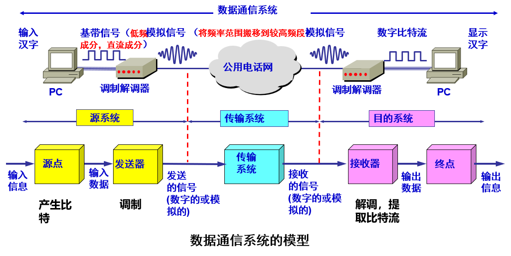
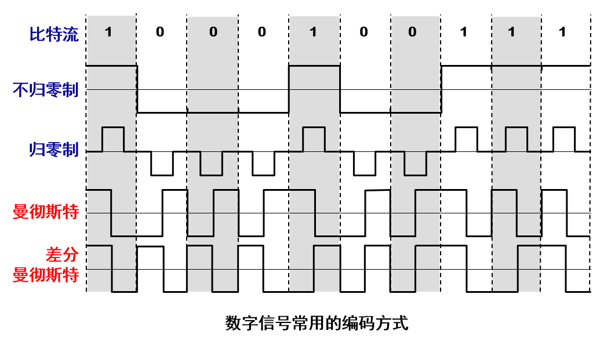
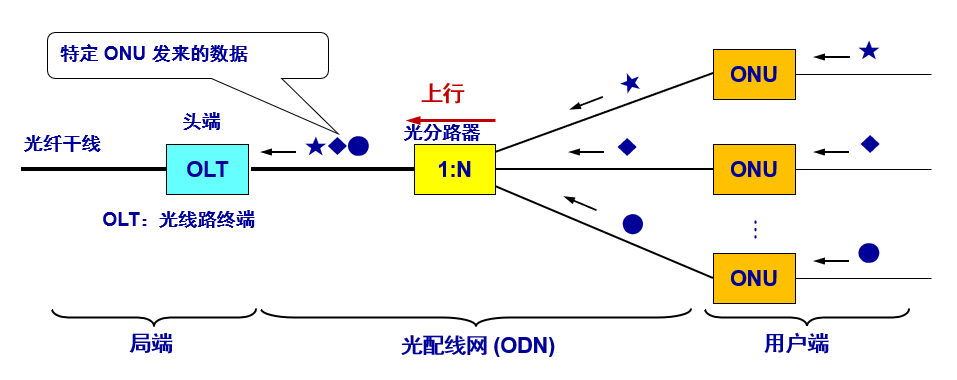

# 2.1 物理层的基本概念

物理层的功能：**怎样在连接各种计算机的传输媒体上传输数据比特流，屏蔽不同传输媒体和通信手段的差异**

规程：用于物理层的协议

传输媒体接口的特性：

1. 机械特性：接口所用接线器的形状和尺寸、引脚数目和排列、固定和锁定装置等

2. 电气特性：接口电路的各条线上出现的电压范围

3. 功能特性：某条线上出现某一电平电压的意义

4. 过程特性：对于不同功能的各种可能事件的出现顺序

通过物理层的协议（物理层规程 (procedure)）来完成以上任务

常见标准：RJ45 机械特性

# 2.2 数据通信的基础知识

## 2.2.1  数据通信系统模型

- 组成：源系统（发送端）、传输系统（网络）、目的系统（接收端）
	
- 核心术语：
	
	- 消息：话音、文字、图像、视频等原始信息
		
	- 数据：运送消息的实体，用特定方式表示的消息，通常是有意义的符号序列，用计算机或机器处理产生。例如：消息在传输之前需要进⾏编码，编码后的消息就变成了数据（将消息存储到计算机中形成⼆进制⽐特流）
		
	- 信号：数据的电气或电磁表现，数据在通信线路上传递需要变成电信号或光信号
		
		- 模拟信号：参数连续变化
			
		- 数字信号：参数离散变化
			
	- 码元：在使用时间域（或简称为时域）的波形**表示数字信号时，代表不同离散数值的基本波形**
		
	- 信源：产生和发送数据的源头
		
	- 信宿：接收数据的终点
		
	- 信道：信号传输的通道
            
## 2.2.2  有关信道的几个基本概念  

- 单向通信（单工通信）——只能有一个方向的通信而没有反方向的交互，如电视广播
    
- 双向交替通信（半双工通信）——通信的双方都可以发送信息，但不能双方同时发送(当然也就不能同时接收)，如对讲机通话
    
- 双向同时通信（全双工通信）——通信的双方可以同时发送和接收信息，如普通电话
	  
- 基带信号（即基本频带信号）—— 来自信源的信号。像计算机输出的代表各种文字或图像文件的数据信号都属于基带信号
	- 基带信号往往包含有较多的低频成分，甚至有直流成分，而许多信道并不能传输这种低频分量或直流分量。因此必须对基带信号进行调制 (modulation)
- 调制分为两大类：
	- **基带调制**：仅对基带信号（即数字信号）的波形进行变换，使它能够与信道特性相适应。变换后的信号仍然是基带信号。把这种过程称为**编码** (coding)
	- **带通调制**：使用载波 (carrier)进行调制，把基带信号的频率范围搬移到较高的频段，并转换为模拟信号，这样就能够更好地在模拟信道中传输
	- 带通信号 ：经过载波调制后的信号，即仅在一段频率范围内能够通过信道
	  
- 常用编码方式：

| 编码方式 | 特点  |
| --- | --- | 
| 不归零制 | 正电平 1，负电平 0，无自同步能力 |   
| 归零制 | 正脉冲 1，负脉冲 0 |
| 曼彻斯特编码 | 位周期中心的向上跳变代表 0，位周期中心的向下跳变代表 1。但也可反过来定义 | 
| 差分曼彻斯特 | 在每一位的中心处始终都有跳变。位开始边界有跳变代表 0，而位开始边界没有跳变代表 1 |

常用编码方式：
- 从信号波形中可以看出，曼彻斯特 (Manchester) 编码和差分曼彻斯特编码产生的信号频率比不归零制高
- 从自同步能力来看，每个码元都有从一个电平到另一个电平跳变的过程，在数据传输过程中，通过判断上升/下降沿和下一个上升/下降沿之间的间隔，判断是否接收到一个码元，也就实现自同步。而不归零制不能从信号波形本身中提取信号时钟频率（这叫作没有自同步能力）
基本的带通调制方法：
- 带通调制：调幅（AM）、调频（FM）、调相（PM）
        
- 正交振幅调制（QAM）：同时调幅调相，16QAM 每符号 4bit，速率提高 4 倍
        
## 2.2.3  信道的极限容量

任何实际的信道都不是理想的，在传输信号时会产生各种失真以及带来多种干扰
码元传输的速率越高，或信号传输的距离越远，或传输媒体质量越差，在信道的输出端的波形的失真就越严重

- 信噪比：
	- 噪声存在于所有的电子设备和通信信道中
	- 噪声是随机产生的，它的瞬时值有时会很⼤。因此噪声会使接收端对码元的判决产生错误
	- 但噪声的影响是相对的。如果信号相对较强，那么噪声的影响就相对较小
	- 信噪⽐就是信号的平均功率和噪声的平均功率之⽐。常记为 S/N， 并⽤分⻉ (dB) 作为度量单位。即$dB=10log10​(S/N)$
        
- 香农定理：
- 1984年，美国数学家⾹农 (Shannon) ⽤信息论的理论推导出了带宽受限且有⾼斯⽩噪声⼲扰的信道的极限、⽆差错的信息传输速率
- 信道的极限信息传输速率 C 可表达为：$C=W\log_{2}​(1+S/N)(bits)$
        
	- W：信道的带宽（Hz）
            
	- S：信道内所传信号的平均功率
            
	- N：信道内部的高斯噪声功率
	  
- 信道的带宽或信道中的信噪比越大，则信息的极限传输速率就越高
- 只要信息传输速率低于信道的极限信息传输速率，就⼀定可以找到某种办法来实现无差错的传输
- 实际信道上能够达到的信息传输速率要比香农的极限传输速率低不少
        
- 结论：带宽或信噪比越大，极限速率越高；实际速率低于香农极限
        

# 2.3 物理层下面的传输媒体

- 传输媒体也称为传输介质或传输媒介，它**就是数据传输系统中在发送器和接收器之间的物理通路**
- 传输媒体可分为两大类，即导引型传输媒体和非导引型传输媒体
- 在导引型传输媒体中，电磁波被导引沿着固体媒体（铜线或光纤）传播
- 非导引型传输媒体就是指自由空间。在非导引型传输媒体中，电磁波的传输常称为无线传输

## 2.3.1 **导引型传输媒体**
    
- 双绞线：
	
	- UTP：无屏蔽，成本低，家用、办公
		
	- STP：金属屏蔽，抗干扰，机房、工业
		
	- 标准：EIA/TIA-568，常用 CAT5（100MHz）、CAT5E（125MHz）、CAT6（250MHz）
		
- 同轴电缆：
	
	- 50Ω：数字传输，LAN
		
	- 75Ω：模拟传输，CATV
		
- 光纤：
	
	- 单模：芯径 9µm，激光光源，千米级，低色散，高成本
		
	- 多模：芯径 50/62.5µm，LED 光源，百米级，高色散，低成本
		
	- 波段：850nm、1300nm、1550nm 损耗最小，带宽 25~30THz
		
	- 优点：带宽大、损耗低、抗干扰、保密好
		
	- 缺点：接口贵、易断、维护难
            
## 2 .3.2. **非导引型传输媒体**

- 将自由空间称为“非导引型传输媒体”
	
- 短波：靠电离层反射，低速几十~几千 bit/s
        
- 微波：300MHz~300GHz，直线传播，50km 需中继，多径效应明显
	
- 卫星通信：同步卫星三颗覆盖全球，用于 GPS、北斗、远程通信
        

# 2.4 信道复用技术

1. **频分复用（FDM）**
    
    - 把总带宽划分为多个子频带，用户独占子频带，并行传输，它允许用户使用一个共享信道进行通信，降低成本，提高利用率
    - 它允许用户使用一个共享信道进行通信，降低成本，提高利用率
    - 频分复用的所有用户在同样的时间占用不同的带宽资源（请注意，这里的“带宽”是频率带宽而不是数据的发送速率）
    - 频分复用要求总频率宽度大于各个子信道频率之和
    - 各子信道之间设立隔离带，这样就保证了各路信号互不干扰
    - 频分复用特点是所有子信道传输的信号以并行的方式工作
        
2. **同步时分复用（TDM）**

	- 时分复用则是将时间划分为一段段等长的时分复用帧（TDM 帧）。每一个时分复用的用户在每一个 TDM 帧中占用固定序号的时隙
    - 每一个用户所占用的时隙是周期性地出现（其周期就是 TDM  帧的长度）
    - 每一个用户所占用的时隙是周期性地出现（其周期就是 TDM  帧的长度）
    - 时分复用的所有用户是在不同的时间占用同样的频带宽度
    - 可能会造成线路资源的浪费：
	    - 使用时分复用系统传送计算机数据时，由于计算机数据的突发性质，用户对分配到的子信道的利用率一般是不高的
		- 当某用户暂时无数据发送时，在时分复用帧中分配给该用户的时隙只能处于空闲状态
        
    - 需保护频带，实时性好，用于广播、有线电视
        
3. **统计时分复用（STDM）**
    
    - 数据发往复⽤器，复⽤器按顺序扫描，把复用器中的数据放入STDM  帧中，⼀个STDM帧满了就发出
    - STDM不是固定分配时隙，⽽是按需动态分配时隙
    - 注意STDM帧的时隙数少于终端数
        
    - 利用率高，用于以太网、Wi-Fi
        
## 2.4.2 波分复用（WDM）
    
- 波分复用就是光的频分复用。使用一根光纤来同时传输多个光载波信号，提高光纤的传输能力
        
- CWDM（20nm）、DWDM（0.4/0.8nm），单纤 40Tbps
        
## 2.4.3 码分复用（CDM/CDMA）
    
- 常用的名词是码分多址 CDMA (Code Division Multiple Access)
        
- 每一个用户可以在同样的时间使用同样的频带进行通信
        
- 各用户使用经过特殊挑选的不同码型，因此彼此不会造成干扰
        
- 这种系统发送的信号有很强的抗干扰能力, 最初应用于军事通信，随着设备的价格降低，已广泛应用于民用移动通信
- CDMA工作原理：
	- 每一个比特时间划分为 m 个短的间隔，称为码片 (chip)
	- 每个站被指派一个唯一的 m bit 码片序列
		- 如发送比特 1，则发送自己的 m bit 码片序列
		- 如发送比特 0，则发送该码片序列的二进制反码
	- 例如，S 站的 8 bit 码片序列是 00011011
		- 发送比特 1 时，就发送序列 00011011
		- 发送比特 0 时，就发送序列 11100100
	- S 站的码片序列：(–1 –1 –1 +1 +1 –1 +1 +1)
	
	- 假定S站要发送信息的数据率为 b bit/s。由于每一个比特要转换成 m 个比特的码片，因此 S 站实际上发送的数据率提高到 mb bit/s，同时 S 站所占用的频带宽度也提高到原来数值的 m 倍
	
	- 这种通信方式是扩频(spread spectrum)通信中的一种，即直接序列扩频DSSS (Direct Sequence Spread Spectrum)
	
	- 每个站分配的码片序列不仅必须各不相同，并且还必须互相正交 (orthogonal)。令向量 S 表示站 S 的码片向量，令 T 表示其他任何站的码片向量。两个不同站的码片序列正交，就是向量 S 和 T 的规格化内积 (inner product) 等于 0
	  $$
S·T=\frac{1}{m}\sum_{i=1}^{m}S_{i}T_{i}=0
$$
	- 任何一个码片向量和该码片向量自己的规格化内积都是 1
	 $$
S·S=\frac{1}{m}\sum_{i=1}^{m}S_{i}S_{i}=\frac{1}{m}\sum_{i=1}^{m}S_{i}^2=\frac{1}{m}\sum_{i=1}^{m}(\pm 1)^2=1
$$
        
# 2.5 数字传输系统

1. **系统定位**
    
    - 流程：信源编码→信道编码→调制→信道→解调→信道译码→信源译码
        
2. **数字 vs 模拟**
    
    - 数字：再生中继、可加密、易 TDM、包交换
        
    - 模拟：放大噪声、难纠错、多 FDM、电路交换
        
3. **关键指标**
    
    - 比特率Rb​（bit/s）、波特率Rs​（Baud），Rb​=Rs​log2​M
        
    - 频谱效率η=Rb​/B（bit/s/Hz）
        
4. **码型变换**
    
    - NRZ-L、Manchester、HDB3、8B/10B
        
5. **同步技术**
    
    - 位同步：PLL、CDR
        
    - 帧同步：FAW
        
    - 网同步：1588v2 PTP
        
6. **差错控制**
    
    - ARQ、FEC、HARQ
        

# 2.6 宽带接入技术

1. **概念**
    
    - 宽带：下行≥25Mbit/s，上行≥3Mbit/s（ITU）；我国下行≥100Mbit/s 称基础宽带，≥1000Mbit/s 称千兆宽带
        
2. **技术分类**
    
    |介质|技术|关键参数|
    |:--|:--|:--|
    |铜线|xDSL|ADSL2+（下行 24Mbit/s）、VDSL2（下行 100Mbit/s@300m）、G.fast（1Gbit/s@100m）|
    |光纤|FTTx|GPON（下行 2.5Gbit/s）、XG-PON（下行 10Gbit/s）、XGS-PON（对称 10Gbit/s）|
    |同轴|DOCSIS|3.1（下行 10Gbit/s）、4.0（对称 10Gbit/s）|
    |无线|FBWA|5G NR FWA（n78 频段 1.6Gbit/s@1km）、Wi-Fi 6（理论 9.6Gbit/s）|
## 2 .6.1  ADSL 技术
    
- 非对称：下行>>上行
        
- 频分：0–4kHz 电话，>40kHz 数据
        
- DMT：把 1.1MHz 划分为 256 子信道，4kHz/子信道，25 上行 249 下行
        
## 2.6.2  光纤同轴混合网（HFC网）
    
- HFC (Hybrid Fiber Coax) 网是在目前覆盖面很广的有线电视网 CATV 的基础上开发的一种居民宽带接入网
        
- HFC (Hybrid Fiber Coax) 网是在目前覆盖面很广的有线电视网 CATV 的基础上开发的一种居民宽带接入网
- 现有的 CATV 网是树形拓扑结构的同轴电缆网络，它采用模拟技术的频分复用对电视节目进行单向传输
- HFC 网将原 CATV 网中的同轴电缆主干部分改换为光纤，并使用模拟光纤技术,在模拟光纤中采用光的振幅调制 AM，这比使用数字光纤更为经济
- 模拟光纤从头端连接到光纤结点 (fiber node)，即光分配结点 ODN (Optical Distribution Node)。在光纤结点光信号被转换为电信号。在光纤结点以下就是同轴电缆
        
- 设备：Cable Modem，下行 3–30Mbit/s，上行 0.2–2Mbit/s

## 2.6.3  FTTx 技术
FTTx 是一种实现宽带居民接入网的方案，代表多种宽带光纤接入方式
FTTx 表示 Fiber To The…（光纤到…）
- FTTH：光纤到户
        
- FTTB：光纤到大楼
        
- FTTC：光纤到路边
        
- PON：无源光网络，ODN 分光，一户一纤

-  **演进趋势**
    
    - 光纤化：FTTH 渗透率提升，XGS-PON 标配
        
    - 云化：vOLT、vBNG
        
    - 协同化：FTTR 全屋千兆
        
    - 高速化：50G PON 2025 商用，对称 50Gbit/s