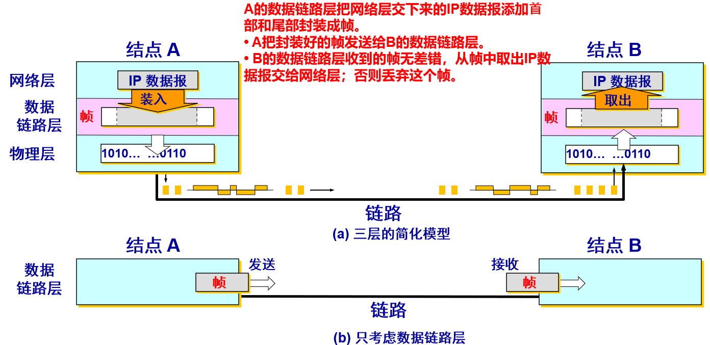
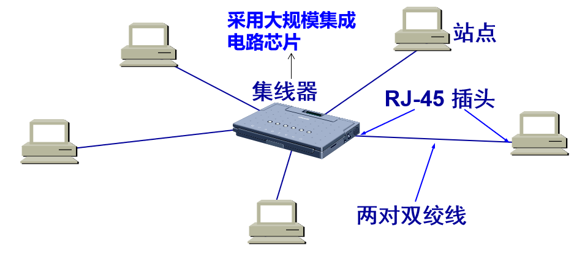
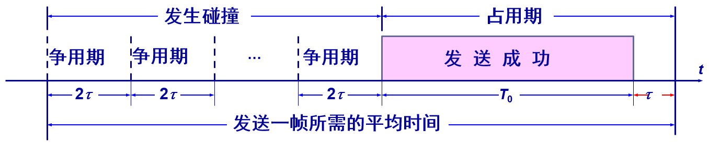
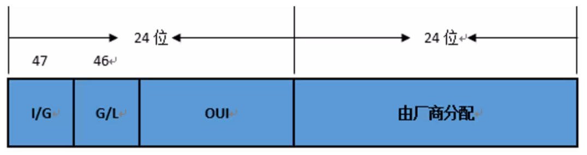
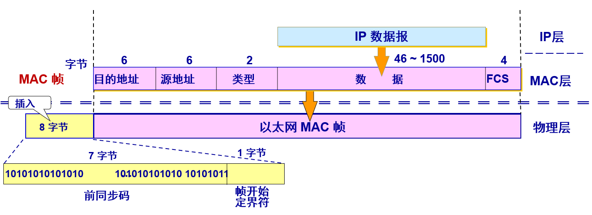
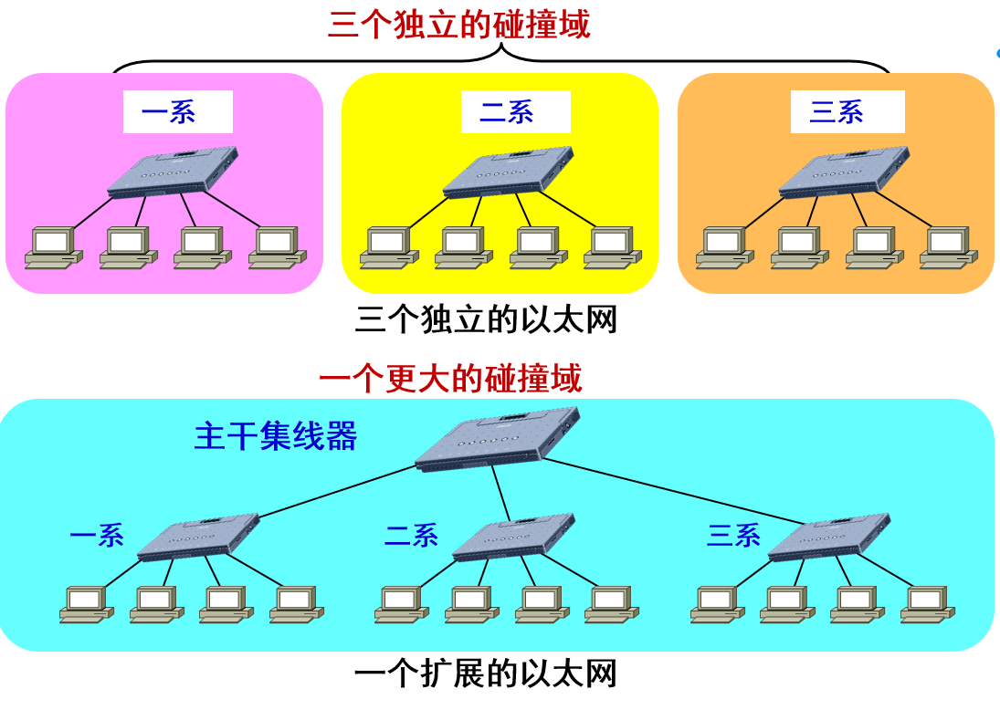
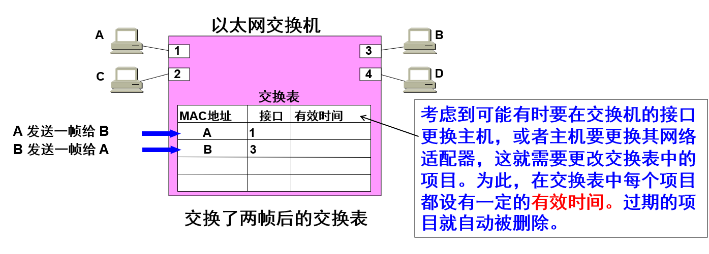
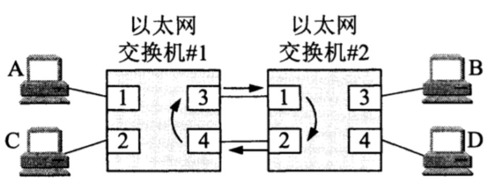
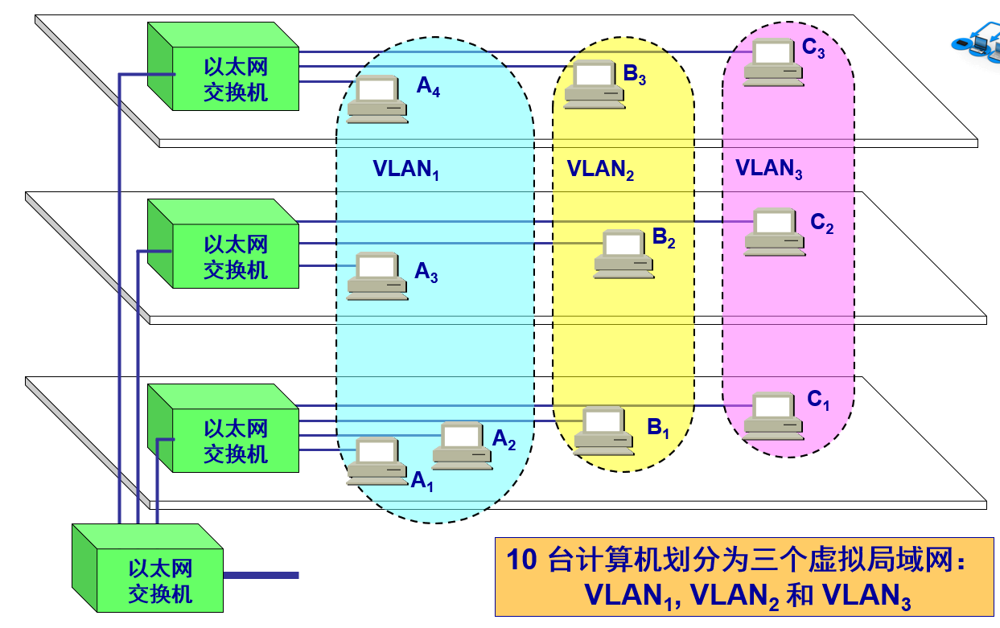
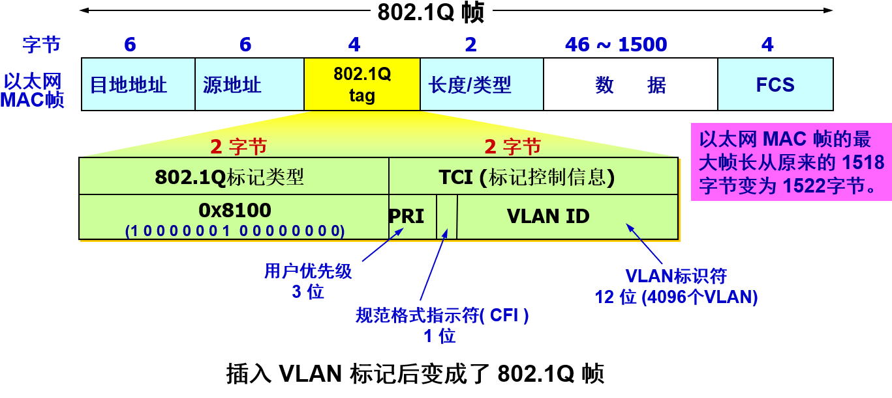

# 3.1  使用点对点信道的数据链路层（循环冗余检验技术）
## 为什么需要数据链路层
- 物理层解决了相邻结点透明传输比特的问题
- 物理层没解决的问题：

	- **传输错误问题**：发送端发送比特 1，而接收端收到比特 0，接收端无法知道接收的是否正确
	- **接收方选择问题**：多个设备连接，谁发送谁接受
	- **传输结束问题**：如何知道一组数据即将到来，何时结束

常用的信道主要有以下两种类型
	- 点对点信道。这种信道使用一对一的点对点通信方式
	- 广播信道。这种信道使用一对多的广播通信方式，因此过程比较复杂。广播信道上连接的主机很多，因此必须使用专用的共享信道协议来协调这些主机的数据发送
## 3.1.1 数据链路和帧

- 链路 (link) 是一条无源的点到点的物理线路段，中间没有任何其他的交换结点
	- 一条链路只是一条通路的一个组成部分

- 数据链路 (data link) 除了物理线路外，还必须有通信协议来控制这些数据的传输。若把实现这些协议的硬件和软件加到链路上，就构成了数据链路
	- 现在最常用的方法是使用适配器（即网卡）来实现这些协议的硬件和软件
	- 一般的适配器都包括了**数据链路层**和**物理层**这两层的功能

**帧**：点对点信道的通信链路层的协议数据单元

## 3.1.2 三个基本问题

1. 封装成帧
	- 在一段数据的前后分别添加首部和尾部，然后就构成了一个帧，确定帧的界限
	- 首部和尾部的一个重要作用就是进行帧定界
	  

2. 透明传输
	- **透明传输**：无论什么样的比特组合的数据，都能够按照原样没有差错地通过这个数据链路层
	- 如果数据中的某个字节的二进制代码恰好和 SOH 或 EOT 一样，数据链路层就会错误地“找到帧的边界”
	  
	- 解决方法：字节填充或字符填充
	- 发送端的数据链路层在数据中出现控制字符“SOH”或“EOT”前插入一个**转义字符“ESC”**
	- 若转义字符也出现在数据当中，则在转义字符前插入一个转义字符，接收到连续的转义字符时，删除前面的一个
	  
3. 差错检测

	- 循环冗余检验（Cyclic Redundancy Check, CRC）
		- 在发送端，先把数据划分成组，假定每组 k 个比特
		- 冗余码的计算
			- **原理**：通过模 2 除法（异或运算）生成冗余位，广泛应用于网络通信和存储系统。
			- **计算步骤**：
				- **约定生成多项式**（如 CRC-32 的 `G(x) = x³² + x²⁶ + x²³ + x²² + x¹⁶ + x¹² + x¹¹ + x¹⁰ + x⁸ + x⁷ + x⁵ + x⁴ + x² + x + 1`）。
				- **数据左移**：在原始数据后补 `r` 个 0（`r` 是生成多项式的最高次幂）。
				- **模 2 除法**：用生成多项式对应的二进制数除扩展后的数据，余数即为冗余码（CRC 码）。
				- **附加冗余码**：将余数替换到数据末尾的 0 位置。
			- **示例**：
				- 数据：`1101011011`，生成多项式：`10011`（x⁴ + x + 1）
				- 步骤：
					- 数据左移 4 位：`11010110110000`
					- 模 2 除法求余数（过程略），得到冗余码：`1110`
					- 传输数据：`11010110111110`

## 帧检验序列（Frame Check Sequence, FCS）

- **定义与本质**

| 项目 | CRC                                     | FCS                                                               |
| ---- | --------------------------------------- | ----------------------------------------------------------------- |
| 全称 | Cyclic Redundancy Check（循环冗余校验） | Frame Check Sequence（帧检验序列）                                |
| 本质 | 一种**错误检测的算法或方法**            | 一个**附加在数据帧尾部的字段或值**（通常是 CRC 计算得出的冗余码） |

- **功能与作用**

	- **CRC**：
		- 是一种**数学算法**，通过生成多项式对数据进行除法运算，生成校验码。
		- 用于**检测数据传输过程中是否出现比特错误**（如 0 变 1 或 1 变 0）。
		- 本身是一种**方法**，不依赖于具体帧结构。
	- **FCS**：
		- 是**数据链路层帧格式中的一个字段**（通常为 4 字节），用于存储校验码。
		- 提供**错误检测机制**，接收方通过重新计算校验码并与 FCS 字段比较，判断帧是否出错。
		- 是**CRC 算法的一种应用场景**，但理论上也可以通过其他校验方法生成。

- **关系与区别**

	- **关系**：
		- FCS**通常由 CRC 算法计算得出**，是 CRC 校验码在帧中的具体体现。
		- 例如，以太网帧的 FCS 字段就是使用 CRC-32 算法生成的 32 位校验码。
	- **区别**：
		- CRC 是**算法**，FCS 是**结果或字段**。
		- CRC 不限于网络通信，也用于存储、压缩等领域；FCS**专用于数据帧的完整性校验**。
		- CRC 只提供**检错能力**，FCS 字段的存在使得接收方可以**快速判断帧是否出错并丢弃错误帧**

- **工作流程举例**（以太网帧）

	- 发送端：
		- 对帧头+数据部分使用 CRC 算法（如 CRC-32）计算冗余码。
		- 将计算结果作为 FCS 字段附加在帧尾
	- 接收端：
		- 对接收到的帧（除 FCS 外）重新计算 CRC。
		- 将计算结果与接收到的 FCS 比较：
			- 若一致，认为帧无错，接受。
			- 若不一致，认为帧出错，丢弃
  

- **总结**

	- **CRC 是“方法”，FCS 是“结果”**
	- **FCS 是 CRC 在数据帧中的具体应用**，但 FCS 也可以通过其他校验算法生成
	- 在以太网等协议中，**FCS 字段就是 CRC 校验码**，用于确保帧在传输过程中的完整性
  
  ---
  
# 3.2  点对点协议 （PPP协议）
## 3.2.1 PPP 协议的特点

1. PPP 协议应满足的需求
   - **简单** —— 这是首要的要求，最复杂的部分放在TCP协议中，链路层的帧不需要纠错，不需要序号，无需流量控制，只需要进行CRC检验
   - **封装成帧** —— 必须规定特殊的字符作为帧定界符
   - **透明性** —— 必须保证数据传输的透明性
   - **支持多种网络层协议** —— 能够在同一条物理链路上同时支持多种网络层协议（如IP和IPX等）
   - **多种类型链路** —— 能够在多种类型的链路上运行，如串行或并行，同步或异步，低速或高速，电的链路或光的链路
   - **差错检测** —— 能够对接收端收到的帧进行检测，并立即丢弃有差错的帧

2. PPP 协议不需要的功能

- 纠错
- 流量
- 序号
- 多点线路
- 半双工或单工链路（也就是PPP协议只支持全双工通信链路）

## 3.2.2 PPP 协议的帧格式

### 1 . 各字段的意义
1. Flag（标志字段）
		固定 0 x 7 E（01111110），标识一帧的开始与结束。采用“比特填充”（发送端在连续 5 个 1 后自动插入 1 个 0）或“字符填充”（异步链路时转义）保证数据透明传输。
2. Address（地址字段）
		固定 0 xFF（11111111）。PPP 是点对点链路，不需要地址寻址，保留该字段仅为与 HDLC 兼容。
3. Control（控制字段）    
		固定 0 x 03（00000011），表示“无编号帧”（UI），即没有序号、确认和流量控制，提供无连接不可靠服务。
4. Protocol（协议字段）
		16 bit，指明 Data 字段承载的上层协议或协商子协议：
		1. 0 x 0021  IPv 4 数据报
		2. 0 x 0057  IPv 6 数据报
		3. 0 x 8021  IPCP（IP Control Protocol）
		4. 0 xC 021  LCP（Link Control Protocol）
		5. 0 xC 023  PAP
		6. 0 xC 223  CHAP
			等等。
5. Data（信息字段）
		用户数据或协议协商报文。默认最大长度 1500 B（MRU），可在 LCP 阶段协商更大或更小值。不足 MRU 时无需填充。
6. FCS（Frame Check Sequence）
		缺省 16 bit CRC（CRC-CCITT，生成多项式 x¹⁶+x¹²+x⁵+1）；LCP 可协商 32 bit CRC（CRC-32）。检验范围从 Address 到 Data 的最后一个字节。接收端计算出错则丢弃该帧，不反馈重传。
7. 结束 Flag
		与起始 Flag 相同，也为 0 x 7 E。两帧可以共用同一个 Flag（即前一帧的结束 Flag 同时作为下一帧的开始 Flag）。
		
- PPP 帧的首部和尾部分别为 4 个字段和 2 个字段
- 标志字段 F = 0x7E （符号“0x”表示后面的字符是用十六进制表示。十六进制的 7E 的二进制表示是 01111110）即帧定界符
- 地址字段 A 只置为 0xFF。地址字段实际上并不起作用
- 控制字段 C 通常置为 0x03
- PPP 是面向字节的，所有的 PPP 帧的长度都是整数字节

### 2 . 字节填充

#### 一、发送端处理规则

1. 帧首尾各插一个 Flag：0 x 7 E。
	1. 对 Address、Control、Protocol、Data、FCS 各字节逐一扫描：
		- 若字节 == 0 x 7 E → 替换成两字节序列 **0 x 7 D 0 x 5 E**
		- 若字节 == 0 x 7 D → 替换成两字节序列 **0 x 7 D 0 x 5 D**
		- 若字节值 < 0 x 20（32）且该链路“允许转义控制字符”(ACCM) 掩码对应位为 1，也转义：
			0 x 7 D + (原字节 XOR 0 x 20)
			默认 ACCM 为 0 xFFFFFFFF，即所有 0 x 00–0 x 1 F 全部转义；LCP 可协商改变 ACCM。

2. 把转义后的字节流发出；FCS 计算**在转义之前**完成。

#### 二、接收端恢复算法

1. 收到字节流后，遇到 0 x 7 E 即认为是帧边界。
	1. 扫描帧内字节：
		- 若当前字节 == 0 x 7 D → 丢弃 0 x 7 D，把下一字节 XOR 0 x 20 后作为真实数据；
		- 否则直接作为真实数据。

2. 把还原后的完整帧（含 Addr/Ctrl/Protocol/Data/FCS）交给 FCS 校验；
	校验失败则丢弃，成功则按 Protocol 字段上交网络层。

3. 零比特填充：出现 5 个连续 1 时，在后面加一个 0
   

## 3.2.3 PPP 协议的工作状态
- 当用户拨号接入 ISP 时，就建立了一条从用户个人电脑到ISP的物理连接
- PC 机向ISP发送一系列的 LCP（链路控制协议） 分组（封装成多个 PPP 帧）
- 这些分组及其响应选择一些 PPP 参数 (最大帧长、使用的鉴别协议)，并进行网络层配置，NCP （网络控制协议） 给新接入的 PC 机分配一个临时的 IP 地址，使 PC 机成为互联网上的一个主机
- 通信完毕时，NCP释放网络层连接，收回原来分配出去的 IP 地址。接着，LCP 释放数据链路层连接。最后释放的是物理层的连接
- **可见，PPP 协议已不是纯粹的数据链路层的协议，它还包含了物理层和网络层的内容**

# 3.3  使用广播信道的数据链路层协议（CSMA/CD协议）

## 3.3.1  局域网的数据链路层

- 局域网最主要的特点是
	- 网络为一个单位所拥有
	- 地理范围和站点数目均有限

- 局域网具有如下**主要优点**
	- **具有广播功能，从一个站点可很方便地访问全网。局域网上的主机可共享连接在局域网上的各种硬件和软件资源**
	- 便于系统的扩展和逐渐地演变，各设备的位置可灵活调整和改变
	- 提高了系统的可靠性、可用性和残存性
- 局域网拓扑结构
	
- 以太网中的媒体共享技术
	- **静态划分信道**（用户只要分配到信道就不会和其他用户产生冲突，这种划分信道的方法代价较高，不适用于局域网使用）
		- 频分复用
		- 时分复用
		- 波分复用
		- 码分复用
	- 动态媒体接入控制
		- **随机接入**：所有的用户可随机地发送信息，但如果有两个或更多的用户在同一时刻发送信息，在共享媒体上就会产生碰撞。因此，需要设计一种协议解决碰撞问题。（以太网使用随机接入）
		- **受控接入** ，如多点线路探询 (polling)，或轮询
1. 数据链路层的两个子层
   - 为了使数据链路层能更好地适应多种局域网标准，IEEE 802 委员会就将局域网的数据链路层拆成两个子层：
		   - 逻辑链路控制 LLC (Logical Link Control)子层；
		   - 媒体接入控制 MAC (Medium Access Control)子层
   - 与接入到传输媒体有关的内容都放在 MAC子层，而 LLC 子层则与传输媒体无关
   - 不管采用何种协议的局域网，对 LLC 子层来说都是透明的
     
   - 一般不考虑 LLC 子层
	   - 由于 TCP/IP 体系经常使用的局域网是 DIX Ethernet V2 而不是 802.3 标准中的几种局域网，因此现在 **802 委员会制定的逻辑链路控制子层 LLC（即 802.2 标准）的作用已经不大了**
	   - **很多厂商生产的适配器上就仅装有 MAC 协议而没有 LLC 协议**
 2. 适配器的作用
    - 将计算机连接到局域网
    - 网络接口板又称为通信适配器 (adapter) 或网络接口卡 NIC (Network Interface Card)，或“网卡”
    - 计算机通过适配器（网卡）和局域网进行通信
      

## 3.3.2  CSMA/CD 协议

- 最初的以太网是将许多计算机都连接到一根总线上，采用广播通信方式，也可以实现一对一通信
  

### 以太网采用广播方式发送

- 总线上的每一个工作的计算机都能**检测到 B 发送的数据信号**
- **为了实现⼀对⼀通信，将接收站的硬件地址写⼊帧⾸部中的⽬的地址字段中，仅当数据帧中的⽬的地址与适配器的硬件地址⼀致时，才能接收这个数据帧**
- 由于只有**计算机 D** 的地址与数据帧首部写入的**地址一致**，因此只有 D 才接收这个数据帧
- **其他所有的计算机**（A, C 和 E）都检测到不是发送给它们的数据帧，因此就**丢弃**这个数据帧而不能够收下来
- 在具有广播特性的总线上实现了**一对一的通信**

### 以太网两种重要措施

为了通信的简便，以太网采取了两种重要的措施：
1. 采用较为灵活的无连接的工作方式
   - 不必先建立连接就可以直接发送数据
   - 对发送的数据帧不进行编号，也不要求对方发回确认
   - 这样做的理由是局域网信道的质量很好，因信道质量产生差错的概率是很小的
   - 提供的服务是不可靠交付（尽最大努力的交付）
   - 当目的站收到有差错的数据帧时就丢弃此帧，其他什么也不做。**差错的纠正由高层来决定**
2. 以太网发送的数据都使用**曼彻斯特** (Manchester) 编码
   

### CSMA/CD协议

- CSMA/CD 含义：载波监听多点接入 / 碰撞检测  (Carrier Sense Multiple Access with Collision Detection) 
- “多点接入”表示许多计算机以多点接入的方式连接在一根总线上
- “载波监听”是指每一个站在发送数据之前先要检测一下总线上是否有其他计算机在发送数据，如果有，则暂时不要发送数据，以免发生碰撞
- 总线上并没有什么“载波”。因此， “载波监听”就是用电子技术检测总线上有没有其他计算机发送的数据信号

### 碰撞检测

- “碰撞检测”就是计算机边发送数据边检测信道上的信号电压大小
- 当几个站同时在总线上发送数据时，总线上的信号电压摆动值将会增大（互相叠加）
- 当一个站检测到的信号电压摆动值超过一定的门限值时，就认为总线上至少有两个站同时在发送数据，表明产生了碰撞
- 所谓“碰撞”就是发生了冲突。因此“碰撞检测”也称为“冲突检测

## 3.3.3  使用集线器的星形拓扑

传统以太网最初是使用粗同轴电缆，后来演进到使用比较便宜的细同轴电缆，最后发展为使用更便宜和更灵活的双绞线
采用双绞线的以太网采用星形拓扑，在星形的中心则增加了一种可靠性非常高的设备，叫做**集线器** (hub)

- 1990年 IEEE 制定出星形以太网 10BASE-T 的标准 802.3i
10（速率为10 Mbit/s）BASE（基带传输）- T（双绞线）
	- 使用无屏蔽双绞线，采用星形拓扑
	- 每个站需要用两对双绞线，分别用于发送和接收
	- 双绞线的两端使用 RJ-45 插头
	- 集线器使用了大规模集成电路芯片，因此集线器的可靠性提高
	- 10BASE-T 的通信距离稍短，每个站到集线器的距离不超过 100 m
- 意义
	- 这种 10 Mbit/s 速率的无屏蔽双绞线星形网的出现，既降低了成本，又提高了可靠性。具有很高的性价比
	- 10BASE-T 双绞线以太网的出现，是局域网发展史上的一个非常重要的里程碑，它为以太网在局域网中的统治地位奠定了牢固的基础
	- 从此以太网的拓扑就从总线形变为更加方便的星形网络，而以太网也就在局域网中占据了统治地位

### 集线器的一些特点
1. 集线器是使用电子器件来模拟实际电缆线的工作，因此整个系统仍然像一个传统的以太网那样运行
2. 使用集线器的以太网在逻辑上仍是一个总线网，各工作站使用的还是 CSMA/CD 协议，并共享逻辑上的总线
3. 集线器很像一个多接口的转发器，工作在物理层（不进行碰撞检测，网卡执行碰撞检测协议）
4. 集线器采用了专门的芯片，进行自适应串音回波抵消，减少了近端串音
5. 可使用光纤作为传输媒体（10BASE-F）

## 3.3.4  以太网的信道利用率

多个站在以太网上同时工作就可能会发生碰撞，当发生碰撞时，信道资源实际上是被浪费了。因此，当扣除碰撞所造成的信道损失后，**以太网总的信道利用率并不能达到 100%**
假设 $\tau$ 是以太网单程端到端传播时延。则争用期长度为 $2\tau$，即端到端传播时延的两倍。检测到碰撞后不发送干扰信号
设帧长为 L (bit)，数据发送速率为 C (bit/s)，则帧的发送时间为  $T_{0} = L/C$ (s)
以太网信道被占用的情况：
- 一个站在发送帧时出现了碰撞。经过一个争用期 2t 后，可能又出现了碰撞。这样经过若干个争用期后，一个站发送成功了。假定发送帧需要的时间是 $T_{0}$
  
- 注意到，成功发送一个帧需要占用信道的时间是 $T_{0} + \tau$，比这个帧的发送时间要多一个单程端到端时延 $\tau$，这是因为当一个站发送完最后一个比特时，这个比特还要在以太网上传播，在最极端的情况下，发送站在传输媒体的一端，而比特在媒体上传输到另一端所需的时间是 $\tau$
- 要提高以太网的信道利用率，就必须减小 $\tau$ 与 $T_{0}$ 之比
- 在以太网中定义了参数 α，它是以太网单程端到端时延 $\tau$ 与帧的发送时间 $T_{0}$ 之比：
  $$
a=\frac{\tau}{T_{0}}
$$
	- α →0，表示一发生碰撞就立即可以检测出来，并立即停止发送，因而信道利用率很高
	- α 越大，表明争用期所占的比例增大，每发生一次碰撞就浪费许多信道资源，使得信道利用率明显降低
	- 为提高利用率，以太网的参数a的值应当尽可能小些
	- 对以太网参数 α 的要求是：
		- 当数据率一定时，以太网的连线的长度受到限制，否则 $\tau$ 的数值会太大
		- 以太网的帧长不能太短，否则 T0 的值会太小，使 α 值太大
	- 信道利用率的最大值 $S_{max}$
		- 在理想化的情况下，以太网上的各站发送数据都不会产生碰撞（这显然已经不是 CSMA/CD，而是需要使用一种特殊的调度方法），即总线一旦空闲就有某一个站立即发送数据
		- 发送一帧占用线路的时间是 $T_{0} + \tau$，而帧本身的发送时间是 $T_{0}$。于是我们可计算出理想情况下的极限信道利用率 $S_{max}$ 为
		  $$
S_{max}=\frac{T_{0}}{T_{0}+\tau}=\frac{1}{1+a}
$$
		- 只有当参数 a 远小于 1 才能得到尽可能高的极限信道利用率
		- 据统计，当以太网的利用率达到 30%时就已经处于重载的情况。很多的网络容量被网上的碰撞消耗掉了
## 3.3.5  以太网的 MAC 层

### 1.  MAC 层的硬件地址
- 在局域网中，硬件地址又称为物理地址，或 MAC 地址
- 802 标准所说的“地址”严格地讲应当是每一个站的“名字”或标识符，但鉴于大家都早已习惯了将这种 48 位的“名字”称为“地址”，所以本书也采用这种习惯用法，尽管这种说法并不太严格。
  `请注意，如果连接在局域网上的主机或路由器安装有多个适配器，那么这样的主机或路由器就有多个“地址”。更准确些说，这种 48 位“地址”应当是某个接口的标识符`
- 48 位的 MAC 地址
	- IEEE 802 标准规定 MAC 地址字段可采用 6 字节 ( 48位) 或 2字节 (16位) 这两种中的一种
	- IEEE 的注册管理机构 RA 负责向厂家分配地址字段 6 个字节中的前三个字节 (即高位 24 位)，称为组织唯一标识符(Organization Unique Identifier, OUI)
	- 地址字段 6 个字节中的后三个字节 (即低位 24 位) 由厂家自行指派，称为扩展唯一标识符，必须保证生产出的适配器没有重复地址
	- 一个地址块可以生成 $2^{24}$ 个不同的地址。这种 48 位地址称为 MAC-48，它的通用名称是 EUI-48
	- 生产适配器时，6 字节的 MAC 地址已被固化在适配器的 ROM，因此，MAC 地址也叫作硬件地址 (hardware address)或物理地址
	- “MAC地址”实际上就是适配器地址或适配器标识符 EUI-48
	  
	- IEEE规定地址字段的第一字节的最低位为 I/G 位。I/G 表示 Individual / Group
		- 当 I/G 位=0 时，地址字段表示一个单个站地址，即某台设备的 MAC 地址
		- 当 I/G 位=1 时，表示组地址，用来进行多播（以前曾译为组播），即一组设备的 MAC 地址
		- 当 I/G 位分别为 0 和 1 时，一个地址块可分别生成 $2^{23}$ 个单个站地址和 $2^{23}$ 个组地址
		- 所有 48 位都为 1 时，为广播地址（FF-FF-FF-FF-FF-FF）, 用来表示所有终端设备，且只能作为目的地址使用
	- IEEE 把地址字段第一字节的最低第 2 位规定为 G/L 位，表示 Global / Local
		- 当 G/L 位=0 时，是全球管理（保证在全球没有相同的地址），由 IEEE 分配地址
		- 当 G/L位=1 时，是本地管理，这时网络管理员可以对地址进行分配
	- 适配器从网络上每收到一个 MAC 帧就首先用硬件检查帧中的 MAC 地址
		- 如果是发往本站的帧则收下，然后再进行其他的处理
		- 否则就将此帧丢弃，不再进行其他的处理
	- “发往本站的帧”包括以下三种帧：
		- 单播 (unicast) 帧（一对一）
		- 广播 (broadcast) 帧（一对全体）
		- 多播 (multicast) 帧（一对多）

### 2.  MAC 帧的格式
- 常用的以太网 MAC 帧格式有两种标准 ：
	- DIX Ethernet V2 标准
	- IEEE 的 802.3 标准
- 最常用的 MAC 帧是以太网 V2 的格式
	
- 无效的 MAC 帧
	- 数据字段的长度与长度字段的值不一致
	- 帧的长度不是整数个字节
	- 用收到的帧检验序列 FCS 查出有差错
	- 对于检查出的无效 MAC 帧就简单地丢弃。以太网不负责重传丢弃的帧
# 3.4  扩展的以太网
## 3.4.1  在物理层扩展以太网
- 使用光纤扩展
	- 主机使用光纤（通常是一对光纤）和一对光纤调制解调器连接到集线器
	- 很容易使主机和几公里以外的集线器相连接
- 使用集线器扩展
	- 使用多个集线器可连成更大的、多级星形结构的以太网
	  
	- 优点
		- 使原来属于不同碰撞域的以太网上的计算机能够进行跨碰撞域的通信
		- 扩大了以太网覆盖的地理范围
	- 缺点
		- 碰撞域增大了，但总的吞吐量并未提高，例如没有扩展前三个系的吞吐量共为30Mbit/s，而扩展后的吞吐量为10Mbit/s
		- 如果不同的碰撞域使用不同的数据率，那么就不能用集线器将它们互连起来
## 3.4.2  在数据链路层扩展以太网
- 扩展以太网更常用的方法是在数据链路层进行
- 早期使用**网桥**，现在使用**以太网交换机**
- 交换机工作在数据链路层。它根据 MAC 帧的目的地址对收到的帧进行转发和过滤。当交换机收到一个帧时，并不是向所有的接口转发此帧，而是先检查此帧的目的 MAC 地址，然后再确定将该帧转发到哪一个接口，或把它丢弃
### 以太网交换机的特点
- 以太网交换机实质上就是一个**多接口的网桥**（通常都有十几个或更多的接口），每个接口都直接与一个单台主机或另一个以太网交换机相连，并且一般都工作在**全双工方式**
- 以太网交换机具有**并行性**，能同时连通多对接口，使多对主机能同时通信
- 相互通信的主机都是独占传输媒体，无碰撞地传输数据
- 以太网交换机的接口有**存储器**，能在输出端口繁忙时把到来的帧进行缓存，可实现不同速率交换机互联
- 以太网交换机是一种**即插即用设备**，其内部的**帧交换表**（又称为地址表）是通过**自学习算法**自动地逐渐建立起来的
- 以太网交换机使用了专用的交换结构芯片，用**硬件转发**，其转发速率要比使用软件转发的网桥快很多
- 优点：
	- 用户独享带宽，增加了总容量
		- 使用以太网交换机时，虽然在每个接口到主机的带宽还是 10 Mbit/s，但由于一个用户在通信时是独占而不是和其他网络用户共享传输媒体的带宽，因此对于拥有 N 个接口的交换机的总容量为 N´10 Mbit/s
	- 从共享总线以太网转到交换式以太网时，所有接入设备的软件和硬件、适配器等都不需要做任何改动
	- 以太网交换机一般都具有多种速率的接口，方便了各种不同情况的用户
- 以太网交换机的交换方式
	- 存储转发方式
		- 把整个数据帧先缓存后再进行处理
	- 直通 (cut-through) 方式
		- 接收数据帧的同时就立即按数据帧的目的 MAC 地址决定该帧的转发接口，因而提高了帧的转发速度
		- 缺点是它不检查差错就直接将帧转发出去，因此有可能也将一些无效帧转发给其他的站
### 以太网交换机的自学习功能
- 以太网交换机运行自学习算法自动维护交换表
	- 开始时，以太网交换机里面的交换表是空的
	- **交换机收到一帧后先进行自学习**。查找交换表中与收到帧的源地址有无相匹配的项目
		- 如没有，就在交换表中增加一个项目（源地址、进入的接口和有效时间）
		- 如有，则把原有的项目进行更新（进入的接口或有效时间）
	- **转发帧**。查找交换表中与收到帧的目的地址有无相匹配的项目
		- 如没有，则向所有其他接口（进入的接口除外）转发
		- 如有，则按交换表中给出的接口进行转发
		- 若交换表中给出的接口就是该帧进入交换机的接口，则应丢弃这个帧（因为这时不需要经过交换机进行转发）
	  
	- 交换机组网时的“兜圈子现象”
		- 计算机网络中的交换机环路问题，即因网络连接不当形成物理或逻辑环路，导致数据包在交换机之间无限制循环传输的现象。这种现象会引发广播风暴、MAC地址表不稳定等问题，严重影响网络性能
		  
	- 为了解决兜圈子问题，IEEE的802.1D标准制定了一个生成树协议STP，其要点的协议是不改变网络的实际拓扑，但在逻辑上切断某些链路。使得从一台主机到其他主机的路径是无环路的树状结构，从而避免广播风暴大量占用交换机的资源 
		-：生成树 STP 协议原理任意一交换机中如果到达根网桥有两条或者两条以上的链路，生成树协议都根据算法把其中一条切断，仅保留一条，从而保证任意两个交换机之间只有一条单一的活动链路。因为这种生成的拓扑结构，很像是以根交换机为树干的树形结构，故为生成树协议
- 以太网交换机的这种自学习方法使得以太网交换机能够即插即用，不必人工进行配置，因此非常方便

### 从总线以太网到星形以太网
- 早期，以太网采用无源的总线结构
- 现在，采用以太网交换机的星形结构成为以太网的首选拓扑
- 总线以太网使用 CSMA/CD 协议，以半双工方式工作
- 以太网交换机不使用共享总线，没有碰撞问题，因此不使用 CSMA/CD 协议，而是以全双工方式工作。但仍然采用以太网的帧结构
## 3.4.3  虚拟局域网
- 广播域太⼤，容易引起“广播风暴”，实际工作中，各部门功能单⼀，部门内部可以相互访问，部门间不能相互访问（安全性），因此，需要一种技术，将各部门从单一的广播域隔离出来，以增加网络安全性，虚拟局域网技术可以解决上述问题
- 利用以太网交换机可以很方便地实现虚拟局域网 VLAN (Virtual LAN)
	- 虚拟局域网 VLAN 是由一些局域网网段构成的与物理位置无关的逻辑组，而这些网段具有某些共同的需求。每一个 VLAN 的帧都有一个明确的标识符，指明发送这个帧的计算机是属于哪一个 VLAN
	- 虚拟局域网其实只是局域网给用户提供的一种服务，而并不是一种新型局域网
	- 虚拟局域网 VLAN 是由一些局域网网段构成的与物理位置无关的逻辑组，而这些网段具有某些共同的需求。每一个 VLAN 的帧都有一个明确的标识符，指明发送这个帧的计算机是属于哪一个 VLAN
	  虚拟局域网（VLAN）是一种通过交换机在逻辑上划分网络的技术，它能够将物理网络中的终端设备根据功能、部门等需求，不受物理位置限制地划分到不同的逻辑网络组中。同一VLAN内的设备可直接通信，不同VLAN间需通过路由设备转发，从而实现广播域隔离、提升网络安全性和管理效率

	- 当 B1 向 VLAN2 工作组内成员发送数据时，工作站 B2 和 B3 将会收到广播的信息。
	- B 1 发送数据时，工作站 A1，A2 和 C1都不会收到 B1 发出的广播信息。
	- 虚拟局域网限制了接收广播信息的工作站数，使得网络不会因传播过多的广播信息(即“广播风暴”)而引起性能恶化
- IEEE 批准了 802.3ac 标准，该标准定义了以太网的帧格式的扩展，以支持虚拟局域网
- 虚拟局域网协议允许在以太网的帧格式中插入一个4字节的标识符，称为 VLAN 标记 (tag)，用来指明发送该帧的计算机属于哪一个虚拟局域网
- 插入 VLAN 标记得出的帧称为 802.1Q 帧或带标记的以太网帧

# 3.5  高速以太网