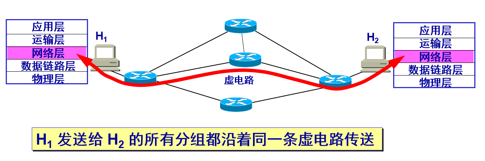
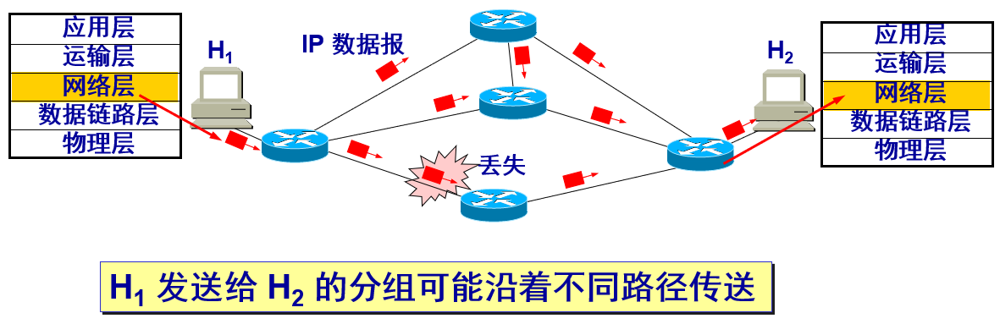
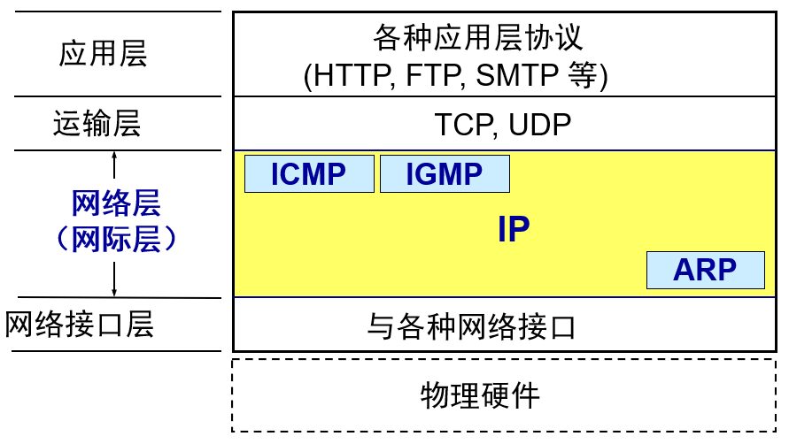
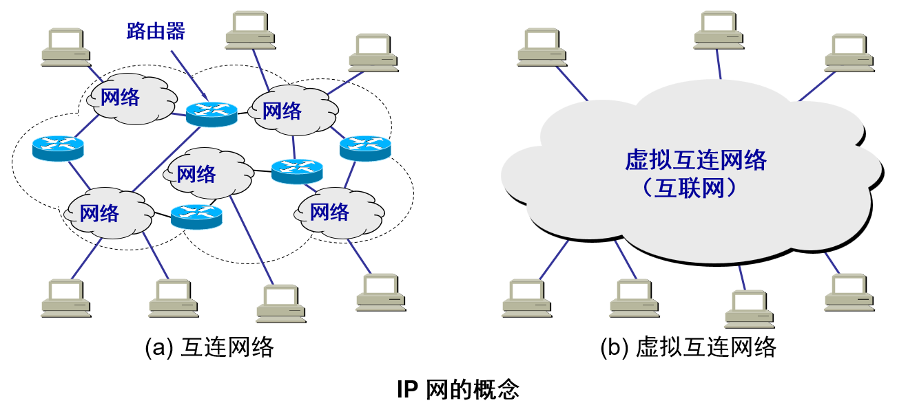
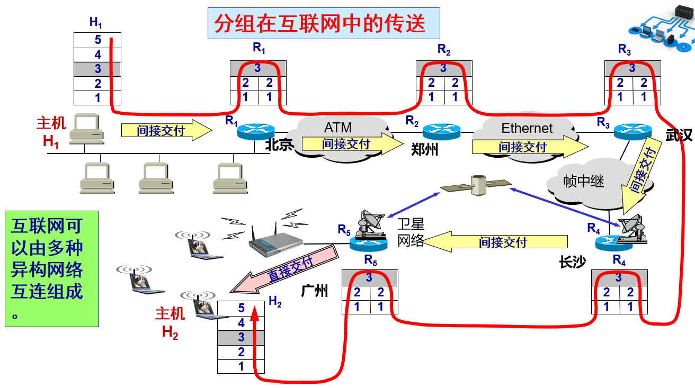
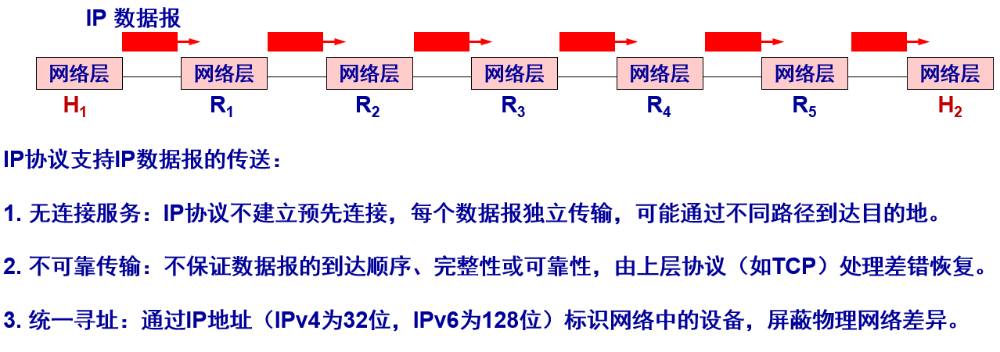
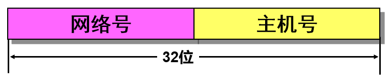
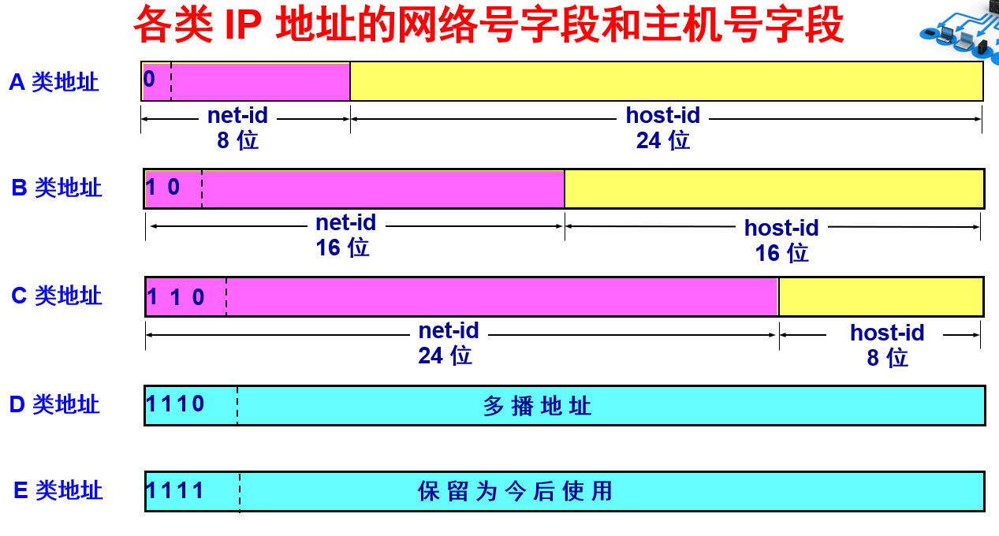
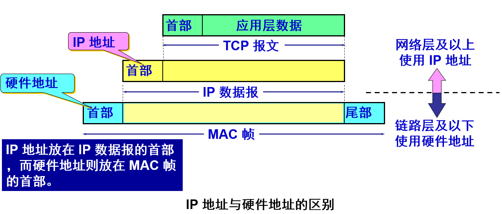

# 4.1 网络层提供的两种服务
- 虚电路服务
	- 通信之前先建立虚电路 (Virtual Circuit)，以保证双方通信所需的一切网络资源
	- 如果再使用可靠传输的网络协议，就可使所发送的分组无差错按序到达终点，不丢失、不重复
	  
	- 虚电路表示这只是一条**逻辑上的连接**，分组都沿着这条逻辑连接按照存储转发方式传送，而**并不是真正建立了一条物理连接**，因此分组交换的虚连接和电路交换的连接只是类似，但并不完全一样
- 数据报服务
	- 网络层向上只提供简单灵活的、无连接的、尽最大努力交付的数据报服务
	- 网络在发送分组时不需要先建立连接。每一个分组（即 IP 数据报）独立发送，与其前后的分组无关（不进行编号） 
	- 网络层不提供服务质量的承诺。即所传送的分组可能出错、丢失、重复和失序（不按序到达终点），当然也不保证分组传送的时限 
	- 由于传输网络不提供端到端的可靠传输服务，这就使网络中的路由器可以做得比较简单，而且价格低廉（与电信网的交换机相比较）
	- 如果主机（即端系统）中的进程之间的通信需要是可靠的，那么就由网络的主机中的运输层负责可靠交付（包括差错处理、流量控制等）
	- 采用这种设计思路的好处是：网络的造价大大降低，运行方式灵活，能够适应多种应用
	  

	- 虚电路服务与数据报服务的对比

| 对比的方面             | 虚电路服务                                         | 数据报服务                                         |
|------------------------|----------------------------------------------------|----------------------------------------------------|
| 思路                   | 可靠通信应当由网络来保证                           | 可靠通信应当由用户主机来保证                       |
| 连接的建立             | 必须有                                             | 不需要                                             |
| 终点地址               | 仅在连接建立阶段使用，每个分组使用短的虚电路号     | 每个分组都有终点的完整地址                         |
| 分组的转发             | 属于同一条虚电路的分组均按照同一路由进行转发       | 每个分组独立选择路由进行转发                       |
| 当结点出故障时         | 所有通过出故障的结点的虚电路均不能工作             | 出故障的结点可能会丢失分组，一些路由可能会发生变化 |
| 分组的顺序             | 总是按发送顺序到达终点                             | 到达终点时不一定按发送顺序                         |
| 端到端的差错处理和流量控制 | 可以由网络负责，也可以由用户主机负责               | 由用户主机负责                                     |

# 4.2 网际协议IP
网际协议 IP 是 TCP/IP 体系中最主要的协议之一。与 IP 协议配套使用的还有三个协议：
- 地址解析协议 ARP(Address Resolution Protocol)
- 网际控制报文协议 ICMP(Internet Control Message Protocol)
- 网际组管理协议 IGMP(Internet Group Management Protocol)
  
## 4.2.1  虚拟互连网络
将网络互连并能够互相通信，会遇到许多问题需要解决，如：不同的寻址方案、不同的最大分组长度、不同的网络接入机制、不同的超时控制、不同的差错恢复方法……
故使用一些中间设备进行互连
- 中间设备又称为中间系统或中继 (relay)系统
- 有以下五种不同的中间设备：
	- 物理层中继系统：集线器 (repeater)
	- 数据链路层中继系统：交换机或桥接器 (bridge)
	- 网络层中继系统：路由器 (router)
	- 网桥和路由器的混合物：桥路器 (brouter)
	- 网络层以上的中继系统：网关 (gateway)
- 当中继系统是转发器或网桥时，一般并不称之为网络互连，因为这仅仅是把一个网络扩大了，而这仍然是一个网络
- 网关由于比较复杂，目前使用得较少
- 网络互连都是指用路由器进行网络互连和路由选择
- 由于历史的原因，许多有关 TCP/IP 的文献将网络层使用的路由器称为网关

虚拟互连网络的意义
- 所谓虚拟互连网络也就是逻辑互连网络，它的意思就是互连起来的各种物理网络的异构性本来是客观存在的，但是我们利用 IP 协议就可以使这些性能各异的网络从用户看起来好像是一个统一的网络
- 使用 IP 协议的虚拟互连网络可简称为 IP 网
- 使用虚拟互连网络的好处是：当互联网上的主机进行通信时，就好像在一个网络上通信一样，而看不见互连的各具体的网络异构细节
- 如果在这种覆盖全球的 IP 网的上层使用 TCP 协议，那么就是现在的互联网 (Internet)
  
- 如果我们只从网络层考虑问题，那么 IP 数据报就可以想象是在网络层中传送
  
## 4.2.2 分类的IP地址
> 在 IP协议中，IP 地址是一个最基本的概念，用于标识网络中的设备 （寻址），屏蔽物理网络差异
### 1. IP 地址及其表示方法
我们把整个因特网看成为一个单一的、抽象的网络，IP 地址就是给每个连接在互联网上的主机（或路由器）的每个接口分配一个在全世界范围是唯一的 32 位的标识符。
（注意IP地址和硬件地址的区别：IP地址随主机或路由器的地理位置会发生变化，硬件地址不会随地理位置变化）
IP 地址现在由**互联网名字和数字分配机构ICANN** (Internet Corporation for Assigned Names and Numbers)进行分配
- IP 地址的编址方法
	- 分类的 IP 地址。这是最基本的编址方法，在 1981 年就通过了相应的标准协议
	- 子网的划分。这是对最基本的编址方法的改进，其标准\[RFC 950] 在 1985 年通过
	- 构成超网。这是比较新的无分类编址方法。1993 年提出后很快就得到推广应用
- 分类 IP 地址
	- 将IP地址划分为若干个固定类，每一类地址都由两个固定长度的字段组成，其中一个字段是网络号 net-id，它标志主机（或路由器）所连接到的网络，而另一个字段则是主机号 host-id，它标志该主机（或路由器）
	- 主机号在它前面的网络号所指明的网络范围内必须是唯一的
	- 由此可见，一个 IP 地址在整个互联网范围内是唯一的
	- 这种两级的 IP 地址结构如下
	  
	- 这种两级的 IP 地址可以记为
	  IP 地址 ::= { <网络号>, <主机号>}
	  `::=  代表“定义为”`
	  
		- A 类地址的网络号字段 net-id 为 1 字节，主机号字段 host-id 为 3 字节
		- B 类地址的网络号字段 net-id 为 2 字节，主机号字段 host-id 为 2 字节
		- C 类地址的网络号字段 net-id 为 3 字节，主机号字段 host-id 为 1 字节
		- D 类地址是多播地址
		- E 类地址保留为今后使用
	- 点分十进制记法
		- 机器中存放的 IP 地址是 32 位二进制代码，每 8 位为一组
		  {10000000}{00001011}{00000011}{00011111}
		- 将每 8 位的二进制数转换为十进制数，采用点分十进制记法，则进一步提高可读性
		  128.11.3.31
			  
| 序号 | 二进制   | 十进制 | 
| ---- | -------- | ------ |
| 1    | 10000000 | 128    |
| 2    | 11000000 | 192    |
| 3    | 11100000 | 224    |
| 4    | 11110000 | 240    |
| 5    | 11111000 | 248    |
| 6    | 11111100 | 252    |
| 7    | 11111110 | 254    |
| 8    | 11111111 | 255    |

对应位权（从高位到低位）：

| 位序 | 7   | 6   | 5   | 4   | 3   | 2   | 1   | 0   |
|------|-----|-----|-----|-----|-----|-----|-----|-----|
| 权值 | 128 | 64  | 32  | 16  | 8   | 4   | 2   | 1   |
### 2. 常用三种类别的IP地址
IP 地址的指派范围（一般全零和全1的网络号和主机号不用来指派）

| 网络类别 | 网络数 | 第 1 个网络号 | 最后一个网络号 | 每个网络中主机数 |
|----------|--------|--------------|------------------|------------------|
| A        | 126 (2⁷–2) | 1.0.0.0      | 126.0.0.0        | 16 777 214 (2²⁴–2) |
| B        | 16 384 (2¹⁴) | 128.0.0.0    | 191.255.0.0      | 65 534 (2¹⁶–2) |
| C        | 2 097 152 (2²¹) | 192.0.0.0    | 223.255.255.0    | 254 (2⁸–2) |
### 3. 一般不使用的特殊的 IP 地址
| 源地址 | 目的地址 | 网络号 | 主机号 | 代表的意思 |
|--------|----------|--------|--------|------------|
| 使用   | 使用     | 0      | 0      | 在本网络上的本主机（见 6.6 节 DHCP 协议） |
| 可以   | 不可     | 0      | host-id | 在本网络上的某台主机 host-id |
| 不可   | 可以     | 全 1   | 全 1   | 只在本网络上进行广播（各路由器均不转发） |
| 不可   | 可以     | net-id | 全 1   | 对 net-id 上的所有主机进行广播 |
| 可以   | 可以     | 127    | 非全 0 或全 1 的任何数 | 用作本地软件环回测试之用 |
### 4. IP地址的特点
1. IP地址是一种分等级的地址结构
2. IP地址是标志一台主机（或路由器）和一条链路的接口。当一台主机同时连接到多个网络中，会拥有多个IP地址，其网络前缀不同
3. 用转发器或交换机连接起来的若干个局域网仍为一个网络
4. 所有分配到网络前缀的网络都是平等的
## 4.2.3 IP地址与硬件地址
IP 地址与硬件地址是不同的地址
从层次的角度看
- 硬件地址（或物理地址）是数据链路层和物理层使用的地址
- IP 地址是网络层和以上各层使用的地址，是一种逻辑地址（称 IP 地址是逻辑地址是因为 IP 地址是用软件实现的）

## 4.2.4 地址解析协议ARP
### 1. 基本定义

- ​**​全称​**​：地址解析协议
    
- ​**​核心任务​**​：根据已知的 ​**​IP 地址​**​ 解析出对应的 ​**​MAC 地址​**​
    
- ​**​所属层次​**​：工作在网络层与数据链路层之间
    

### 2. 为什么需要 ARP？

- 网络设备有两个关键地址：
    
    - ​**​IP 地址​**​（逻辑地址）：用于远程寻址，可变
        
    - ​**​MAC 地址​**​（物理地址）：用于本地网络直接通信，全球唯一
        
    
- 在局域网内，设备间最终通信依赖 MAC 地址，ARP 解决“IP → MAC”的映射问题
    

### 3. 工作流程（广播请求，单播应答）

#### 场景：

设备 A（IP_A, MAC_A）想通信的设备 B（IP_B），但不知 B 的 MAC 地址。

1. ​**​ARP 请求（广播）​**​
    
    - A 广播发送 ARP 请求包，内容包含：
        
        - 发送方 IP_A 和 MAC_A
            
        - 目标 IP_B
            
        - 目标 MAC 地址为 `FF:FF:FF:FF:FF:FF`（广播地址）
            
        
    
2. ​**​ARP 应答（单播）​**​
    
    - 所有设备收到请求，但只有 IP_B 的设备响应
        
    - B 单播回复 ARP 应答包，包含自己的 IP_B 和 MAC_B
        
    
3. ​**​更新 ARP 缓存​**​
    
    - A 收到应答后，将 `IP_B → MAC_B`存入 ​**​ARP 缓存表​**​
        
    - 后续通信直接查表，缓存有过期时间
        
    

### 4. ARP 缓存表

- 临时存储 `IP → MAC`映射关系
    
- 减少重复的 ARP 请求，提升效率
    
- 可通过命令查看（如 `arp -a`）
    
### 5.使用ARP的四种典型情况
- 发送方是主机，要把IP数据报转发到本网络上的另一个主机
	- 运行一次ARP协议
- 发送方是主机
- 发送方是路由器
- 发送方是路由器

## 4.2.5 IP数据报的格式
IP数据报的格式说明协议IP都具有什么功能
### 1. IP数据报首部的固定部分中的各字段
1. 版本：占四位，指协议IP的版本（IPv4、IPv6）
2. 首部长度：占四位，可表示的最大十进制数值是15
3. 区分长度：占八位，用来获得更好的服务，为**区分服务DS**，只有在使用区分长度时才起作用
4. 总长度：首部和数据之和的长度，总长度字段为16位

**最大传输单元MTU**：一个数据帧中数据字段的最大长度

## 4.2.6 IP 层转发分组的流程

# 4.3 IP层转发分组的过程
## 4.3.1 基于终点的转发
> 分组在互联网上传送和转发是基于分组首部中的目的地址的
# 4.4  网际控制报文协议 ICMP
# 4.5  互联网的路由选择协议
# 4.6  IPv6
# 4.7  IP 多播
# 4.8  虚拟专用网 VPN 和网络地址转换 NAT
# 4.9  多协议标记交换 MPLS