# 4.1 网络层提供的两种服务
- 虚电路服务
	- 通信之前先建立虚电路 (Virtual Circuit)，以保证双方通信所需的一切网络资源
	- 如果再使用可靠传输的网络协议，就可使所发送的分组无差错按序到达终点，不丢失、不重复
	  
	- 虚电路表示这只是一条**逻辑上的连接**，分组都沿着这条逻辑连接按照存储转发方式传送，而**并不是真正建立了一条物理连接**，因此分组交换的虚连接和电路交换的连接只是类似，但并不完全一样
- 数据报服务
	- 网络层向上只提供简单灵活的、无连接的、尽最大努力交付的数据报服务
	- 网络在发送分组时不需要先建立连接。每一个分组（即 IP 数据报）独立发送，与其前后的分组无关（不进行编号） 
	- 网络层不提供服务质量的承诺。即所传送的分组可能出错、丢失、重复和失序（不按序到达终点），当然也不保证分组传送的时限 
	- 由于传输网络不提供端到端的可靠传输服务，这就使网络中的路由器可以做得比较简单，而且价格低廉（与电信网的交换机相比较）
	- 如果主机（即端系统）中的进程之间的通信需要是可靠的，那么就由网络的主机中的运输层负责可靠交付（包括差错处理、流量控制等）
	- 采用这种设计思路的好处是：网络的造价大大降低，运行方式灵活，能够适应多种应用
	  

	- 虚电路服务与数据报服务的对比

| 对比的方面             | 虚电路服务                                         | 数据报服务                                         |
|------------------------|----------------------------------------------------|----------------------------------------------------|
| 思路                   | 可靠通信应当由网络来保证                           | 可靠通信应当由用户主机来保证                       |
| 连接的建立             | 必须有                                             | 不需要                                             |
| 终点地址               | 仅在连接建立阶段使用，每个分组使用短的虚电路号     | 每个分组都有终点的完整地址                         |
| 分组的转发             | 属于同一条虚电路的分组均按照同一路由进行转发       | 每个分组独立选择路由进行转发                       |
| 当结点出故障时         | 所有通过出故障的结点的虚电路均不能工作             | 出故障的结点可能会丢失分组，一些路由可能会发生变化 |
| 分组的顺序             | 总是按发送顺序到达终点                             | 到达终点时不一定按发送顺序                         |
| 端到端的差错处理和流量控制 | 可以由网络负责，也可以由用户主机负责               | 由用户主机负责                                     |

# 4.2 网际协议IP
网际协议 IP 是 TCP/IP 体系中最主要的协议之一。与 IP 协议配套使用的还有三个协议：
- 地址解析协议 ARP(Address Resolution Protocol)
- 网际控制报文协议 ICMP(Internet Control Message Protocol)
- 网际组管理协议 IGMP(Internet Group Management Protocol)
  
## 4.2.1  虚拟互连网络
将网络互连并能够互相通信，会遇到许多问题需要解决，如：不同的寻址方案、不同的最大分组长度、不同的网络接入机制、不同的超时控制、不同的差错恢复方法……
故使用一些中间设备进行互连
- 中间设备又称为中间系统或中继 (relay)系统
- 有以下五种不同的中间设备：
	- 物理层中继系统：集线器 (repeater)
	- 数据链路层中继系统：交换机或桥接器 (bridge)
	- 网络层中继系统：路由器 (router)
	- 网桥和路由器的混合物：桥路器 (brouter)
	- 网络层以上的中继系统：网关 (gateway)
- 当中继系统是转发器或网桥时，一般并不称之为网络互连，因为这仅仅是把一个网络扩大了，而这仍然是一个网络
- 网关由于比较复杂，目前使用得较少
- 网络互连都是指用路由器进行网络互连和路由选择
- 由于历史的原因，许多有关 TCP/IP 的文献将网络层使用的路由器称为网关

虚拟互连网络的意义
- 所谓虚拟互连网络也就是逻辑互连网络，它的意思就是互连起来的各种物理网络的异构性本来是客观存在的，但是我们利用 IP 协议就可以使这些性能各异的网络从用户看起来好像是一个统一的网络
- 使用 IP 协议的虚拟互连网络可简称为 IP 网
- 使用虚拟互连网络的好处是：当互联网上的主机进行通信时，就好像在一个网络上通信一样，而看不见互连的各具体的网络异构细节
- 如果在这种覆盖全球的 IP 网的上层使用 TCP 协议，那么就是现在的互联网 (Internet)
  
- 如果我们只从网络层考虑问题，那么 IP 数据报就可以想象是在网络层中传送
  
## 4.2.2 分类的IP地址
> 在 IP协议中，IP 地址是一个最基本的概念，用于标识网络中的设备 （寻址），屏蔽物理网络差异
### 1. IP 地址及其表示方法
我们把整个因特网看成为一个单一的、抽象的网络，IP 地址就是给每个连接在互联网上的主机（或路由器）的每个接口分配一个在全世界范围是唯一的 32 位的标识符。
（注意IP地址和硬件地址的区别：IP地址随主机或路由器的地理位置会发生变化，硬件地址不会随地理位置变化）
IP 地址现在由**互联网名字和数字分配机构ICANN** (Internet Corporation for Assigned Names and Numbers)进行分配
- IP 地址的编址方法
	- 分类的 IP 地址。这是最基本的编址方法，在 1981 年就通过了相应的标准协议
	- 子网的划分。这是对最基本的编址方法的改进，其标准\[RFC 950] 在 1985 年通过
	- 构成超网。这是比较新的无分类编址方法。1993 年提出后很快就得到推广应用
- 分类 IP 地址
	- 将IP地址划分为若干个固定类，每一类地址都由两个固定长度的字段组成，其中一个字段是网络号 net-id，它标志主机（或路由器）所连接到的网络，而另一个字段则是主机号 host-id，它标志该主机（或路由器）
	- 主机号在它前面的网络号所指明的网络范围内必须是唯一的
	- 由此可见，一个 IP 地址在整个互联网范围内是唯一的
	- 这种两级的 IP 地址结构如下
	  
	- 这种两级的 IP 地址可以记为
	  IP 地址 ::= { <网络号>, <主机号>}
	  `::=  代表“定义为”`
	  
		- A 类地址的网络号字段 net-id 为 1 字节，主机号字段 host-id 为 3 字节
		- B 类地址的网络号字段 net-id 为 2 字节，主机号字段 host-id 为 2 字节
		- C 类地址的网络号字段 net-id 为 3 字节，主机号字段 host-id 为 1 字节
		- D 类地址是多播地址
		- E 类地址保留为今后使用
	- 点分十进制记法
		- 机器中存放的 IP 地址是 32 位二进制代码，每 8 位为一组
		  {10000000}{00001011}{00000011}{00011111}
		- 将每 8 位的二进制数转换为十进制数，采用点分十进制记法，则进一步提高可读性
		  128.11.3.31
			  
| 序号 | 二进制   | 十进制 | 
| ---- | -------- | ------ |
| 1    | 10000000 | 128    |
| 2    | 11000000 | 192    |
| 3    | 11100000 | 224    |
| 4    | 11110000 | 240    |
| 5    | 11111000 | 248    |
| 6    | 11111100 | 252    |
| 7    | 11111110 | 254    |
| 8    | 11111111 | 255    |

对应位权（从高位到低位）：

| 位序 | 7   | 6   | 5   | 4   | 3   | 2   | 1   | 0   |
|------|-----|-----|-----|-----|-----|-----|-----|-----|
| 权值 | 128 | 64  | 32  | 16  | 8   | 4   | 2   | 1   |
### 2. 常用三种类别的IP地址
IP 地址的指派范围（一般全零和全1的网络号和主机号不用来指派）

| 网络类别 | 网络数 | 第 1 个网络号 | 最后一个网络号 | 每个网络中主机数 |
|----------|--------|--------------|------------------|------------------|
| A        | 126 (2⁷–2) | 1.0.0.0      | 126.0.0.0        | 16 777 214 (2²⁴–2) |
| B        | 16 384 (2¹⁴) | 128.0.0.0    | 191.255.0.0      | 65 534 (2¹⁶–2) |
| C        | 2 097 152 (2²¹) | 192.0.0.0    | 223.255.255.0    | 254 (2⁸–2) |
### 3. 一般不使用的特殊的 IP 地址
| 源地址 | 目的地址 | 网络号 | 主机号 | 代表的意思 |
|--------|----------|--------|--------|------------|
| 使用   | 使用     | 0      | 0      | 在本网络上的本主机（见 6.6 节 DHCP 协议） |
| 可以   | 不可     | 0      | host-id | 在本网络上的某台主机 host-id |
| 不可   | 可以     | 全 1   | 全 1   | 只在本网络上进行广播（各路由器均不转发） |
| 不可   | 可以     | net-id | 全 1   | 对 net-id 上的所有主机进行广播 |
| 可以   | 可以     | 127    | 非全 0 或全 1 的任何数 | 用作本地软件环回测试之用 |
### 4. IP地址的特点
1. IP地址是一种分等级的地址结构
2. IP地址是标志一台主机（或路由器）和一条链路的接口。当一台主机同时连接到多个网络中，会拥有多个IP地址，其网络前缀不同
3. 用转发器或交换机连接起来的若干个局域网仍为一个网络
4. 所有分配到网络前缀的网络都是平等的
## 4.2.3 IP地址与硬件地址
IP 地址与硬件地址是不同的地址
从层次的角度看
- 硬件地址（或物理地址）是数据链路层和物理层使用的地址
- IP 地址是网络层和以上各层使用的地址，是一种逻辑地址（称 IP 地址是逻辑地址是因为 IP 地址是用软件实现的）

## 4.2.4 地址解析协议ARP
### 基本定义
- ​​全称​​：地址解析协议
- ​​核心任务​​：根据已知的 ​**​IP 地址​**​ 解析出对应的 ​**​MAC 地址​**​
- ​​所属层次​​：工作在网络层与数据链路层之间

### 为什么需要 ARP？

- 网络设备有两个关键地址：
    - ​**​IP 地址​**​（逻辑地址）：用于远程寻址，可变
    - ​**​MAC 地址​**​（物理地址）：用于本地网络直接通信，全球唯一
    
- 在局域网内，设备间最终通信依赖 MAC 地址，ARP 解决“IP → MAC”的映射问题


### 工作流程（广播请求，单播应答）

- ARP请求分组：包含发送方硬件地址 / 发送方 IP 地址 / 目标方硬件地址(未知时填 0) / 目标方 IP 地址
- 本地广播 ARP 请求（路由器不转发ARP请求）
- ARP 响应分组：包含发送方硬件地址 / 发送方 IP地址 / 目标方硬件地址 / 目标方 IP 地址
- ARP 分组封装在物理网络的帧中传输


#### 场景：
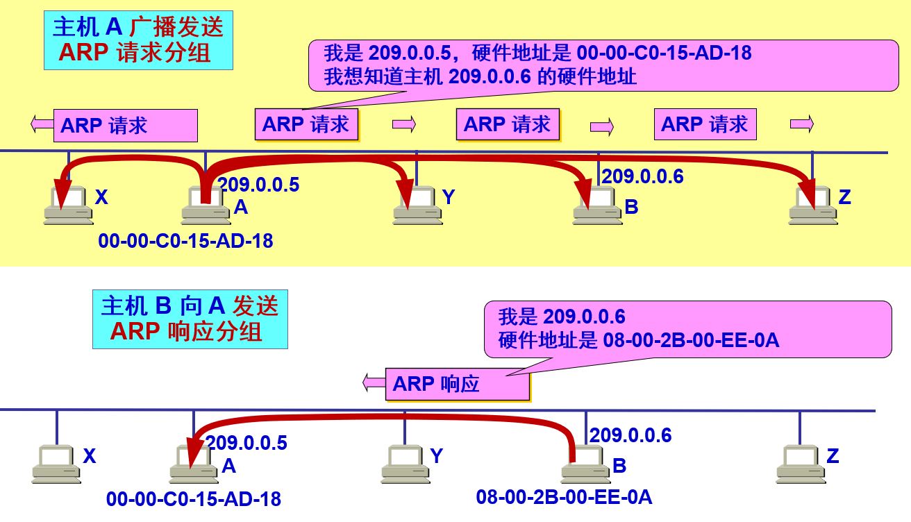

设备 A（IP_A, MAC_A）想通信的设备 B（IP_B），但不知 B 的 MAC 地址。

1. ​**​ARP 请求（广播）​**​
    - A 广播发送 ARP 请求包，内容包含：
        - 发送方 IP_A 和 MAC_A    
        - 目标 IP_B
        - 目标 MAC 地址为 `FF:FF:FF:FF:FF:FF`（广播地址）    
    
2. ​**​ARP 应答（单播）​**​
    
    - 所有设备收到请求，但只有 IP_B 的设备响应
    - B 单播回复 ARP 应答包，包含自己的 IP_B 和 MAC_B
    
3. ​**​更新 ARP 缓存​**​
    
    - A 收到应答后，将 `IP_B → MAC_B`存入 ​**​ARP 缓存表​**​
    - 后续通信直接查表，缓存有过期时间

### ARP 高速缓存的作用

- 存放最近获得的 IP 地址到 MAC 地址的绑定，以减少 ARP 广播的数量
- 为了减少网络上的通信量，主机 A 在发送其 ARP 请求分组时，就将自己的 IP 地址到硬件地址的映射写入 ARP 请求分组
- 为了减少网络上的通信量，主机 A 在发送其 ARP 请求分组时，就将自己的 IP 地址到硬件地址的映射写入 ARP 请求分组
  
### 应当注意的问题
- ARP 是解决同一个局域网上的主机或路由器的 IP 地址和硬件地址的映射问题
- 如果所要找的主机和源主机不在同一个局域网上，那么就要通过 ARP 找到一个位于本局域网上的某个路由器的硬件地址，然后把分组发送给这个路由器，让这个路由器把分组转发给下一个网络。剩下的工作就由下一个网络来做
- 从 IP 地址到硬件地址的解析是**自动进行**的，主机的用户对这种地址解析过程是不知道的
- 只要主机或路由器要和本网络上的另一个已知 IP 地址的主机或路由器进行通信，ARP 协议就会自动地将该 IP 地址解析为链路层所需要的硬件地址
    
### 使用ARP的四种典型情况
- 发送方是主机，要把IP数据报转发到本网络上的另一个主机
	- 这时用 ARP 找到目的主机的硬件地址
	- 运行一次ARP协议
- 发送方是主机，要把 IP 数据报发送到另一个网络上的一个主机
	- 这时用 ARP 找到本网络上的一个路由器的硬件地址。剩下的工作由这个路由器来完成
	- 至少运行两次ARP协议
- 发送方是路由器，要把 IP 数据报转发到本网络上的一个主机
	- 这时用 ARP 找到目的主机的硬件地址
	- 运行一次ARP协议
- 发送方是路由器，要把 IP 数据报转发到另一个网络上的一个主机
	- 这时用 ARP 找到本网络上另一个路由器的硬件地址。剩下的工作由这个路由器来完成
	- 至少运行两次ARP协议
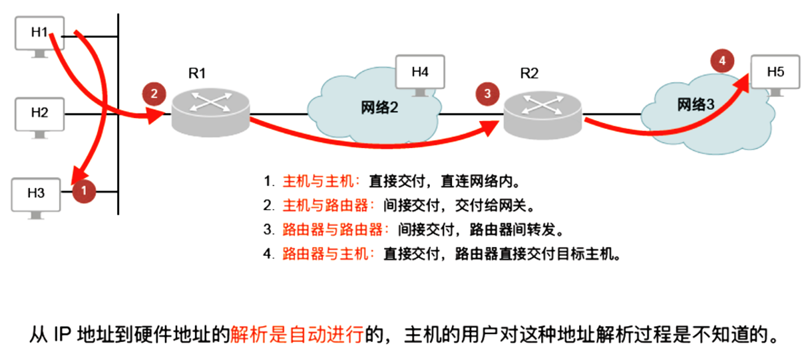
ARP 报文格式：
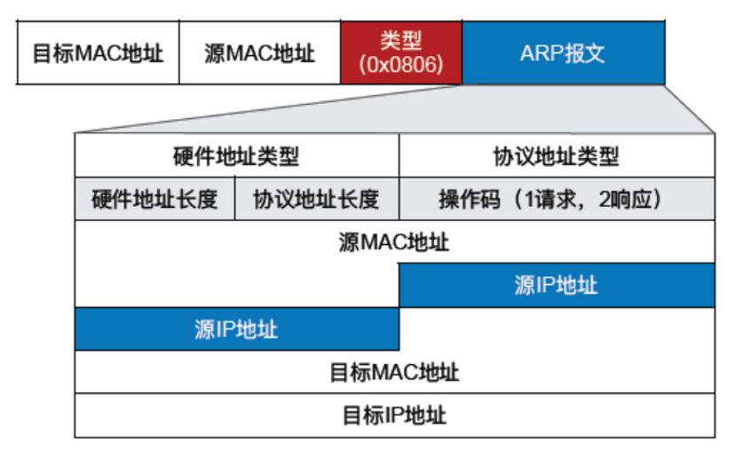

## 4.2.5 IP数据报的格式
- 一个 IP 数据报由**首部**和**数据**两部分组成
- 首部的前一部分是固定长度，共 20 字节，是所有 IP 数据报必须具有的
- 在首部的固定部分的后面是一些可选字段，其长度是可变的
  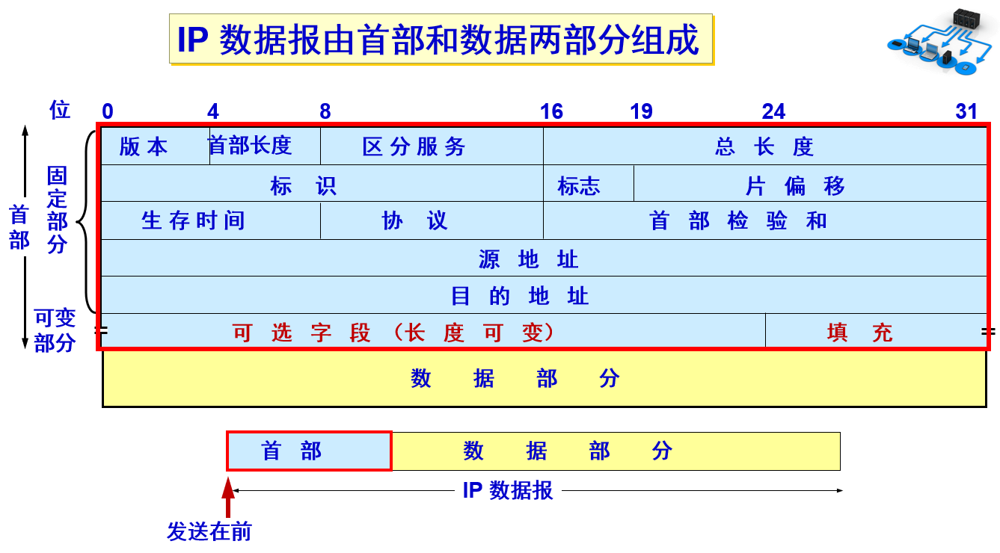
### 1. IP数据报首部的固定部分中的各字段
1. 版本：占四位，指协议IP的版本（IPv4、IPv6）
2. 首部长度：占四位，可表示的最大十进制数值是15(一个单位为 4 字节)，因此 IP 的首部长度的最大值是 60 字节
3. 区分长度：占八位，用来获得更好的服务，为**区分服务DS**，只有在使用区分长度时才起作用，在一般的情况下都**不使用这个字段**
4. 总长度：首部和数据之和的长度，总长度字段为16位，单位为字节，因此数据报的最大长度为 65535 字节
   **总长度必须不超过最大传送单元 MTU**
5. 标识：占 16 位，它是一个计数器，用来产生 **IP 数据报的标识**，当数据报由于长度超过网络的MTU而必须分片时，这个标识字段就复制到所有数据报分片的标识字段中，以便数据包重装。
6. 标志(flag)：占 3 位，目前只有前两位有意义。标志字段的最低位是 MF (More Fragment)。MF = 1 表示后面“还有分片”。MF = 0 表示最后一个分片。标志字段中间的一位是 DF (Don't Fragment) 。只有当 DF = 0 时才允许分片
7. 片偏移：占 13 位，指出：较长的分组在分片后某片在原分组中的相对位置。片偏移以 8 个字节为偏移单位，每个分片的长度一定是8字节的整数倍
8. 生存时间：占 8 位，记为 TTL (Time To Live)，指示数据报在网络中可通过的路由器数的最大值，每经过一个路由器，TTL的值就减1。若TTL变为0，丢弃该数据报
9. 协议：占 8 位，指出此数据报携带的数据使用何种协议，以便目的主机的 IP 层将数据部分交给哪个协议处理
10. 协议：占 8 位，指出此数据报携带的数据使用何种协议，以便目的主机的 IP 层将数据部分交给哪个协议处理
11. 源地址和目的地址都各占 4 字节

**最大传输单元MTU**：一个数据帧中数据字段的最大长度
IP 数据报首部检验和的计算采用 **16 位二进制反码求和算法**：
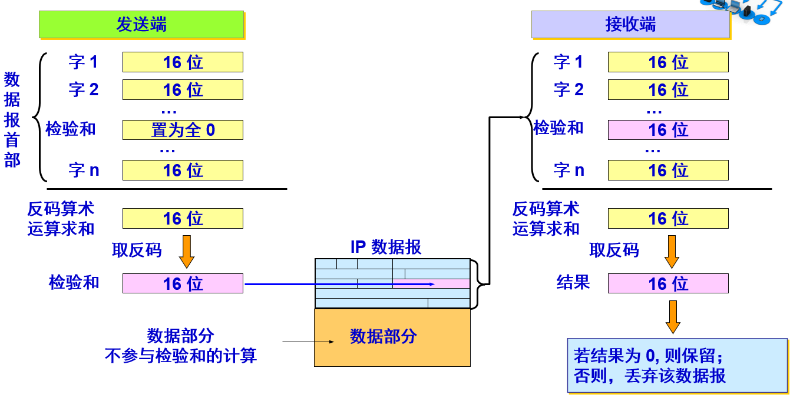
一、算法步骤（RFC 1071 / RFC 791）
1. 把“首部检验和字段”本身先清零。
2. 把首部看成一串 16-bit 大端（big-endian）字：  
    第 1 字 = byte0||byte1，第 2 字 = byte2||byte3 …
3. 逐字做 **16-bit 二进制反码求和（one’s complement sum）**：
    - 用普通二进制加法把字加到一个 16-bit 累加器；
    - 若结果产生第 17 位进位（≥0x10000），则把该进位 **回卷（wrap-around）** 加回低 16 位（即加 1）；
    - 重复直到没有进位。
4. 对最终 16-bit 结果取 **反码（按位取反）**，得到检验和。
5. 发送端把该值填入首部检验和字段；接收端重复 1-3 步，若最终累加器为 0xFFFF（即全 1），则首部无错。
---
二、8-byte 迷你粒子（手工逐位）
假设一个极简“IP 首部”只有 8 byte，内容如下（十六进制，大端）：
`45 00 00 08 00 00 00 00`
step-0 先把“检验和字段”清零 → 把第 7-8 byte 设为 00 00：
`45 00 00 08 00 00 00 00`
step-1 拆成 16-bit 字（大端）
- 字1: 0x4500
- 字2: 0x0008
- 字3: 0x0000 ← 原检验和字段，已清零
- 字4: 0x0000
step-2 反码求和  
累加器初始 = 0x0000
(1) 0x0000 + 0x4500 = 0x4500 （无进位）  
(2) 0x4500 + 0x0008 = 0x4508 （无进位）  
(3) 0x4508 + 0x0000 = 0x4508 （无进位）  
(4) 0x4508 + 0x0000 = 0x4508 （无进位）
step-3 取反码  
最终累加器 = 0x4508  
按位取反 → 0xBAF7
step-4 发送端把 0xBAF7 写回第 7-8 byte，报文变成
`45 00 00 08 00 00 BA F7`

---
三、接收端验证
接收端再把 4 个 16-bit 字相加（此时第 3 字已是 0xBAF7）：
```
0x4500 + 0x0008 + 0xBAF7 + 0x0000
= 0x4508 + 0xBAF7
= 0xFFFF        
（手工：4508 + BA F7 = 1 0000 → 回卷 1 → 0000 + 1 = 1，再与低 16 位结合得 0xFFFF）
```
结果正好是 0xFFFF（反码算术中的“负零”），说明首部无错。

---
四、扩展到真实 20-byte IPv4 首部
1. 把 20 byte 依次两两拼成 10 个 16-bit 大端字；
2. 检验和字段（第 11-12 byte）先清零；
3. 按上述“加→回卷→加→回卷…”跑完 10 个字；
4. 取反 → 得到 2-byte 检验和，填回去即可。
## 4.2.6 IP 层转发分组的流程（路由器查找路由表）

假设：有四个 A 类网络通过三个路由器连接在一起。每一个网络上都可能有成千上万个主机

若**按目的主机号来制作路由表**，每一个路由表就有 4 万个项目，即 4 万行（每一行对应于一台主机），则所得出的路由表就会**过于庞大**

但若**按主机所在的网络地址来制作路由表**，那么每一个路由器中的路由表就只包含 4 个项目（每一行对应于一个网络），这样就可使路由表大大简化

在路由表中，对每一条路由，最主要的是
**（目的网络地址，下一跳地址）**

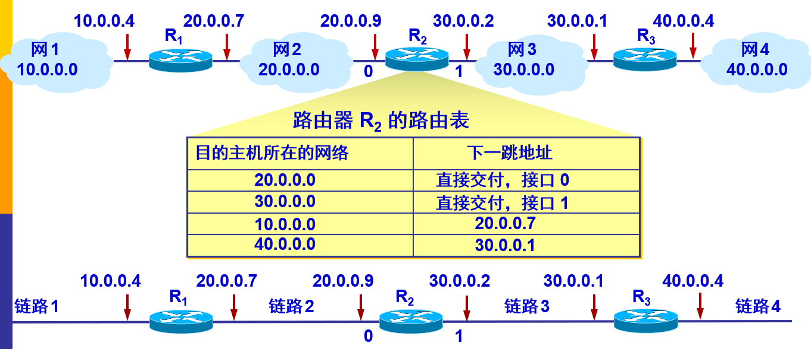

根据目的网络地址就能确定下一跳路由器，这样做的结果是：
- IP 数据报最终一定可以找到目的主机所在目的网络上的路由器（可能要通过多次的间接交付）
- 只有到达最后一个路由器时，才试图向目的主机进行直接交付

特定主机路由：
- 虽然互联网所有的分组转发都是基于目的主机所在的网络，但在大多数情况下都允许有这样的特例，即为特定的目的主机指明一个路由
- 采用特定主机路由可使网络管理人员能更方便地控制网络和测试网络，同时也可在需要考虑某种安全问题时采用这种特定主机路由

默认路由 (default route)：
- 路由器还可采用默认路由以减少路由表所占用的空间和搜索路由表所用的时间
- 这种转发方式在一个网络只有很少的对外连接时是很有用的
- 默认路由在主机发送 IP 数据报时往往更能显示出它的好处
- 如果一个主机连接在一个小网络上，而这个网络只用一个路由器和互联网连接，那么在这种情况下使用默认路由是非常合适的
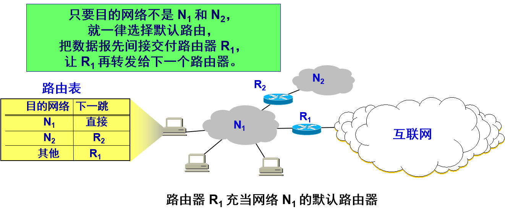
> IP 数据报的首部中没有地方可以用来指明“下一跳路由器的 IP 地址”，当路由器收到待转发的数据报，不是将下一跳路由器的 IP 地址填入 IP 数据报，而是送交下层的网络接口软件
> 网络接口软件使用 ARP 负责将下一跳路由器的 IP 地址转换成硬件地址，并将此硬件地址放在链路层的 MAC 帧的首部，然后根据这个硬件地址找到下一跳路由器

### 路由器分组转发算法

1. 从数据报的首部提取**目的主机的 IP 地址 D**, 得出**目的网络地址为 N**
2. 若网络 N 与此路由器直接相连，则把数据报**直接交付**目的主机 D；否则是**间接交付**，执行(3)
3. 若路由表中有目的地址为 D 的**特定主机路由**，则把数据报传送给路由表中所指明的下一跳路由器；否则，执行(4)
4. 若路由表中有**到达网络 N 的路由**，则把数据报传送给路由表指明的下一跳路由器；否则，执行(5)
5. 若路由表中有一个**默认路由**，则把数据报传送给路由表中所指明的默认路由器；否则，执行(6)
6. 报告转发分组出错

关于路由表：
- 路由表没有给分组指明到某个网络的完整路径
- 路由表指出，到某个网络应当先到某个路由器（即下一跳路由器）
- 在到达下一跳路由器后，再继续查找其路由表，知道再下一步应当到哪一个路由器
- 这样一步一步地查找下去，直到最后到达目的网络
# 4.3 划分子网和构造超网
## 4.3.1 划分子网
### 从两级 IP 地址到三级 IP 地址

在 ARPANET 的早期，IP 地址的设计确实不够合理
- IP 地址空间的利用率有时很低
- 给每一个物理网络分配一个网络号会使路由表变得太大因而使网络性能变坏
- 两级的 IP 地址不够灵活
从 1985 年起在 IP 地址中又增加了一个“**子网号字段**”，使两级的 IP 地址变成为**三级的 IP 地址**，这种做法叫作**划分子网 (subnetting)**

### 划分子网的基本思路

从主机号**借用**若干个位作为**子网号** subnet-id，而主机号 host-id 也就相应减少了若干个位
IP地址 ::= {<网络号>, <子网号>, <主机号>}


凡是从其他网络发送给本单位某个主机的 IP 数据报，仍然是根据 IP 数据报的**目的网络号 net-id**，先找到连接在**本单位网络上的路由器**，然后**此路由器**在收到 IP 数据报后，再按**目的网络号** net-id 和**子网号** subnet-id 找到目的子网，最后就将 IP 数据报直接交付目的主机

划分为三个子网后对外仍是一个网络
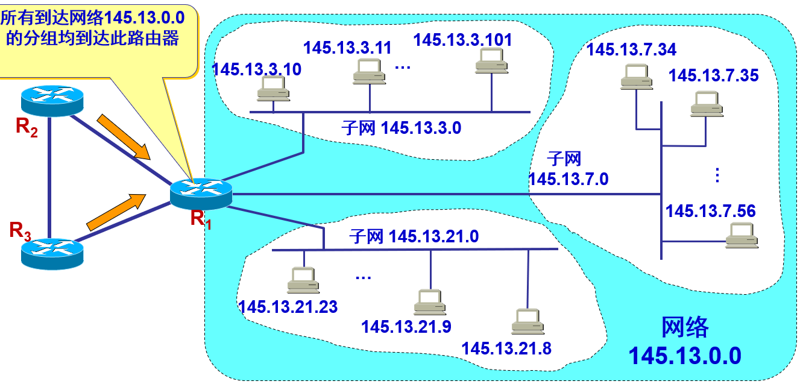

### 子网掩码
从一个 IP 数据报的首部并**无法判断**源主机或目的主机所连接的网络是否进行了子网划分，使用**子网掩码**(subnet mask)可以找出 IP 地址中的子网部分
规则：
- 子网掩码长度＝32位
- **某位＝1**：IP地址中的对应位为网络号和子网号
- **某位＝0**：IP地址中的对应位为主机号
- “1”必须要连续，“1”的前面不能有“0”。例如：
  地址 176.0.0.0，对应的二进制：10110000.00000000.00000000.00000000（“1”不连续）
  地址96.0.0.0对应的二进制：01100000.00000000.00000000.00000000（“1”前面有0）
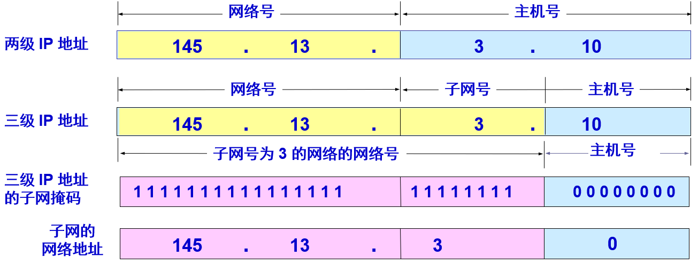
`(IP 地址) && (子网掩码) =网络地址(逐位进行 AND 运算)`
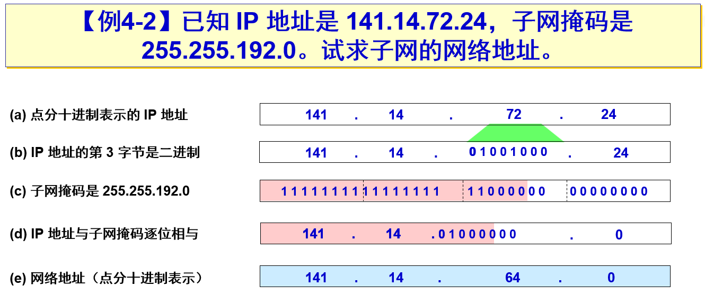
### 子网划分方法
- 有固定长度子网和变长子网两种子网划分方法
- 在采用固定长度子网时，所划分的所有子网的子网掩码都是相同的。
- 划分子网增加了灵活性，但却减少了能够连接在网络上的主机总数
  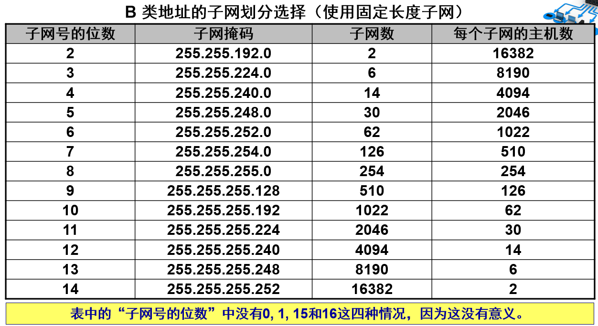
## 4.3.2 使用子网时分组的转发
带有子网掩码的路由表

| 目的网络地址        | 子网掩码            | 下一跳  |
| ------------- | --------------- | ---- |
| 128.30.33.0   | 255.255.255.128 | 接口 0 |
| 128.30.33.128 | 255.255.255.128 | 接口 1 |
| 128.30.36.0   | 255.255.255.0   | $R_{2}$   |
### 划分子网情况下路由器转发分组的算法
1. 从收到的分组的首部提取**目的 IP 地址 D**。
2. 先用各网络的**子网掩码和 D 逐位相“与”**，看是否和相应的网络地址匹配。  
	   - 若匹配，则将分组直接交付。  
	   - 否则就是间接交付，执行步骤 3。  
3. 若路由表中有目的地址为 D 的**特定主机路由**，则将分组传送给指明的下一跳路由器；否则，执行步骤 4。  
4. 对路由表中的每一行，**将子网掩码和 D 逐位相“与”**。若结果与该行的目的网络地址匹配，则将分组传送给该行指明的下一跳路由器；否则，执行步骤 5。  
5. 若路由表中有一个**默认路由**，则将分组传送给路由表中所指明的默认路由器；否则，执行步骤 6。  
6. 报告转发分组出错。

| 目的网络          | 子网掩码            | 下一跳   |
| ------------- | --------------- | ----- |
| 128.96.39.0   | 255.255.255.128 | 接口 m0 |
| 128.96.39.128 | 255.255.255.128 | 接口 m1 |
| 128.96.40.0   | 255.255.255.128 | 接口 R2 |
| 192.4.153.0   | 255.255.255.192 | 接口 R3 |
| 默认            | —               | 接口 R4 |
若收到分组的IP地址是128.96.39.10，计算下一跳？
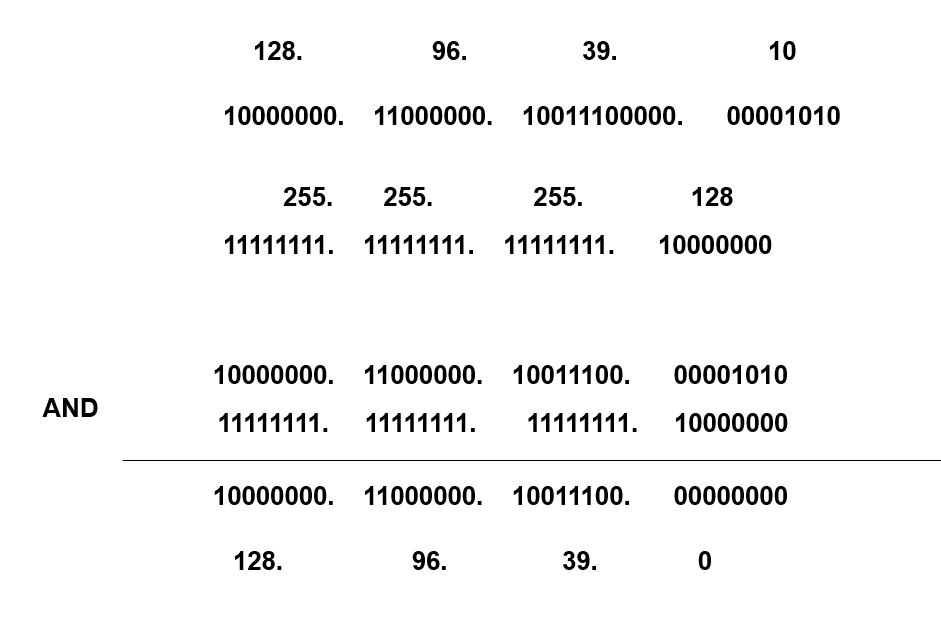
## 4.3.3 无分类编址 CIDR（构造超网）
### 网络前缀
划分子网在一定程度上缓解了互联网在发展中遇到的困难。然而在 1992 年互联网仍然面临三个必须尽早解决的问题
- B 类地址在 1992 年已分配了近一半，眼看就要在 1994 年 3 月全部分配完毕
- 互联网主干网上的路由表中的项目数急剧增长（从几千个增长到几万个）
- 整个 IPv4 的地址空间最终将全部耗尽

使用变长子网掩码 VLSM (Variable Length Subnet Mask)可进一步提高 IP 地址资源的利用率，在 VLSM 的基础上又进一步研究出无分类编址方法，它的正式名字是**无分类域间路由选择 CIDR (Classless Inter-Domain Routing)** 

CIDR 消除了传统的 A 类、B 类和 C 类地址以及划分子网的概念，可以根据需要划分IP地址，因而可以更加有效地分配 IPv4 的地址空间
CIDR使用各种长度的“**网络前缀**”(network-prefix)来代替分类地址中的网络号和子网号，IP 地址从三级编址（使用子网掩码）又回到了两级编址

### 无分类的两级编址
无分类的两级编址的记法是
IP地址 ::= {<网络前缀>, <主机号>}

CIDR 使用“**斜线记法**”(slash notation)，它又称为 **CIDR 记法**，即在 IP 地址后面加上一个斜线“/”，然后写上网络前缀所占的位数。例如： 220.78.168.0**/24**

CIDR 把网络前缀都相同的连续的 IP 地址组成“CIDR 地址块”
128.14.32.0/20 表示的地址块共有 $2^{12}$ 个地址（因为斜线后面的 20 是网络前缀的位数，所以这个地址的主机号是 12 位）
- 这个地址块的起始地址是 128.14.32.0
- 在不需要指出地址块的起始地址时，也可将这样的地址块简称为“/20 地址块”
- 128.14.32.0/20 地址块的最小地址：128.14.32.0
- 128.14.32.0/20 地址块的最大地址：128.14.47.255
- 全 0 和全 1 的主机号地址一般不使用。
  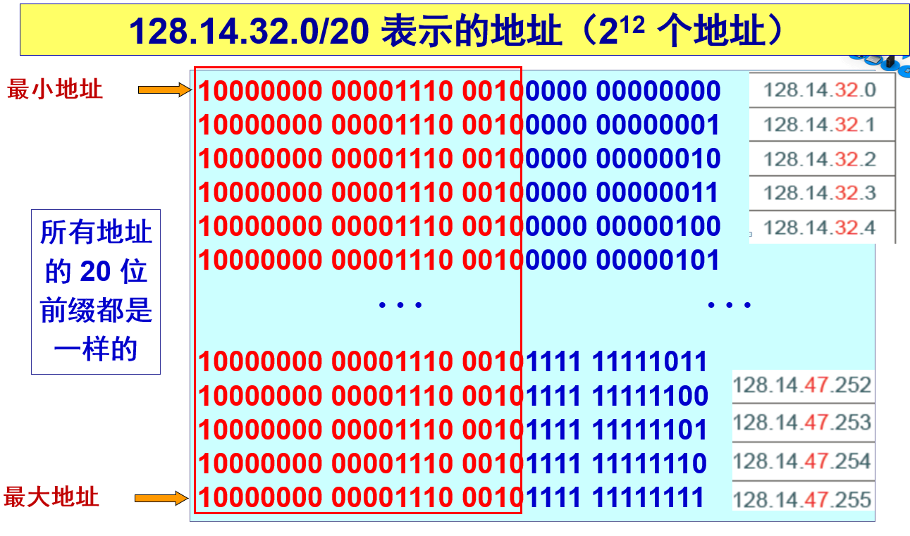
  
### 路由聚合 (route aggregation)
- 一个 CIDR 地址块可以表示很多地址，这种地址的聚合常称为**路由聚合**，它使得路由表中的一个项目可以表示很多个（例如上千个）原来传统分类地址的路由
- 路由聚合有利于**减少路由器之间的路由选择信息的交换，从而提高了整个互联网的性能**
- 路由聚合也称为**构成超网 (supernetting)**
- CIDR 虽然不使用子网了，但仍然使用“**掩码**”这一名词（但不叫子网掩码）
- 对于 /20  地址块，它的掩码是 20 个连续的 1。斜线记法中的数字就是掩码中1的个数

CIDR 记法的其他形式：
- 10.0.0.0/10 可简写为 10/10，也就是把点分十进制中低位连续的 0 省略
- 10.0.0.0/10 隐含地指出 IP 地址 10.0.0.0 的掩码是 255.192.0.0。此掩码可表示为
  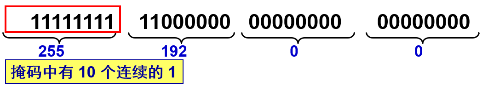
- 网络前缀的后面加一个**星号** \* 的表示方法，如 00001010 00*，在星号 \* 之前是网络前缀，而星号 \* 表示 IP 地址中的主机号，可以是任意值
  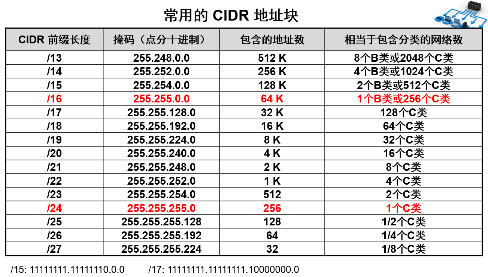
  
### 构成超网
前缀长度不超过 23 位的 CIDR 地址块都包含了多个 C  类地址，这些 C 类地址合起来就构成了超网

CIDR 地址块中的地址数一定是 2 的整数次幂，网络前缀越短，其地址块所包含的地址数就越多

CIDR 的一个好处是：可以更加有效地分配 IPv4 的地址空间，可根据客户的需要分配适当大小的 CIDR 地址块
- 前缀 n = 32：32 位 IP 地址全部属于前缀，主机号长度为 0，此时整个地址块只含单一地址，用于**主机路由**。  
- 前缀 n = 31：地址块仅含两个连续 IP，主机号分别为 0 和 1，典型场景是**点对点链路**。  
- 前缀 n = 0 且 IP 地址为全 0（即 0.0.0.0/0）：表示**默认路由**，匹配任意目的地址。

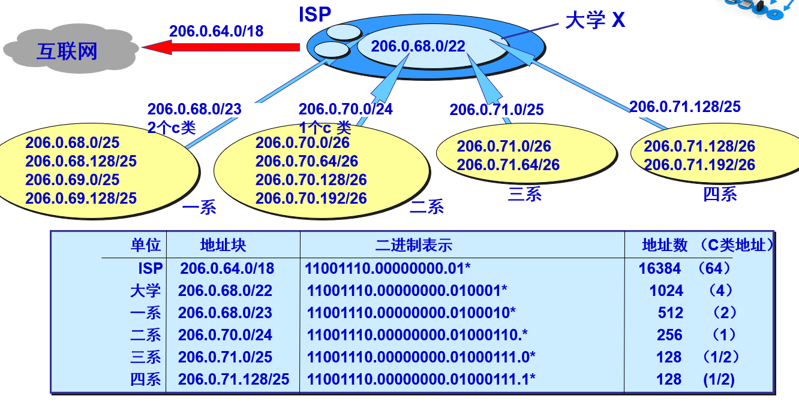
> 这个 ISP 共有 64 个 C 类网络。如果不采用 CIDR 技术，则在与该 ISP 的路由器交换路由信息的每一个路由器的路由表中，就需要有 64 个项目。但采用地址聚合后，只需用路由聚合后的 1 个项目 206.0.64.0/18 就能找到该 ISP；
> 同样，这个大学共有4个系，在ISP内的路由器的路由表中，也需使用206.0.68.0/22这个项目，当数据报由ISP传递到大学的地址，大学再进一步传递数据报到各个系；
> 另外，四个系的路由聚合为大学的一个路由，是将网络前缀缩短。

### 最长前缀匹配
- 使用 CIDR 时，路由表中的每个项目由“网络前缀”和“下一跳地址”组成。在查找路由表时可能会得到不止一个匹配结果
- 应当从匹配结果中选择具有最长网络前缀的路由：**最长前缀匹配 (longest-prefix matching)**
- 网络前缀越长，其地址块就越小，因而路由就越具体 (more specific)
- 最长前缀匹配又称为**最长匹配**或**最佳匹配**

选择两个匹配的地址中更具体的一个，**即选择最长前缀的地址**
例：
路由表  
• 192.168.0.0/24 → A  
• 192.168.0.0/28 → B  

目的地址 192.168.0.5  
最长前缀匹配结果：**B**

# 4.4  网际控制报文协议 ICMP
- 为了更有效地转发 IP 数据报和提高交付成功的机会，在网际层使用了网际控制报文协议 ICMP (Internet Control Message Protocol)
- ICMP 是互联网的标准协议，**允许主机或路由器报告差错情况和提供有关异常情况的报告**
- ICMP 报文封装在 IP 数据报中，作为其中的数据部分，再加上首部，组成 IP数据报发送出去，**是网络层的协议**
- ICMP 分担 IP 的一部分功能：
	 - **差错报告**：目的不可达、源站抑制、超时、参数问题、重定向
	 - **查询**：回送请求 / 应答、地址掩码请求 / 应答、时间戳请求 / 应答
	   
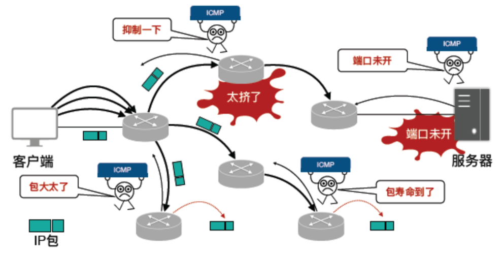

ICMP 报文的格式：

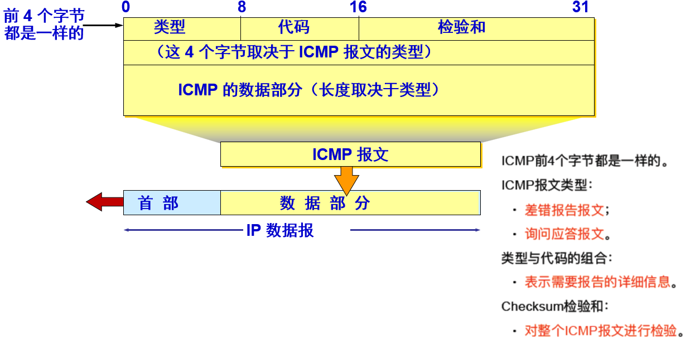
## 4.4.1 ICMP 报文的种类
ICMP 报文的种类有两种，即 **ICMP 差错报告报文**和 **ICMP 询问报文**。ICMP 报文的前 4 个字节是统一的格式，共有三个字段：即**类型**、**代码**和**检验和**。接着的 4 个字节的内容与 ICMP 的类型有关
ICMP 差错报告报文共有 4 种
- 终点不可达
- 时间超过
- 参数问题
- 改变路由（重定向）(Redirect)
  
- 不应发送 ICMP 差错报告报文的几种情况：
	- 对 ICMP 差错报告报文不再发送 ICMP 差错报告报文
	- 对第一个分片的数据报片的所有后续数据报片都不发送 ICMP 差错报告报文
	- 对具有多播地址的数据报都不发送 ICMP 差错报告报文
	- 对具有特殊地址（如127.0.0.0 或 0.0.0.0）的数据报不发送 ICMP 差错报告报文
	  
ICMP 询问报文有两种：
- 回送请求和回答报文：ICMP回送请求报文是由主机或路由器向一个特定的目的主机发出询问。收到此报文的主机必须给源主机或路由器发送ICMP回送回答报文。这种询问报文用来测试目的站是否可达以及了解其状态
	- 请求：type = 8，code = 0
	- 回答：type = 0，code = 0
- 时间戳请求和回答报文：ICMP时间戳请求报文是请某台主机或路由器回答当前的日期和时间。可用于时钟同步和时间测量
	- 请求：type = 13，code = 0
	- 回答：type = 14，code = 0
## 4.4.2 ICMP 的应用举例：回送请求和回答报文
### PING (Packet InterNet Groper)
- PING 用来测试两个主机之间的连通性
- PING 使用了 ICMP 回送请求与回送回答报文
- PING 是**应用层直接使用网络层** ICMP 的例子，它没有通过运输层的 TCP 或UDP
- Traceroute 的应用举例：
	- 在 Windows 操作系统中这个命令是 tracert，用来跟踪一个分组从源点到终点的路径
	- 它利用 IP 数据报中的 TTL 字段和 ICMP 时间超过差错报告报文实现对从源点到终点的路径的跟踪
# 4.5  互联网的路由选择协议
## 4.5.1 有关路由选择协议的几个基本概念
### 理想的路由算法

- 算法必须是**正确的和完整的**
- 算法在计算上应**简单**
- 算法应能适应通信量和网络拓扑的变化，要有**自适应性**
- 算法应具有**稳定性**
- 算法应是**公平的**
- 算法应是**最佳的**
- 
不存在一种绝对的最佳路由算法，实际的路由选择算法，应尽可能接近于理想的算法

### 分层次的路由选择协议
互联网采用**分层次路由选择协议**的原因：
1. **规模巨大**——全网路由器若都维护完整拓扑，路由表过大、交换量过高，会耗尽处理能力与链路带宽。  
2. **隐私与安全**——各单位希望隐藏内部网络结构与私有路由策略，同时仍能接入互联网。

### 自治系统 AS(Autonomous System)
自治系统 AS 的定义：在单一的技术管理下的一组路由器，而这些路由器使用一种 AS 内部的路由选择协议和共同的度量以确定分组在该 AS 内的路由，同时还使用一种 AS 之间的路由选择协议用以确定分组在 AS之间的路由

两大类路由选择协议：
- 内部网关协议 IGP（Interior Gateway Protocol）  
	- 作用范围：单个自治系统（AS）内部  
	- 典型协议：RIP、OSPF、IS-IS、EIGRP  
- 外部网关协议 EGP（External Gateway Protocol）  
	- 作用范围：自治系统之间（AS 边界）  
	- 典型协议：BGP-4（当前唯一大规模使用的 EGP）

自治系统之间的路由选择也叫作**域间路由选择 (interdomain routing)**，在自治系统内部的路由选择叫作**域内路由选择 (intradomain routing)**

## 4.5.2 内部网关协议 RIP
一、基本定位
- 分布式、距离向量型 IGP，最早被广泛使用的路由协议。
- 仅适合小型网络：直径 ≤ 15 跳，16 跳视为不可达。
---
二、“距离”定义
- 直连网络：距离 = 1
- 非直连：每经一台路由器 +1，记作“跳数(hop count)” 
- 选路原则：跳数最少即最优，忽略带宽、时延等其他因素。
---
三、协议三要素
1. 跟谁交换：仅相邻路由器
2. 交换内容：本路由器当前完整路由表（目的网络/掩码/距离/下一跳）
3. 交换时机：
    - 周期更新：固定 30 s 发送一次 RIP 响应报文  
    - 触发更新：拓扑变化时立即通告
---
四、路由表建立与收敛
- 初始：只知直连网络（距离=1），路由表其余为空
- 经过若干轮相邻更新，所有路由器最终获得到达 AS 内任一网的最短距离和下一跳
- 收敛速度：好消息传得快，坏消息传得慢（“计数到无穷”问题）
---
五、距离向量算法（Bellman-Ford 简化版）  
收到相邻路由器 X 的 RIP 报文后：
1. 修改报文项目：
    - 下一跳统一改为 X 
    - 距离全部 +1 
2. 对每条修改后项目：
    - 目的网络不在表中 → 直接添加
    - 已存在且原下一跳就是 X → 用新项目替换（保持最新）
    - 已存在但下一跳不同 → 仅当新距离更小时更新
3. 超时处理：180 s（3 分钟）未收到某邻居更新，则将其距离置 16（不可达）
4. 返回
---
六、RIP2 报文格式要点
- 应用层协议，UDP 端口 520
- 报文结构：4 B 首部 + 路由项（20 B/条，最多 25 条）  
    每条含：地址族、路由标记、网络地址、子网掩码、下一跳地址、距离(1-16)
- 一次报文最大长度：4 + 20×25 = 504 B
---
七、优缺点  
优点  
└ 实现简单、配置容易、开销小
缺点
1. 最大15跳，规模受限
2. 周期发送完整路由表，网络越大带宽浪费越严重
3. 慢收敛：坏消息需“计数到16”才能全网确认，易出现路由环路/计数到无穷
4. 仅支持等代价负载均衡，无法根据链路质量灵活选路
## 4.5.3 内部网关协议 OSPF
开放最短路径优先 OSPF (Open Shortest Path First)是为克服 RIP 的缺点在1989年开发出来的。OSPF 的原理很简单，但实现起来却较复杂

### OSPF 协议的基本特点

- “开放”表明 OSPF 协议不是受某一家厂商控制，是公开发表的
- “最短路径优先”是因为使用了 Dijkstra（迪杰斯特拉） 提出的最短路径算法 SPF
- 采用分布式的链路状态协议 (link state protocol)
- 和谁交换信息：使用洪泛法向本自治系统中所有路由器发送信息
- 交换什么信息：发送的信息就是与本路由器相邻的所有路由器的链路状态，但这只是本路由器所知道的部分信息
	- “链路状态”就是说明本路由器都和哪些路由器相邻，以及该链路的“度量”(metric)：费用，距离，时延，带宽等
- 何时交换信息：只有当链路状态发生变化时，路由器才用洪泛法向所有路由器发送此信息

#### 链路状态数据库 (link-state database)
- 由于各路由器之间频繁地交换链路状态信息，因此所有的路由器最终都能建立一个链路状态数据库
- 这个数据库实际上就是全网的拓扑结构图，它在全网范围内是一致的（这称为链路状态数据库的同步）
- OSPF 的链路状态数据库能较快地进行更新，使各个路由器能及时更新其路由表

#### 区域
- 为了使 OSPF 能够用于规模很大的网络，OSPF 将一个自治系统再划分为若干个更小的范围，叫作区域
- 每一个区域都有一个 32 位的区域标识符（用点分十进制表示）
- 区域也不能太大，在一个区域内的路由器最好不超过 200 个
  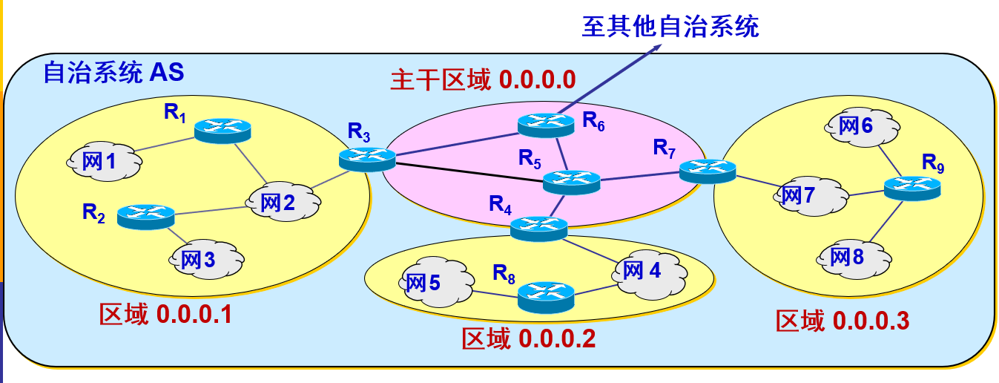
- 划分区域
	- 划分区域的好处就是将利用洪泛法交换链路状态信息的范围局限于每一个区域而不是整个的自治系统，这就减少了整个网络上的通信量
	- 在一个区域内部的路由器只知道本区域的完整网络拓扑，而不知道其他区域的网络拓扑的情况
	- OSPF 使用层次结构的区域划分。在上层的区域叫作主干区域 (backbone area)
	- 主干区域的标识符规定为0.0.0.0。主干区域的作用是用来连通其他在下层的区域

#### 传送
- OSPF 不用 UDP 而是直接用 IP 数据报传送
- OSPF 构成的数据报很短。这样做可减少路由信息的通信量
- 数据报很短的另一好处是可以不必将长的数据报分片传送
- 但分片传送的数据报只要丢失一个，就无法组装成原来的数据报，而整个数据报就必须重传
  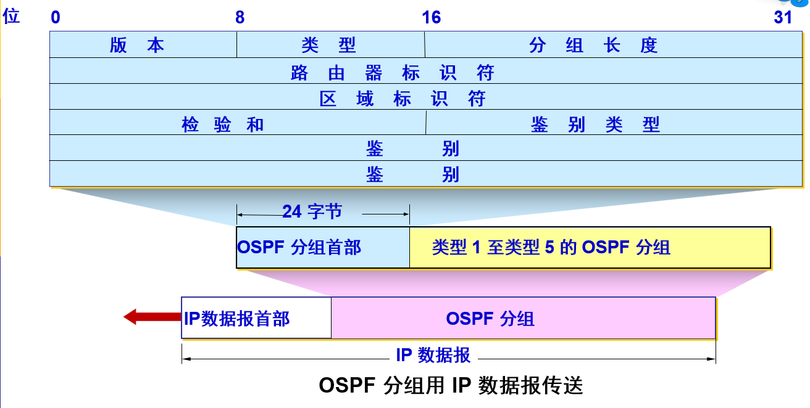
  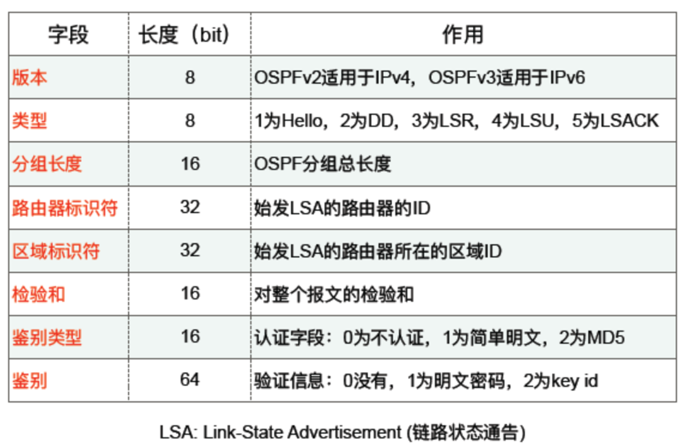
### OSPF 的五种分组类型
| 类型 | 含义 | 作用 |
|----|----|----|
| 1 Hello | 问候 | 发现邻居；设置参数：metric、mask、area-id、Router-ID 等；维持邻居关系 |
| 2 DBD | 数据库描述 | 向邻居发送链路状态摘要信息 |
| 3 LSR | 链路状态请求 | 向邻居请求自己没有的链路状态信息 |
| 4 LSU | 链路状态更新 | 用洪泛法对全网更新链路状态 |
| 5 LSAck | 链路状态确认 | 向发送更新的路由器进行确认 |

注：路由器使用 Dijkstra 算法，依据自己的链路状态数据库计算到其他节点的最短路径。

OSPF 还规定每隔一段时间，如 30 分钟，要刷新一次数据库中的链路状态

由于一个路由器的链路状态只涉及到与相邻路由器的连通状态，因而与整个互联网的规模并无直接关系。**因此当互联网规模很大时，OSPF  协议要比距离向量协议 RIP 好得多**

**OSPF 没有“坏消息传播得慢”的问题**，据统计，其响应网络变化的时间小于 100 ms。
## 4.5.4 外部网关协议 BGP

BGP 是不同自治系统的路由器之间交换路由信息的协议。较新版本是 2006 年 1 月发表的 BGP-4（BGP 第 4 个版本），即 RFC 4271 ~ 4278。可以将 BGP-4 简写为 BGP。

### 使用环境
- 互联网的规模太大，使得自治系统之间路由选择非常困难。对于自治系统之间的路由选择，要寻找最佳路由是很不现实的
	- 当一条路径通过几个不同 AS 时，要想对这样的路径计算出有意义的代价是不太可能的
	- 比较合理的做法是在 AS 之间交换“可达性”信息
- 因此，边界网关协议 BGP 只能是力求寻找一条能够到达目的网络且比较好的路由（不能兜圈子），而并非要寻找一条最佳路由
### 发言人
- 每一个自治系统的管理员要选择至少一个路由器作为该自治系统的“ BGP 发言人” (BGP speaker)
- 一般说来，两个 BGP 发言人都是通过一个共享网络连接在一起的，而 BGP 发言人往往就是 BGP 边界路由器
### 交换路由信息
- 一个 BGP 发言人与其他自治系统中的 BGP 发言人要交换路由信息，就要先建立 TCP 连接，然后在此连接上交换 BGP 报文以建立 BGP 会话(session)，利用 BGP 会话交换路由信息
- 使用 TCP 连接能提供可靠的服务，也简化了路由选择协议
- 使用 TCP 连接交换路由信息的两个 BGP 发言人，彼此成为对方的邻站(neighbor)或对等站(peer)
BGP 发言人和自治系统 AS 的关系：
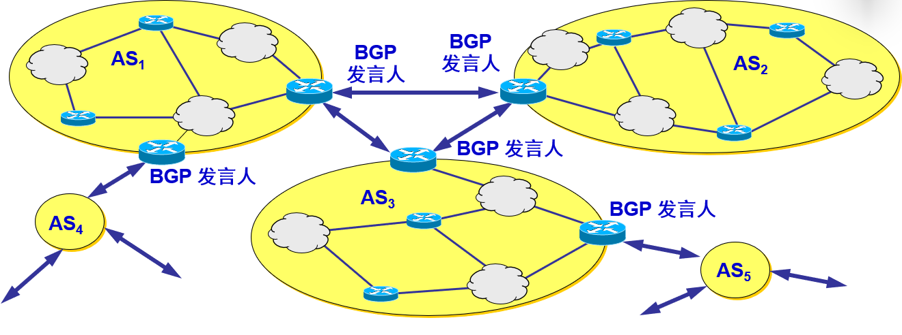
### AS 的连通图
BGP 所交换的网络可达性的信息就是要到达某个网络所要经过的一系列 AS。当 BGP 发言人互相交换了网络可达性的信息后，各 BGP 发言人就根据所采用的策略从收到的路由信息中找出到达各 AS 的较好路由
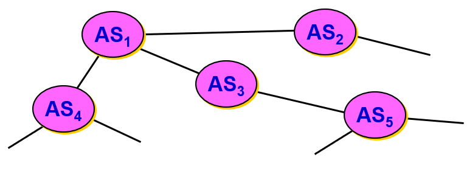
### BGP 发言人交换路径向量
1. 建立 TCP 连接  
   相邻发言人先建立可靠 TCP 会话（端口 179）。
2. 交换 OPEN 报文  
   协商版本、AS 号、保持时间等参数，确认邻居关系。
3. 初始同步  
   发送完整的 UPDATE 报文，把本端所有可达网络连同“路径向量”（AS-Path、Next-Hop、Local-Pref 等属性）一次性通告给邻居。
4. 增量更新  
   之后仅在网络可达性变化时发送增量 UPDATE：  
	   - 新增前缀：携带新 AS-Path 属性  
	   - 撤销前缀：发送 Withdrawn Routes 列表
5. 环路检测  
   接收方检查 AS-Path；若已含本 AS 号，则丢弃该前缀，避免环路。
6. 保存与转发  
   接收方把有效前缀写入本地 BGP 表，再根据自己策略把更新继续通告给下游对等体，形成逐跳扩散的路径向量。
7. 保活与保活应答  
   周期性发送 KEEPALIVE 报文维持会话；无更新时仅发 KEEPALIVE。
8. 错误处理  
   检测到格式或状态错误时发送 NOTIFICATION 报文，立即关闭连接。

BGP “兜圈子”现象：
AS3告诉AS1要到达AS6的路径：AS3-AS6;

AS1告诉AS2要到达AS6的路径：AS1-AS3-AS6;

AS2告诉AS3要到达AS6的路径：AS2-AS1-AS3-AS6; 若AS3接收此路由信息，则更新路径AS3-AS2-AS1-AS3-AS6, 将出现“兜圈子现象”，因此，AS3立即删除此路径信息。
### BGP协议建立在eBGP连接和iBGP连接上
   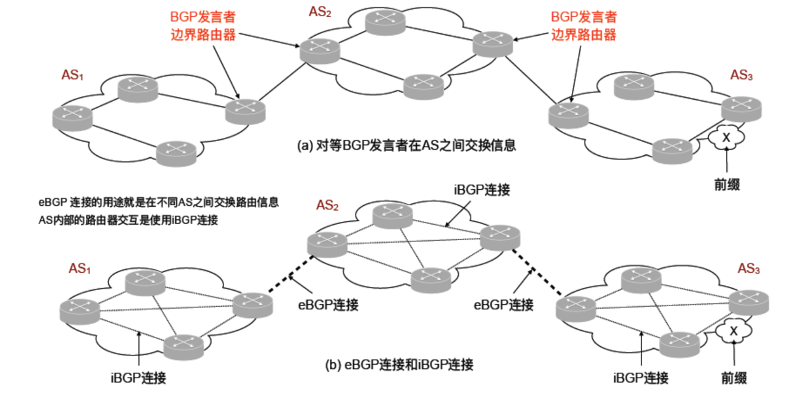
### BGP 与 IGP 的关系
- **分工**  
    – IGP（OSPF、IS-IS 等）负责“AS 内”路由发现与计算，保证同一自治系统内部全网可达。  
    – BGP（eBGP/iBGP）负责“AS 间”路由策略，把本 AS 的前缀宣告给外部，并选择/传递来自其他 AS 的前缀。
    
- **配合方式**
    
    1. eBGP：在不同 AS 的边界路由器之间交换前缀，形成跨 AS 路径。
        
    2. iBGP：在同一 AS 内的所有 BGP 发言人之间同步这些外部前缀，确保出口路由器都能选到最佳外部下一跳。
        
    3. IGP：为 iBGP 会话和下一跳 IP 提供可达性，即“BGP 管前缀，IGP 管下一跳”。
        
- **注意**  
    BGP 自身不计算 AS 内部拓扑，也不依赖度量值选路；内部链路状态全靠 IGP 维护。
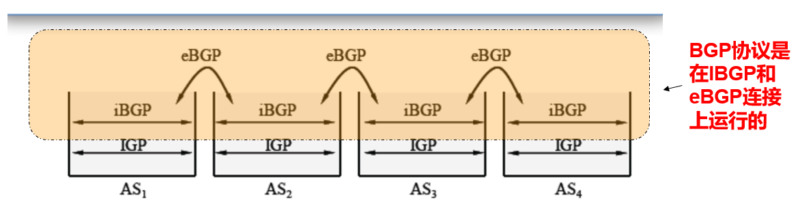
### BGP 协议的特点
- BGP 协议交换路由信息的结点数量级是自治系统数的量级，这要比这些自治系统中的网络数少很多
- 每一个自治系统中 BGP 发言人（或边界路由器）的数目是很少的。这样就使得自治系统之间的路由选择不致过分复杂
- BGP 支持 CIDR，因此 BGP 的路由表也就应当包括目的网络前缀、下一跳路由器，以及到达该目的网络所要经过的各个自治系统序列
- 在BGP 刚刚运行时，BGP 的邻站是交换整个的 BGP 路由表。但以后只需要在发生变化时更新有变化的部分。这样做对节省网络带宽和减少路由器的处理开销都有好处
### BGP-4 共使用四种报文
1. 打开 (OPEN) 报文，用来与相邻的另一个BGP发言人建立关系
2. 更新 (UPDATE) 报文，用来发送某一路由的信息，以及列出要撤消的多条路由
3. 保活 (KEEPALIVE) 报文，用来确认打开报文和周期性地证实邻站关系
4. 通知 (NOTIFICATION) 报文，用来发送检测到的差错
BGP 报文具有通用首部：
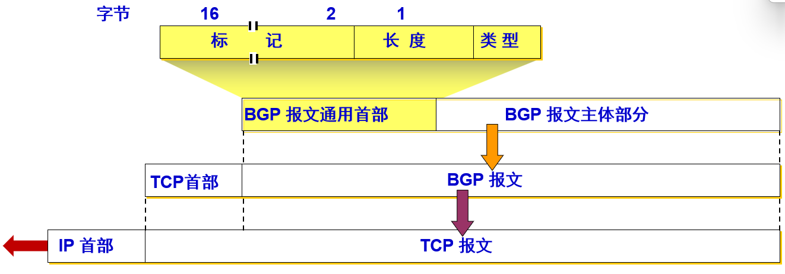
## 4.5.5 路由器的构成
路由器是一种典型的网络层设备
路由器的主要作用是：
- 连通不同的网络
- 选择信息传送的线路
### 路由器的结构
- 路由器是一种具有多个**输入端口**和**多个输出端口**的专用计算机，其任务是转发分组。也就是说，将路由器某个输入端口收到的分组，按照分组要去的目的地（即目的网络），把该分组从路由器的某个合适的输出端口转发给下一跳路由器
- 下一跳路由器也按照这种方法处理分组，直到该分组到达终点为止
- 路由器的转发分组正是**网络层**的主要工作
典型的路由器的结构：
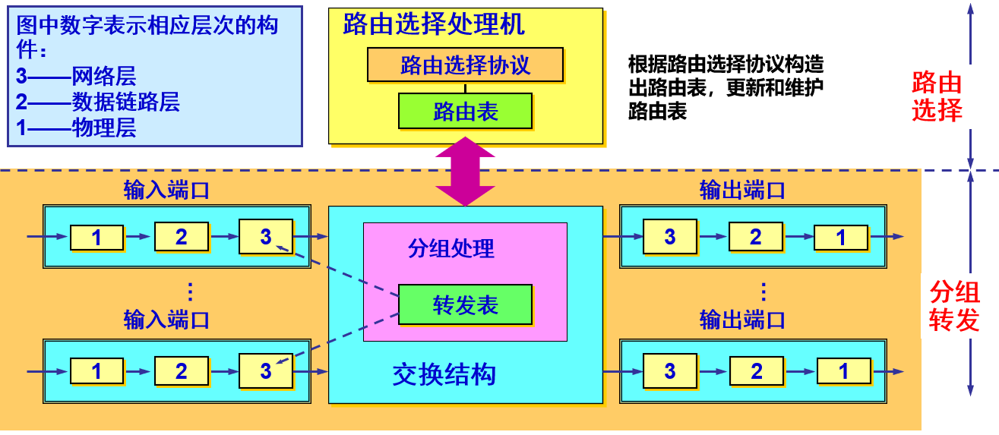
整个的路由器结构可划分为两大部分：
- 路由选择部分
	- 也叫作**控制部分**，其核心构件是路由选择处理机
	- 路由选择处理机的任务是根据所选定的路由选择协议构造出路由表，同时经常或定期地和相邻路由器交换路由信息而不断地更新和维护路由表
- 分组转发部分
	- 交换结构 (switching fabric)：又称为交换组织，其作用是根据转发表 (forwarding table) 对分组进行处理
	- 一组输入端口
	- 一组输入端口
	  `（请注意：这里的端口就是硬件接口）`
#### “转发”和“路由选择”的区别
- “转发”(forwarding) 就是路由器根据转发表将用户的 IP 数据报从合适的端口转发出去
- “路由选择”(routing) 则是按照分布式算法，根据从各相邻路由器得到的关于网络拓扑的变化情况，动态地改变所选择的路由
- 路由表是根据路由选择算法得出的。而转发表是从路由表得出的
#### 输入端口对线路上收到的分组的处理
- 路由器的输入端口里面装有物理层、数据链路层和网络层的处理模块
- 数据链路层剥去帧首部和尾部后，将分组送到网络层的队列中排队等待处理。这会产生一定的时延
- 输入端口中的查找和转发功能在路由器的交换功能中是最重要的
  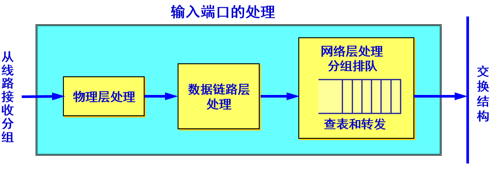
#### 输出端口将交换结构传送来的分组发送到线路
- 输出端口里面装有物理层、数据链路层和网络层的处理模块
- 输出端口从交换结构接收分组，然后把它们发送到路由器外面的线路上
- 在网络层的处理模块中设有一个缓冲区（队列）。当交换结构传送过来的分组的速率超过输出链路的发送速率时，来不及发送的分组就必须暂时存放在这个队列中
- 数据链路层处理模块将分组加上链路层的首部和尾部，交给物理层后发送到外部线路
  
  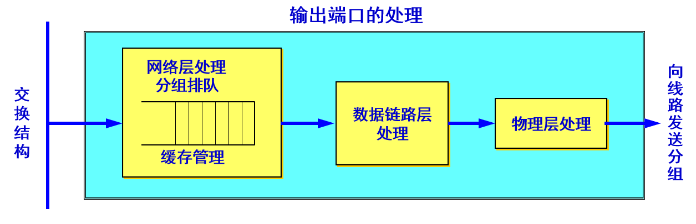
#### 分组丢弃
若路由器处理分组的速率赶不上分组进入队列的速率，则队列的存储空间最终必定减少到零，这就使后面再进入队列的分组由于没有存储空间而只能被丢弃

路由器中的输入或输出队列产生溢出是造成分组丢失的重要原因
### 交换结构
- 交换结构是路由器的关键构件，正是这个交换结构把分组从一个输入端口转移到某个合适的输出端口
- 实现交换有多种方法。常用交换方法有三种
	- 通过存储器
		- 当路由器的某个输入端口收到一个分组时，就用中断方式通知路由选择处理机。然后分组就从输入端口复制到存储器中
		- 路由器处理机从分组首部提取目的地址，查找路由表，再将分组复制到合适的输出端口的缓存中
		- 若存储器的带宽（读或写）为每秒 M 个分组，那么路由器的交换速率（即分组从输入端口传送到输出端口的速率）一定小于 M/2
	- 通过总线
		- 数据报从输入端口通过共享的总线直接传送到合适的输出端口，而不需要路由选择处理机的干预
		- 因为每一个要转发的分组都要通过这一条总线，因此路由器的转发带宽就受总线速率的限制
		- 现代的技术已经可以将总线的带宽提高到每秒吉比特的速率，因此许多的路由器产品都采用这种通过总线的交换方式
	- 通过纵横交换结构
		- 这种交换结构常称为互连网络 (interconnection network)
		- 它有2N条总线，可以使N个输入端口和N个输出端口相连接
		- 当输入端口收到一个分组时，就将它发送到与该输入端口相连的水平总线上
		- 若通向所要转发的输出端口的垂直总线是空闲的，则在这个结点将垂直总线与水平总线接通，然后将该分组转发到这个输出端口
		- 但若该垂直总线已被占用（有另一个分组正在转发到同一个输出端口），则后到达的分组就被阻塞，必须在输入端口排队
  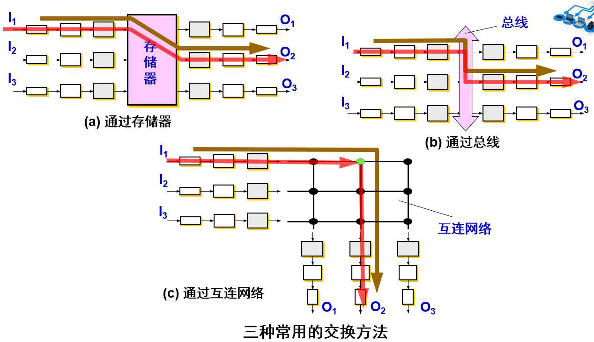
# 4.6  IPv6
IP 是互联网的核心协议。互联网经过几十年的飞速发展，到2011年2月，IPv4 的 32 位地址已经耗尽，ISP 已经不能再申请到新的 IP 地址块了

我国在2014-2015年也逐步停止了向新用户和应用分配 IPv4 地址，解决 IP 地址耗尽的根本措施就是采用具有更大地址空间的新版本的 IP，即 IPv6
## 4.6.1 IPv6的基本首部
- IPv6 仍支持无连接的传送，但将协议数据单元 PDU 称为分组。为方便起见，本书仍采用数据报这一名词
- 所引进的主要变化如下：
	- 更大的地址空间。IPv6 将地址从 IPv4 的 32 位增大到了 128 位
	- 扩展的地址层次结构
	- 灵活的首部格式。 IPv6 定义了许多可选的扩展首部
	- 改进的选项。 IPv6 允许数据报包含有选项的控制信息，其选项放在有效载荷中
	- 允许协议继续扩充
	- 支持即插即用（即自动配置）。因此 IPv6 不需要使用 DHCP
	- 支持资源的预分配。  IPv6 支持实时视像等要求，保证一定的带宽和时延的应用
	- IPv6 首部改为 8 字节对齐。首部长度必须是 8 字节的整数倍。原来的 IPv4 首部是 4 字节对齐
### IPv6 数据报的一般形式
IPv6数据报由两大部分组成：
- 基本首部 (base header)
	- IPv6 将首部长度变为固定的 40 字节，称为基本首部。把首部中不必要的功能取消了，使得 IPv6 首部的字段数减少到只有 8 个
		- 取消了首部长度字段，因为首部长度是固定的 40 字节
		- 取消了服务类型字段
		- 取消了总长度字段，改用有效载荷长度字段
		- 把 TTL 字段改称为跳数限制字段
		- 取消了协议字段，改用下一个首部字段
		- 取消了检验和字段
		- 取消了选项字段，而用扩展首部来实现选项功能
- 有效载荷 (payload)。有效载荷也称为净负荷。有效载荷允许有零个或多个扩展首部(extension header)，再后面是数据部分
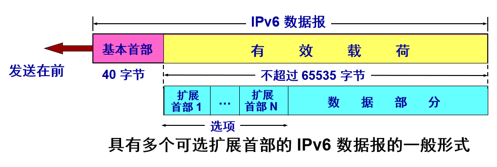
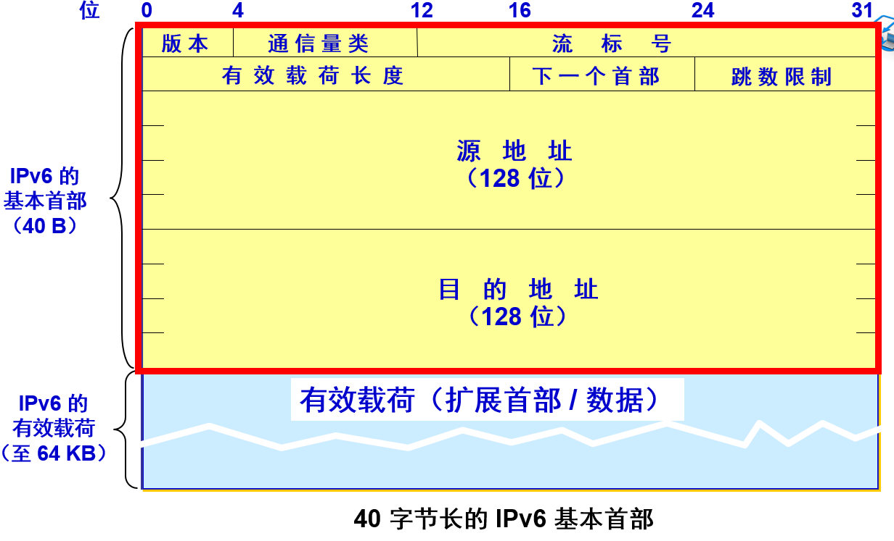
- 版本(version)—— 4 位。它指明了协议的版本，对 IPv6 该字段总是 6
- 通信量类(traffic class)—— 8 位。这是为了区分不同的 IPv6 数据报的类别或优先级。目前正在进行不同的通信量类性能的实验
- 流标号(flow label)—— 20 位。 “流”是互联网络上从特定源点到特定终点的一系列数据报， “流”所经过的路径上的路由器都保证指明的服务质量。所有属于同一个流的数据报都具有同样的流标号
- 有效载荷长度(payload length)—— 16 位。它指明 IPv6 数据报除基本首部以外的字节数（所有扩展首部都算在有效载荷之内），其最大值是 64 KB
- 下一个首部(next header)—— 8 位。它相当于 IPv4 的协议字段或可选字段
- 跳数限制(hop limit)—— 8 位。源站在数据报发出时即设定跳数限制。路由器在转发数据报时将跳数限制字段中的值减 1。当跳数限制的值为零时，就要将此数据报丢弃
- 源地址—— 128 位。是数据报的发送站的 IP 地址
- 目的地址—— 128 位。是数据报的接收站的 IP 地址

IPv6 把原来 IPv4 首部中选项的功能都放在扩展首部中，并将扩展首部留给路径两端的源站和目的站的主机来处理。数据报途中经过的路由器都不处理这些扩展首部（只有一个首部例外，即逐跳选项扩展首部）。这样就大大提高了路由器的处理效率。

在 RFC 2460 中定义了六种扩展首部：
- 逐跳选项
- 路由选择
- 分片
- 鉴别
- 封装安全有效载荷
- 目的站选项
每一个扩展首部都由若干个字段组成，它们的长度也各不相同。但所有扩展首部的第一个字段都是8位的“下一个首部”字段。此字段的值指出了在该扩展首部后面的字段是什么

## 4.6.2 IPv6的地址
IPv6 数据报的目的地址可以是以下三种基本类型地址之一：
1. 单播 (unicast)：传统的点对点通信
2. 多播 (multicast)：一点对多点的通信
3. 任播 (anycast)：这是 IPv6 增加的一种类型。任播的目的站是一组计算机，但数据报在交付时只交付其中的一个，通常是距离最近的一个
### 结点与接口
IPv6 将实现 IPv6 的主机和路由器均称为结点。一个结点就可能有多个与链路相连的接口。IPv6 地址是分配给结点上面的接口的
- 一个接口可以有多个单播地址
- 其中的任何一个地址都可以当作到达该结点的目的地址。即一个结点接口的单播地址可用来唯一地标志该结点
### 冒号十六进制记法
在IPv6中，每个地址占 128 位，地址空间大于 $3.4\times10^{38}$。为了使地址再稍简洁些，IPv6 使用冒号十六进制记法(colon hexadecimal notation, 简写为colon hex)

每个 16 位的值用十六进制值表示，各值之间用冒号分隔。例如：68E6:8C64:FFFF:FFFF:0:1180:960A:FFFF
在十六进制记法中，允许把数字前面的0省略。例如把0000中的前三个0省略，写成1个0
### 零压缩
冒号十六进制记法可以允许零压缩 (zero compression)，即一连串连续的零可以为一对冒号所取代。  
FF05:0:0:0:0:0:0:B3    可压缩为：  
FF05::B3
`注意：在任一地址中只能使用一次零压缩 `
### 点分十进制记法的后缀
- 冒号十六进制记法可结合使用点分十进制记法的后缀，这种结合在 IPv4 向 IPv6 的转换阶段特别有用
- 例如：0:0:0:0:0:0:128.10.2.1
  再使用零压缩即可得出：  :: 128.10.2.1
- CIDR 的斜线表示法仍然可用。
- 例如：60 位的前缀 12AB00000000CD3 可记为：12AB:0000:0000:CD30:0000:0000:0000:0000/60
  或 12AB::CD30:0:0:0:0/60 （零压缩）
  或 12AB:0:0:CD30::/60 （零压缩）

- IPv6 地址分类

| 地址类型     | 二进制前缀            | 缩写表示      |
| -------- | ---------------- | --------- |
| 未指明地址    | 00...0（128 位）    | ::/128    |
| 环回地址     | 00...1（128 位）    | ::1/128   |
| 多播地址     | 11111111（8 位）    | FF00::/8  |
| 本地链路单播地址 | 1111111010（10 位） | FE80::/10 |
| 全球单播地址   | 除上述四种外的所有前缀      | —         |

- 未指明地址
	- 这是 16 字节的全 0 地址，可缩写为两个冒号“::”
	- 这个地址只能为还没有配置到一个标准的 IP 地址的主机当作源地址使用
	- 这类地址仅此一个
- 环回地址
	- 即 0:0:0:0:0:0:0:1（记为 ::1）
	- 作用和IPv4的环回地址一样
	- 这类地址也是仅此一个
- 多播地址
	- 功能和 IPv4 的一样
	- 这类地址占 IPv6 地址总数的 1/256
- 本地链路单播地址 (Link-Local Unicast Address)
	- 有些单位的网络使用 TCP/IP 协议，但并没有连接到互联网上。连接在这样的网络上的主机都可以使用这种本地地址进行通信，但不能和互联网上的其他主机通信
	- 这类地址占 IPv6 地址总数的 1/1024
- 全球单播地址
	- IPv6 的这一类单播地址是使用得最多的一类
	- 曾提出过多种方案来进一步划分这128位的单播地址
	- 根据2006年发布的草案标准RFC 4291的建议，  IPv6 单播地址的划分方法非常灵活
	  
## 4.6.3 从IPv4向IPv6过渡
向 IPv6 过渡只能采用逐步演进的办法，同时，还必须使新安装的 IPv6 系统能够向后兼容：IPv6 系统必须能够接收和转发 IPv4 分组，并且能够为 IPv4 分组选择路由
两种向 IPv6 过渡的策略
- 使用双协议栈
- 使用隧道技术
### 双协议栈
- 双协议栈(dual stack)是指在完全过渡到 IPv6 之前，使一部分主机（或路由器）装有两个协议栈，一个 IPv4 和一个 IPv6
- 双协议栈的主机（或路由器）记为 IPv6/IPv4，表明它同时具有两种 IP 地址：一个 IPv6 地址和一个 IPv4 地址
- 双协议栈主机在和 IPv6 主机通信时是采用 IPv6 地址，而和 IPv4 主机通信时就采用 IPv4 地址
- 根据 DNS 返回的地址类型可以确定使用 IPv4 地址还是 IPv6 地址
  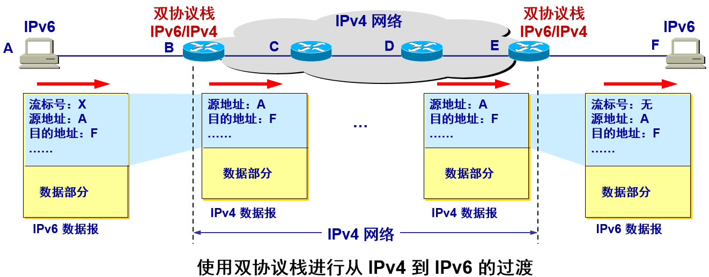

### 隧道技术
- 在 IPv6 数据报要进入IPv4网络时，把 IPv6 数据报封装成为 IPv4 数据报，整个的 IPv6 数据报变成了 IPv4 数据报的数据部分
- 当 IPv4 数据报离开 IPv4 网络中的隧道时，再把数据部分（即原来的 IPv6 数据报）交给主机的 IPv6 协议栈
  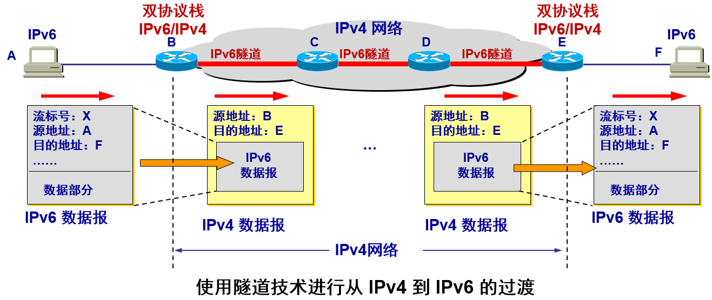
## 4.6.4 ICMPv6
IPv6 也不保证数据报的可靠交付，因为互联网中的路由器可能会丢弃数据报
因此 IPv6 也需要使用 ICMP 来反馈一些差错信息。新的版本称为 ICMPv6
地址解析协议 ARP 和网际组管理协议 IGMP 协议的功能都已被合并到 ICMPv6 中
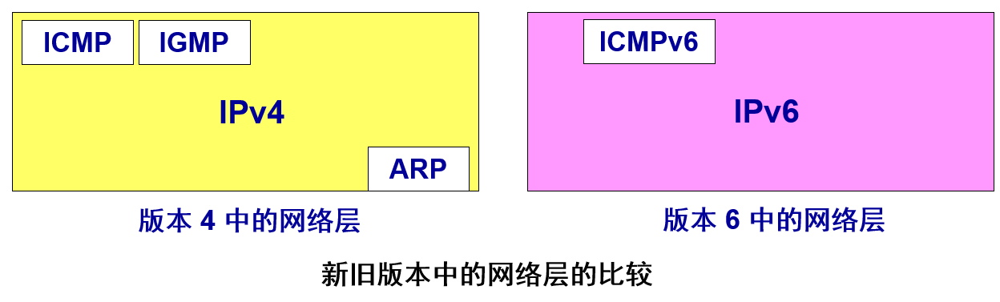
### ICMPv6 报文的分类
ICMPv6 是面向报文的协议，它利用报文来报告差错，获取信息，探测邻站或管理多播通信
ICMPv6 还增加了几个定义报文的功能及含义的其他协议
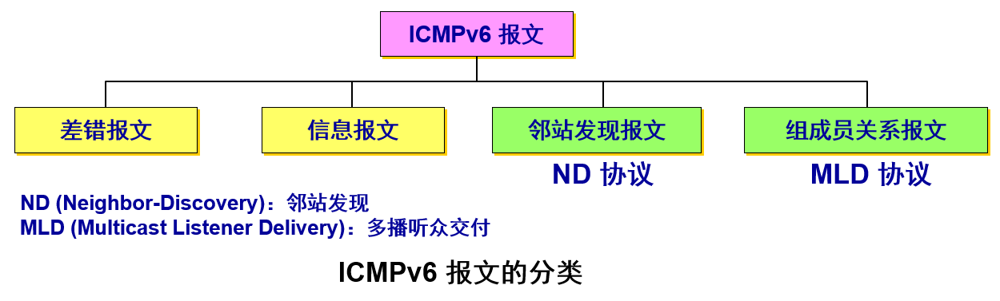
# 4.7  IP 多播
## 4.7.1 IP 多播的基本概念
- IP 多播 (multicast，以前曾译为组播) 已成为互联网的一个热门课题
- 目的：更好地支持一对多通信
- 一对多通信：一个源点发送到许多个终点
  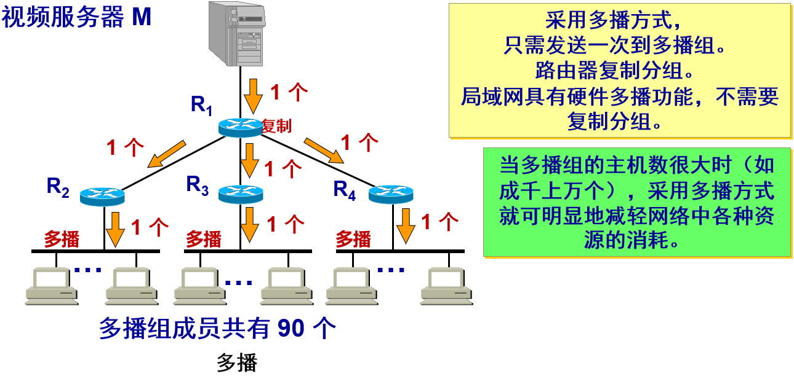
### IP 多播

- 在互联网上进行多播就叫作 IP 多播
- 互联网范围的多播要靠路由器来实现
- 能够运行多播协议的路由器称为多播路由器(multicast router)。当然它也可以转发普通的单播IP数据报
- 从1992年起，在互联网上开始试验虚拟的多播主干网MBONE (Multicast Backbone On the InterNEt)。 现在多播主干网已经有了相当大的规模
### 多播 IP 地址

- IP 多播所传送的分组需要使用多播 IP 地址
- 在多播数据报的目的地址写入的是多播组的标识符
- 多播组的标识符就是 IP 地址中的 D 类地址（多播地址）
- 每一个D类地址标志一个多播组
- 多播地址只能用于目的地址，不能用于源地址
### 多播数据报

- 多播数据报和一般的 IP 数据报的区别就是它使用 D 类 IP 地址作为目的地址，并且首部中的协议字段值是2，表明使用网际组管理协议 IGMP
- 多播数据报也是“尽最大努力交付”，不保证一定能够交付多播组内的所有成员
- 对多播数据报不产生 ICMP 差错报文。因此，若在 PING 命令后面键入多播地址，将永远不会收到响应
## 4.7.2 在局域网上进行硬件多播
- 互联网号码指派管理局 IANA 拥有的以太网地址块的高 24 位为 00-00-5E
- 因此 TCP/IP 协议使用的以太网多播地址块的范围是从   00-00-5E-00-00-00到   00-00-5E-FF-FF-FF
- 不难看出，在每一个地址中，只有23位可用作多播
- D 类 IP 地址可供分配的有 28 位，在这 28 位中的前 5 位不能用来构成以太网硬件地址
D 类 IP 地址与以太网多播地址的映射关系 ：
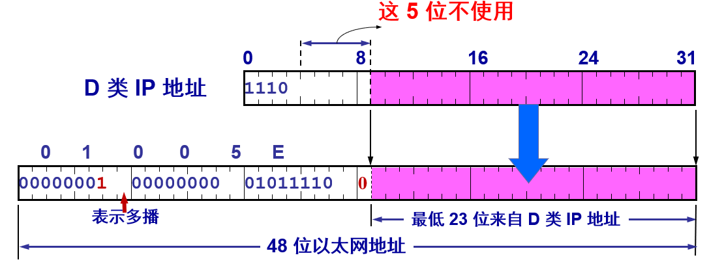
- 由于多播IP地址与以太网硬件地址的映射关系不是唯一的，因此收到多播数据报的主机，还要在 IP 层利用软件进行过滤，把不是本主机要接收的数据报丢弃
## 4.7.3 网际组管理协议 IGMP 和多播路由选择协议
### IP 多播需要两种协议
为了使路由器知道多播组成员的信息，需要利用网际组管理协议 IGMP (Internet Group Management Protocol)
连接在局域网上的多播路由器还必须和互联网上的其他多播路由器协同工作，以便把多播数据报用最小代价传送给所有的组成员。这就需要使用多播路由选择协议
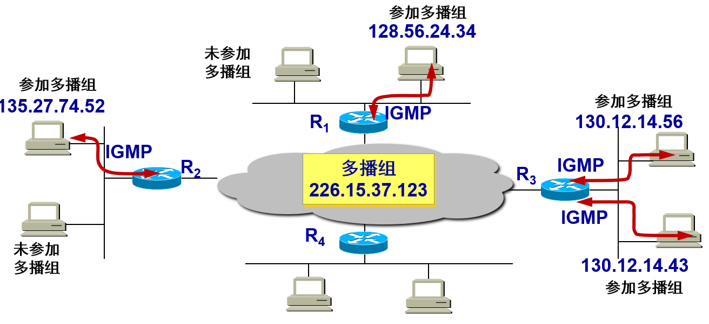
#### IGMP 的使用范围
- IGMP 并非在互联网范围内对所有多播组成员进行管理的协议
- IGMP 不知道 IP 多播组包含的成员数，也不知道这些成员都分布在哪些网络上
- IGMP 协议是让连接在本地局域网上的多播路由器知道本局域网上是否有主机（严格讲，是主机上的某个进程）参加或退出了某个多播组
#### 多播路由选择协议更为复杂
- 多播转发必须动态地适应多播组成员的变化（这时网络拓扑并未发生变化）。请注意，单播路由选择通常是在网络拓扑发生变化时才需要更新路由
- 多播路由器在转发多播数据报时，不能仅仅根据多播数据报中的目的地址，而是还要考虑这个多播数据报从什么地方来和要到什么地方去
- 多播数据报可以由没有加入多播组的主机发出，也可以通过没有组成员接入的网络
### 网际组管理协议 IGMP
1989 年公布的 RFC 1112（IGMPv1）早已成为了互联网的标准协议
1997 年公布的 RFC 2236（IGMPv2，建议标准）对 IGMPv1 进行了更新
2002 年 10 月公布了 RFC 3376（IGMPv3，建议标准），宣布 RFC 2236（IGMPv2）是陈旧的

IGMP 是整个网际协议 IP 的一个组成部分。和 ICMP 相似，IGMP 使用 IP 数据报传递其报文（即 IGMP 报文加上 IP 首部构成 IP 数据报），但它也向 IP 提供服务。因此，我们不把 IGMP 看成是一个单独的协议，而是属于整个网际协议 IP 的一个组成部分
- 第一阶段：加入多播组
	- 当某个主机加入新的多播组时，该主机应向多播组的多播地址发送IGMP 报文，声明自己要成为该组的成员
	- 本地的多播路由器收到 IGMP 报文后，将组成员关系转发给互联网上的其他多播路由器
- 第二阶段：探询组成员变化情况
	- 因为组成员关系是动态的，因此本地多播路由器要周期性地探询本地局域网上的主机，以便知道这些主机是否还继续是组的成员
	- 只要对某个组有一个主机响应，那么多播路由器就认为这个组是活跃的
	- 但一个组在经过几次的探询后仍然没有一个主机响应，则不再将该组的成员关系转发给其他的多播路由器
	  
#### IGMP 采用的一些具体措施

- 在主机和多播路由器之间的所有通信都是使用 IP 多播
- 多播路由器在探询组成员关系时，只需要对所有的组发送一个请求信息的询问报文，而不需要对每一个组发送一个询问报文。默认的询问速率是每 125 秒发送一次
- 当同一个网络上连接有几个多播路由器时，它们能够迅速和有效地选择其中的一个来探询主机的成员关系
- 在 IGMP 的询问报文中有一个数值 N，它指明一个最长响应时间（默认值为 10秒）。当收到询问时，主机在 0 到 N 之间随机选择发送响应所需经过的时延。对应于最小时延的响应最先发送
- 同一个组内的每一个主机都要监听响应，只要有本组的其他主机先发送了响应，自己就可以不再发送响应了

### 多播路由选择

- 多播路由选择协议尚未标准化
- 一个多播组中的成员是动态变化的，随时会有主机加入或离开这个多播组
- 多播路由选择实际上就是要找出以源主机为根结点的多播转发树
- 在多播转发树上的路由器不会收到重复的多播数据报
- 对不同的多播组对应于不同的多播转发树
- 同一个多播组，对不同的源点也会有不同的多播转发树
- 多播路由选择协议在转发多播数据报时使用三种方法：
	- 洪泛与剪除
		- 这种方法适合于较小的多播组，而所有的组成员接入的局域网也是相邻接的
		- 一开始，路由器转发多播数据报使用洪泛的方法（这就是广播）
		- 为了避免兜圈子，采用了叫作反向路径广播 RPB (Reverse Path Broadcasting)的策略
			- 路由器收到多播数据报时，先检查它是否是从源点经最短路径传送来的
			- 若是，就向所有其他方向转发刚才收到的多播数据报（但进入的方向除外），否则就丢弃而不转发
			- 如果存在几条同样长度的最短路径，那么只能选择一条最短路径，选择的准则就是看这几条最短路径中的相邻路由器谁的 IP 地址最小
			- 最后就得出了用来转发多播数据报的多播转发树，以后就按这个多播转发树转发多播数据报。避免了多播数据报的兜圈子，同时每一个路由器也不会接收重复的多播数据报
			- 如果在多播转发树上的某个路由器发现它的下游树枝（即叶节点方向）已没有该多播组的成员，就应把它和下游的树枝一起剪除
			- 当某个树枝有新增加的组成员时，可以再接入到多播转发树上
			  
		  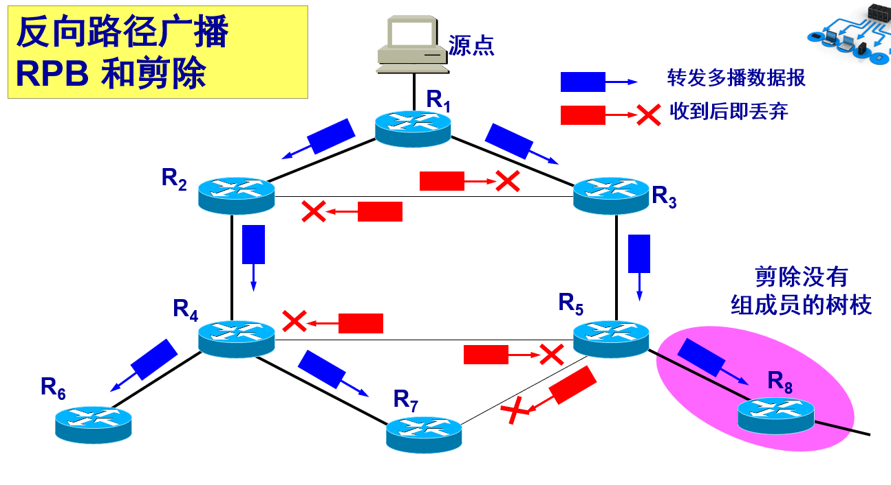
	- 隧道技术 (tunneling)
		- 隧道技术适用于多播组的位置在地理上很分散的情况
		  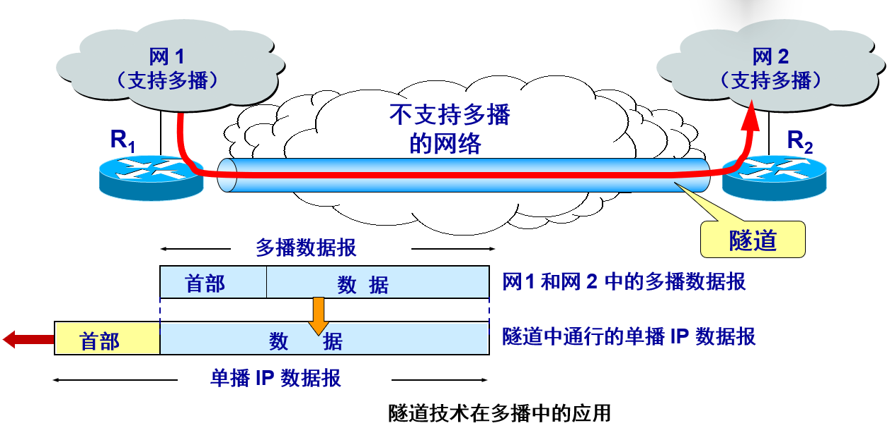
	- 基于核心的发现技术
		- 这种方法对于多播组的大小在较大范围内变化时都适合
		- 这种方法是对每一个多播组 G 指定一个核心(core) 路由器，给出它的 IP 单播地址
		- 核心路由器按照前面讲过的方法创建出对应于多播组 G 的转发树

#### 几种多播路由选择协议

- 距离向量多播路由选择协议 DVMRP (Distance Vector Multicast Routing Protocol)
- 基于核心的转发树 CBT (Core Based Tree)
- 开放最短通路优先的多播扩展 MOSPF (Multicast Extensions to OSPF)
- 协议无关多播-稀疏方式 PIM-SM (Protocol Independent Multicast-Sparse Mode)
- 协议无关多播-密集方式 PIM-DM (Protocol Independent Multicast-Dense Mode)

# 4.8  虚拟专用网 VPN 和网络地址转换 NAT
## 4.8.1 虚拟专用网 VPN

- 由于 IP 地址的紧缺，一个机构能够申请到的IP地址数往往远小于本机构所拥有的主机数
- 考虑到互联网并不很安全，一个机构内也并不需要把所有的主机接入到外部的互联网
- 假定在一个机构内部的计算机通信也是采用 TCP/IP 协议，那么从原则上讲，对于这些仅在机构内部使用的计算机就可以由本机构自行分配其 IP 地址

### 本地地址与全球地址

- 本地地址——仅在机构内部使用的 IP 地址，可以由本机构自行分配，而不需要向互联网的管理机构申请
- 全球地址——全球唯一的 IP 地址，必须向互联网的管理机构申请
- 问题：在内部使用的本地地址就有可能和互联网中某个 IP 地址重合，这样就会出现地址的二义性问题
- 解决：RFC 1918指明了一些专用地址 (private address)。专用地址只能用作本地地址而不能用作全球地址。在互联网中的所有路由器，对目的地址是专用地址的数据报一律不进行转发
- 三个专用 IP 地址块：
	- 10.0.0.0 到 10.255.255.255
	  A类，或记为10.0.0.0/8，它又称为24位块
	- 172.16.0.0 到 172.31.255.255
	  B类，或记为172.16.0.0/12，它又称为20位块
	- 192.168.0.0 到 192.168.255.255
	  C类，或记为192.168.0.0/16，它又称为16位块

### 专用网

- 采用这样的专用 IP 地址的互连网络称为专用互联网或本地互联网，或更简单些，就叫作专用网
- 因为这些专用地址仅在本机构内部使用。专用IP地址也叫作可重用地址(reusable address)

### 虚拟专用网 VPN

- 利用公用的互联网作为本机构各专用网之间的通信载体，这样的专用网又称为虚拟专用网VPN (Virtual Private Network)
- “专用网”是因为这种网络是为本机构的主机用于机构内部的通信，而不是用于和网络外非本机构的主机通信
- “虚拟”表示“好像是”，但实际上并不是，因为现在并没有真正使用通信专线，而 VPN 只是在效果上和真正的专用网一样

#### 虚拟专用网 VPN 构建：

- 如果专用网不同网点之间的通信必须经过公用的互联网，但又有保密的要求，那么所有通过互联网传送的数据都必须加密
- 一个机构要构建自己的 VPN 就必须为它的每一个场所购买专门的硬件和软件，并进行配置，使每一个场所的 VPN 系统都知道其他场所的地址
用隧道技术实现虚拟专用网：
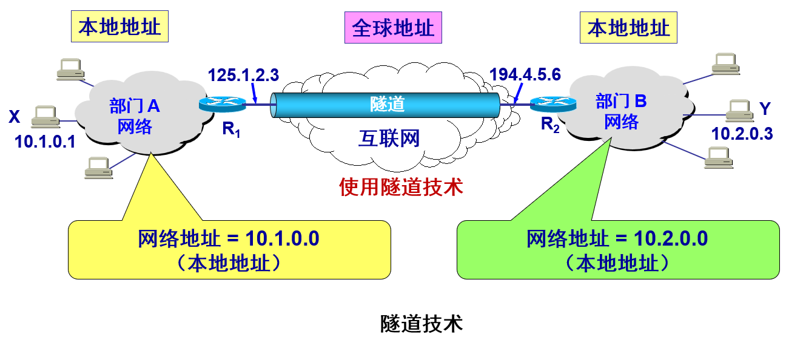
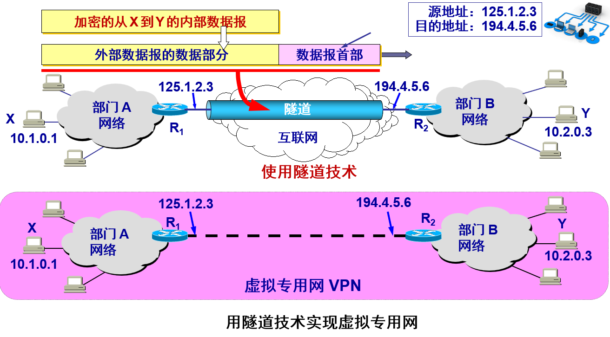

### 内联网 intranet 和外联网 extranet

- 它们都是基于 TCP/IP 协议的
- 由部门 A 和 B 的内部网络所构成的虚拟专用网 VPN 又称为内联网 (intranet)，表示部门 A 和 B 都是在同一个机构的内部
- 一个机构和某些外部机构共同建立的虚拟专用网 VPN 又称为外联网 (extranet)

### 远程接入 VPN

- 远程接入 VPN (remote access VPN)可以满足外部流动员工访问公司网络的需求
- 在外地工作的员工拨号接入互联网，而驻留在员工 PC 机中的 VPN 软件可在员工的 PC 机和公司的主机之间建立 VPN 隧道，因而外地员工与公司通信的内容是保密的，员工们感到好像就是使用公司内部的本地网络

## 4.8.2 网络地址转换 NAT
### NAT技术 — 概述

- NAT (Network Address Translation)是目前用于解决IP地址紧缺问题的主要技术
- NAT的标准文档是RFC 2663，1999年和RFC 3022，2001年（obsolete RFC 1631，1994年）
- NAT是在路由器上实现的，它的主要操作是在私网IP地址和公网IP地址之间作相互转换
- 通过这种转换，一个网络能够在其内部使用私网IP地址，而在外部使用一个或少数几个公网IP地址连接到Internet上
  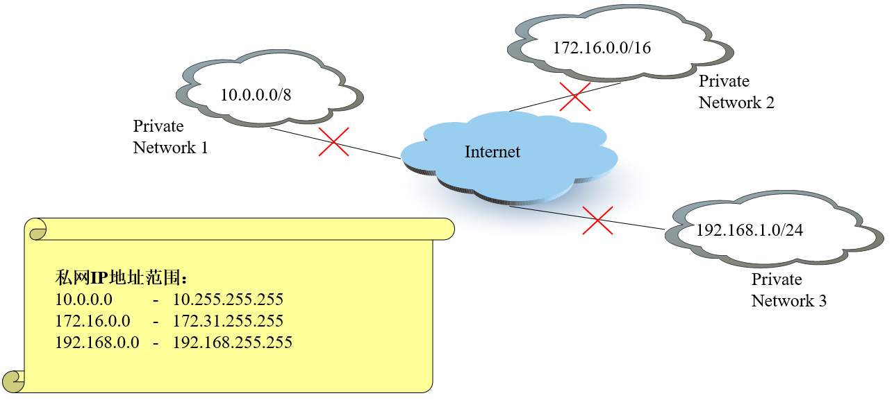

### 网络地址转换 NAT

- 网络地址转换 NAT (Network Address Translation)  方法于1994年提出
- 需要在专用网连接到互联网的路由器上安装 NAT 软件。装有 NAT 软件的路由器叫作 NAT路由器，它至少有一个有效的外部全球IP地址
- 所有使用本地地址的主机在和外界通信时，都要在 NAT 路由器上将其本地地址转换成全球 IP 地址，才能和互联网连接

### 网络地址转换的过程 ：

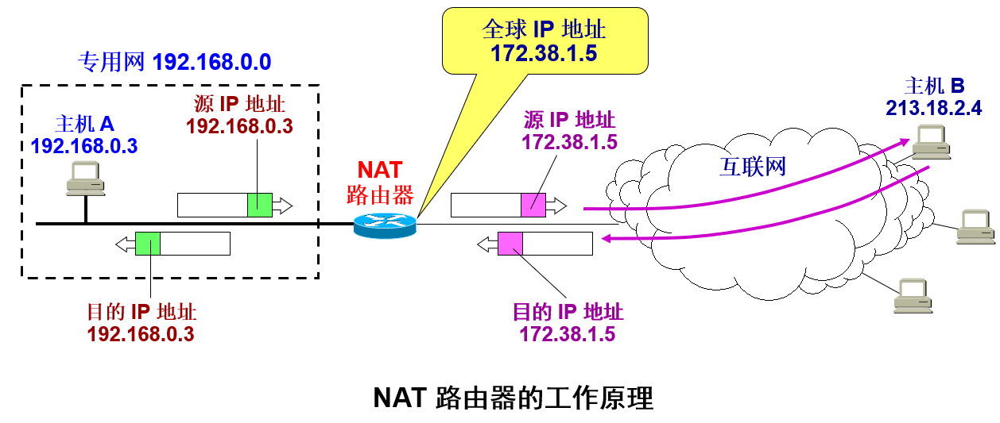
- 内部主机 A 用本地地址 $IP_{A}$ 和互联网上主机 B 通信所发送的数据报必须经过 NAT 路由器
- NAT 路由器将数据报的源地址 $IP_{A}$ 转换成全球地址 $IP_{G}$，并把转换结果记录到NAT地址转换表中，目的地址 $IP_{B}$ 保持不变，然后发送到互联网
- NAT 路由器收到主机 B 发回的数据报时，知道数据报中的源地址是 $IP_{B}$ 而目的地址是 $IP_{G}$
- 根据 NAT 转换表，NAT 路由器将目的地址 $IP_{G}$ 转换为 $IP_{A}$，转发给最终的内部主机 A
- 可以看出，在内部主机与外部主机通信时，在NAT路由器上发生了两次地址转换：
	- 离开专用网时：替换源地址，将内部地址替换为全球地址
	- 进入专用网时：替换目的地址，将全球地址替换为内部地址

| 方向 | 字段       | 旧的 IP 地址    | 新的 IP 地址    |
| -- | -------- | ----------- | ----------- |
| 出  | 源 IP 地址  | 192.168.0.3 | 172.38.1.5  |
| 入  | 目的 IP 地址 | 172.38.1.5  | 192.168.0.3 |
| 出  | 源 IP 地址  | 192.168.0.7 | 172.38.1.6  |
| 入  | 目的 IP 地址 | 172.38.1.6  | 192.168.0.7 |

- 当 NAT 路由器具有 n 个全球 IP 地址时，专用网内最多可以同时有 n 台主机接入到互联网。这样就可以使专用网内较多数量的主机，轮流使用 NAT 路由器有限数量的全球 IP 地址
- 通过 NAT 路由器的通信必须由专用网内的主机发起。专用网内部的主机不能充当服务器用，因为互联网上的客户无法请求专用网内的服务器提供服务
- 为了更加有效地利用 NAT 路由器上的全球IP地址，现在常用的 NAT 转换表把运输层的端口号也利用上。这样，就可以使多个拥有本地地址的主机，共用一个 NAT 路由器上的全球 IP 地址，因而可以同时和互联网上的不同主机进行通信
- 使用端口号的 NAT 叫作网络地址与端口号转换NAPT (Network Address and Port Translation)，而不使用端口号的 NAT 就叫作传统的 NAT (traditional NAT)
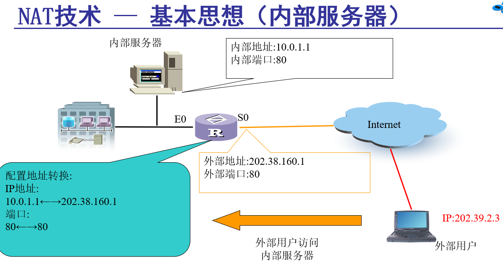
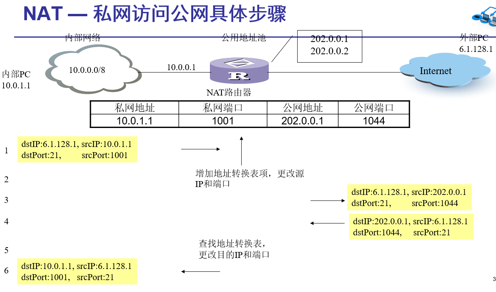
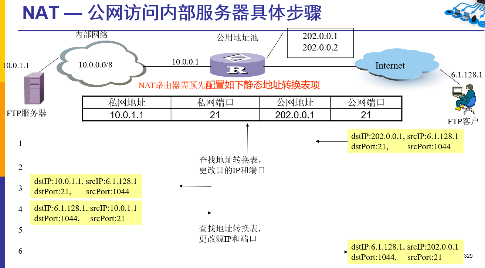
NAPT把专用网内不同的源 IP 地址，都转换为同样的全球 IP 地址。但对源主机所采用的 TCP 端口号（不管相同或不同），则转换为不同的新的端口号。因此，当 NAPT 路由器收到从互联网发来的应答时，就可以从 IP 数据报的数据部分找出运输层的端口号，然后根据不同的目的端口号，从 NAPT 转换表中找到正确的目的主机。
### NAT技术 — 批评
- 开销增加
	- NAT: 重新计算IP Header Checksum
	- NAPT: 重新计算TCP/UDP Header Checksum
- 违反了协议分层的原则
- 使在应用层的数据中携带有IP地址或端口号的协议不能正常运行
# 4.9  多协议标记交换 MPLS
IETF于1997年成立了 MPLS 工作组，开发出一种新的协议——多协议标记交换 MPLS (MultiProtocol Label Switching)
“多协议”表示在 MPLS 的上层可以采用多种协议，例如：IP，IPX；可以使用多种数据链路层协议，例如：PPP，以太网，ATM 等
“标记”是指每个分组被打上一个标记，根据该标记对分组进行转发

为了实现交换，可以利用面向连接的概念，使每个分组携带一个叫作标记 (label) 的小整数。当分组到达交换机（即标记交换路由器）时，交换机读取分组的标记，并用标记值来检索分组转发表。这样就比查找路由表来转发分组要快得多。
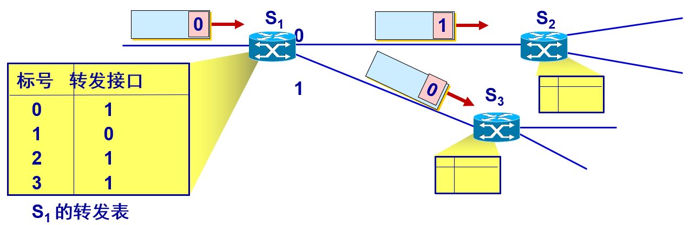
### MPLS 特点
- MPLS并没有取代 IP，而是作为一种 IP 增强技术，被广泛地应用在互联网中
- MPLS 具有以下三个方面的特点：
	- 支持面向连接的服务质量
	- 支持流量工程，平衡网络负载
	- 有效地支持虚拟专用网 VPN
## 4.9.1 MPLS 的工作原理
### 基本工作过程
- IP 分组的转发
	- 在传统的 IP 网络中，分组每到达一个路由器后，都必须提取出其目的地址，按目的地址查找路由表，并按照“最长前缀匹配”的原则找到下一跳的 IP 地址（请注意，前缀的长度是不确定的）
	- 当网络很大时，查找含有大量项目的路由表要花费很多的时间
	- 在出现突发性的通信量时，往往还会使缓存溢出，这就会引起分组丢失、传输时延增大和服务质量下降
	  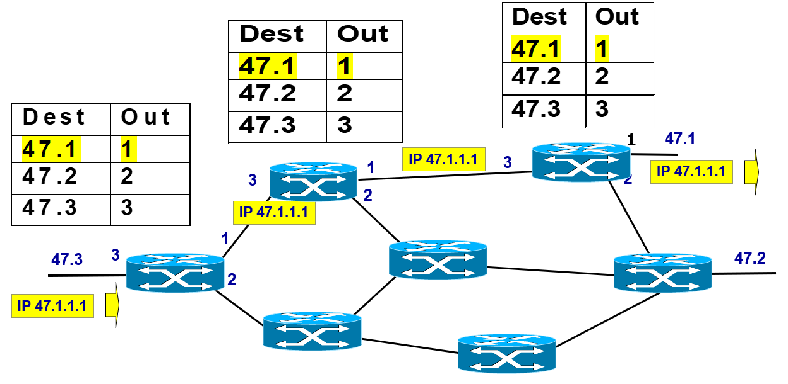
### MPLS 协议的基本原理
- 在 MPLS 域的入口处，给每一个 IP 数据报打上固定长度“标记”，然后对打上标记的 IP 数据报用硬件进行转发
- 采用硬件技术对打上标记的 IP 数据报进行转发就称为标记交换
- “交换”也表示在转发时不再上升到第三层查找转发表，而是根据标记在第二层（链路层）用硬件进行转发
- MPLS 域 (MPLS domain) 是指该域中有许多彼此相邻的路由器，并且所有的路由器都是支持 MPLS 技术的标记交换路由器 LSR (Label Switching Router)
- LSR 同时具有标记交换和路由选择这两种功能，标记交换功能是为了快速转发，但在这之前LSR 需要使用路由选择功能构造转发表
  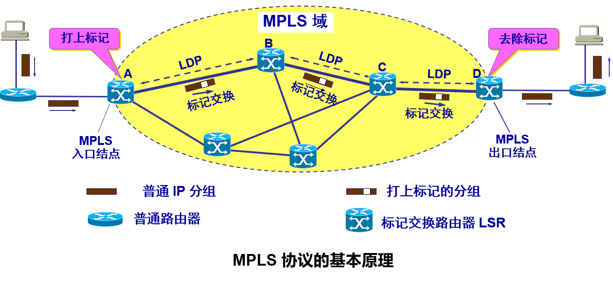
### MPLS 的基本工作过程
- MPLS 域中的各 LSR 使用专门的标记分配协议 LDP 交换报文，并找出标记交换路径 LSP。各 LSR 根据这些路径构造出分组转发表
- 分组进入到 MPLS 域时， MPLS 入口结点把分组打上标记，并按照转发表将分组转发给下一个 LSR。给IP数据报打标记的过程叫作分类(classification)
- 一个标记仅仅在两个标记交换路由器 LSR 之间才有意义。分组每经过一个 LSR，LSR 就要做两件事：一是转发，二是更换新的标记，即把入标记更换成为出标记。这就叫作标记对换 (label swapping)
- 当分组离开 MPLS 域时，MPLS 出口结点把分组的标记去除。再以后就按照一般分组的转发方法进行转发
### 转发等价类 FEC
- MPLS 有个很重要的概念就是转发等价类 FEC (Forwarding Equivalence Class)
- “转发等价类”就是路由器按照同样方式对待的分组的集合
  `“按照同样方式对待”表示：从同样接口转发到同样的下一跳地址，并且具有同样服务类别和同样丢弃优先级等。`
- 划分 FEC 的方法不受什么限制，这都由网络管理员来控制，因此非常灵活
- 入口结点并不是给每一个分组指派一个不同的标记，而是将属于同样 FEC 的分组都指派同样的标记
- FEC 和标记是一一对应的关系
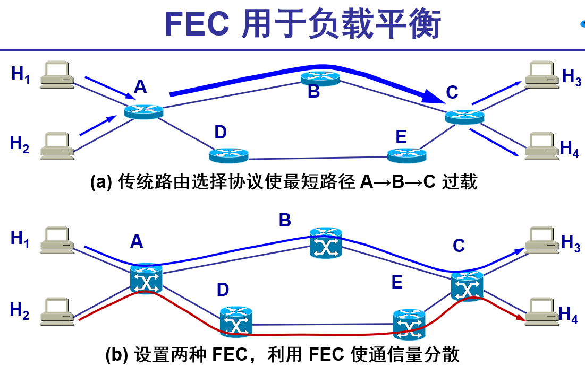
### 流量工程
网络管理员采用自定义的 FEC 就可以更好地管理网络的资源。这种均衡网络负载的做法也称为流量工程 TE (Traffic Engineering) 或通信量工程
## 4.9.2 MPLS 首部的位置与格式
- MPLS 并不要求下层的网络都使用面向连接的技术
- 下层的网络并不提供打标记的手段，而 IPv4 数据报首部也没有多余的位置存放 MPLS 标记
- 这就需要使用一种封装技术：在把 IP 数据报封装成以太网帧之前，先要插入一个 MPLS 首部
- 从层次的角度看，MPLS 首部就处在第二层和第三层之间
  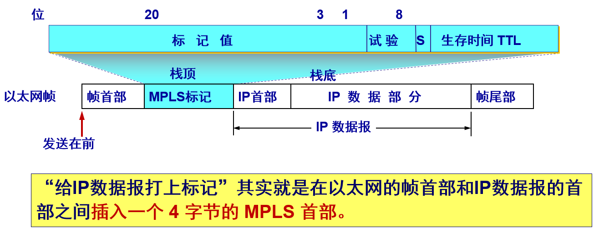
- MPLS 首部共包括以下四个字段：
	- 标记值（占 20 位）。可以同时容纳高达 $2^{20}$ 个流（即 1048576 个流）。实际上几乎没有哪个 MPLS 实例会使用很大数目的流，因为通常需要管理员人工管理和设置每条交换路径
	- 试验（占 3 位）。目前保留用作试验
	- 栈S（占 1 位）。在有“标记栈”时使用
	- 生存时间TTL（占 8 位）。用来防止 MPLS 分组在 MPLS 域中兜圈子