# 5.1  运输层协议概述
> ⽹络层没有解决的问题：
• 主机中谁发送的数据、谁接收数据？
• IP分组⽆序到达⽬的主机，接收进程如何处理？
• 可靠传输问题如何解决？
## 5.1.1  进程之间的通信
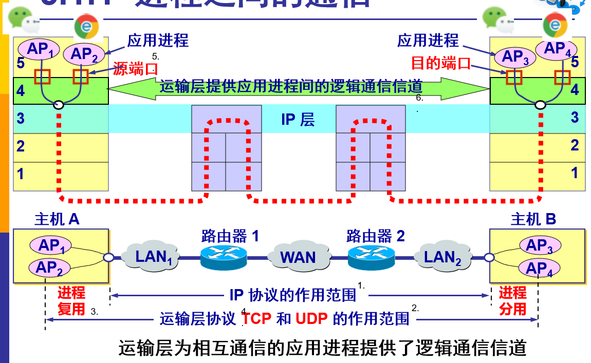
在一台主机中经常有多个应用进程同时分别和另一台主机中的多个应用进程通信，这表明运输层有一个很重要的功能——**复用 (multiplexing)和分用 (demultiplexing)**。根据应用程序的不同需求，运输层需要有两种不同的运输协议，即面向连接的 TCP（传输控制协议） 和无连接的 UDP（用户数据报协）。

当运输层采用面向连接的 TCP 协议时，尽管下面的网络是不可靠的（只提供尽最大努力服务），但这种运输层逻辑通信信道就相当于一条**全双工的可靠信道**
当运输层采用无连接的 UDP 协议时，这种运输层逻辑通信信道是一条**不可靠信道**
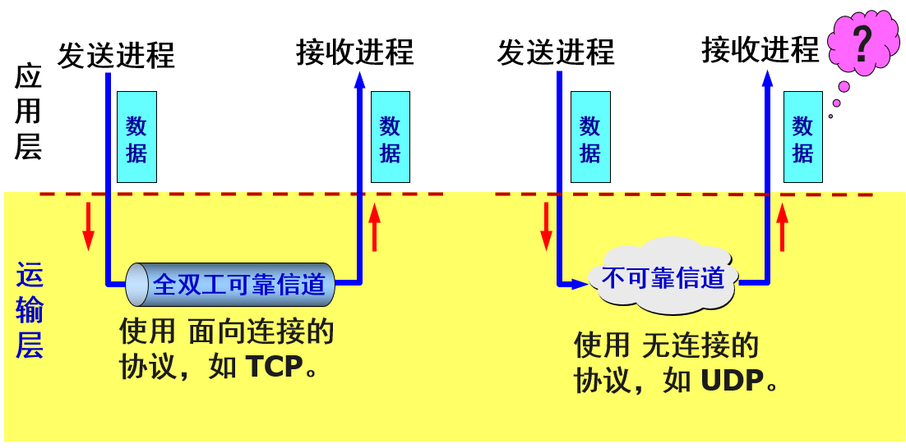
## 5.1.2  运输层的两个主要协议
TCP/IP 的运输层有两个主要协议：
- 用户数据报协议 UDP (User Datagram Protocol)
- 传输控制协议 TCP (Transmission Control

### UDP ：一种无连接协议
- 提供无连接服务。
- 在传送数据之前不需要先建立连接
- 传送的数据单位协议是 **UDP** 报文或用户数据报
- 对方的运输层在收到 UDP 报文后，**不需要给出任何确认**
- 虽然 UDP 不提供可靠交付，但在某些情况下 UDP 是一种最有效的工作方式，例如传输音频、视频

### TCP：一种面向连接的协议
- 提供面向连接的服务
- 传送的数据单位是 **TCP** 报文段 (segment)
- TCP **不提供广播或多播服务**
- 由于 TCP 要提供**可靠的、面向连接的**运输服务，因此不可避免地增加了许多的开销。这不仅使协议数据单元的首部增大很多，还要占用许多的处理机资源
## 5.1.3  运输层的端口
两个计算机通信，不仅必须知道对方的IP地址（为了找到对方的计算机），而且还要知道对方的端口号（为了找到对方计算机中的应用进程）
### 软件端口与硬件端口
- 在协议栈层间的抽象的协议端口是**软件端口**
- 路由器或交换机上的端口是**硬件端口**
- 硬件端口是不同硬件设备进行交互的接口，而软件端口是应用层的各种协议进程与运输实体进行层间交互的一种地址

### 端口
- 端口用一个 **16** 位端口号进行标志
- 端口号**只具有本地意义**，即端口号只是为了标志本计算机应用层中的各进程。在互联网中，不同计算机的相同端口号是没有联系的
- 互联网的计算机通信是采用客户-服务器方式，客户在发起通信请求时，必须先知道服务器的IP地址和端口号，因此运输层的端口号分为下面两类：
	- 服务器端使用的端口号
		- 熟知端口，数值一般为 0~1023
		- 登记端口号，数值为 1024~49151，为没有熟知端口号的应用程序使用的。使用这个范围的端口号必须在 IANA 登记，以防止重复
	- 客户端使用的端口号
		- 又称为短暂端口号，数值为 49152~65535，留给客户进程选择暂时使用
		- 当服务器进程收到客户进程的报文时，就知道了客户进程所使用的动态端口号。通信结束后，这个端口号可供其他客户进程以后使用

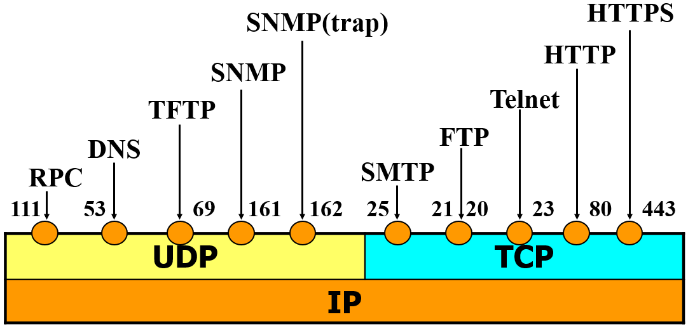
基于端口的复用和分用功能：
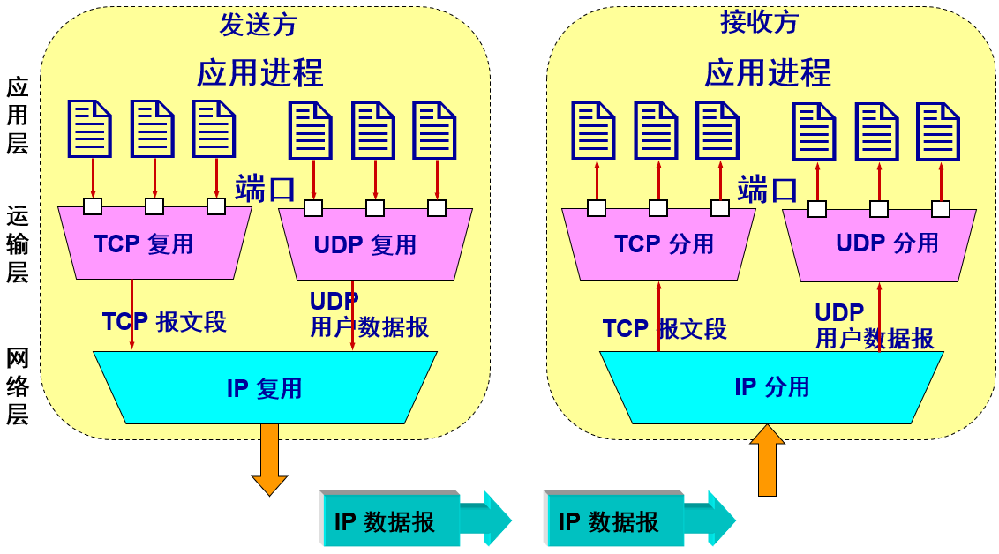
# 5.2  用户数据报协议 UDP
## 5.2.1  UDP 概述
UDP 只在 IP 的数据报服务之上增加了很少一点的功能：

- 复用和分用的功能
- 差错检测的功能

虽然 UDP 用户数据报只能提供不可靠的交付，但 UDP 在某些方面有其特殊的优点
- **UDP 是无连接的**，发送数据之前不需要建立连接，因此减少了开销和发送数据之前的时延
- **UDP 使用尽最大努力交付**，即不保证可靠交付，因此主机不需要维持复杂的连接状态表
- **UDP 是面向报文的**。UDP 对应用层交下来的报文，既不合并，也不拆分，而是保留这些报文的边界。UDP 一次交付一个完整的报文
- **UDP 没有拥塞控制**，因此网络出现的拥塞不会使源主机的发送速率降低，适合对时延要求较高的应用,如音频和视频数据
- UDP 支持**一对一、一对多、多对一和多对多**的交互通信
- **UDP 的首部开销小**，只有 **8** 个字节，比 TCP 的 20 个字节的首部要短
  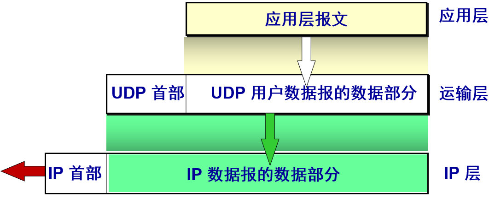
- 发送方 UDP 对应用程序交下来的报文，在添加首部后就向下交付 IP 层。UDP 对应用层交下来的报文，既不合并，也不拆分，而是保留这些报文的边界
- 应用层交给 UDP 多长的报文，UDP 就照样发送，即一次发送一个报文
- 接收方 UDP 对 IP 层交上来的 UDP 用户数据报，在去除首部后就原封不动地交付上层的应用进程，一次交付一个完整的报文
- 应用程序必须选择合适大小的报文
	- **若报文太长**，UDP 把它交给 IP 层后，IP 层在传送时可能要进行分片，这会降低 IP 层的效率
	- **若报文太短**，UDP 把它交给 IP 层后，会使 IP 数据报的首部的相对长度太大，这也降低了 IP 层的效率
## 5.2.2  UDP 的首部格式
用户数据报 UDP 有两个字段：首部字段和数据字段。首部字段很简单，只有 8 个字节，每个字段都是 2 个字节
在计算检验和时，临时把“伪首部”和 UDP 用户数据报连接在一起。伪首部仅仅是为了计算检验和
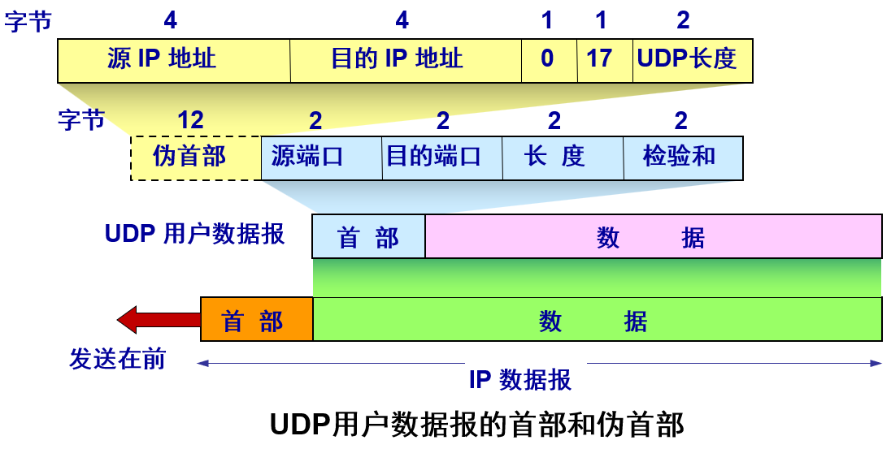
计算 UDP 检验和：
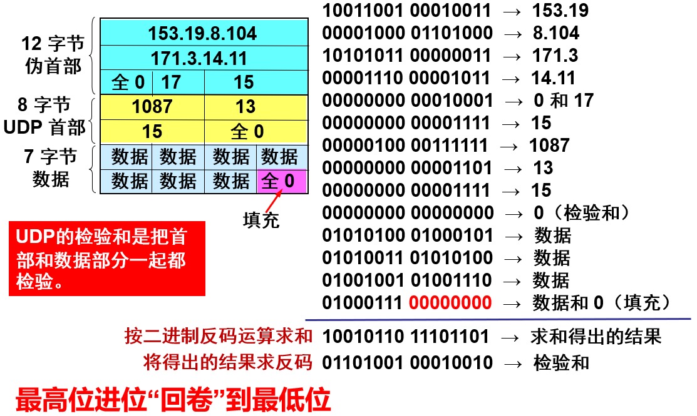
# 5.3  传输控制协议 TCP 概述
## 5.3.1  TCP 最主要的特点
- TCP 是**面向连接**的运输层协议（三报文握手建立连接四报文握手释放连接）
- 每一条 TCP 连接只能有**两个端点** (endpoint)，每一条 TCP 连接只能是**点对点**的（一对一）
- TCP 提供**可靠交付**的服务，传送的数据无差错、不丢失、不重复，且按序到达（确认、序号和重传实现）
- TCP 提供**全双工通信**。TCP允许通信双方的应用进程在任何时候都能发送数据。连接的两端都设有发送缓存和接收缓存，用来临时存放双向通信的数据，如万维网、电子邮件、文件传送等都用TCP协议
- 最主要的特点：面向字节流
	- TCP 中的“流”(stream)指的是流入或流出进程的字节序列
	- “面向字节流”的含义是：虽然应用程序和 TCP 的交互是一次一个数据块，但 TCP 把应用程序交下来的数据看成仅仅是一连串无结构的字节流
	  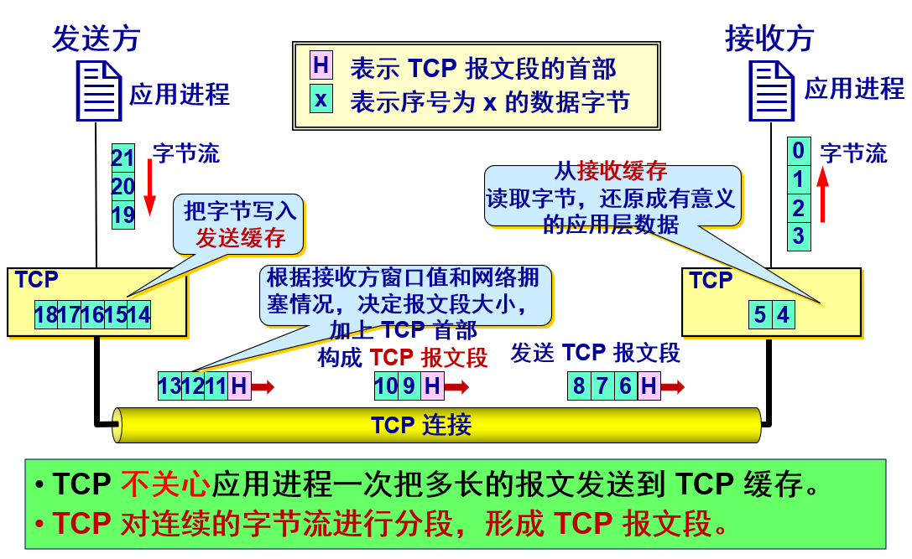
- TCP 连接是一条虚连接而不是一条真正的物理连接
- TCP 对应用进程一次把多长的报文发送到TCP 的缓存中是不关心的
- TCP 根据对方给出的窗口值和当前网络拥塞的程度来决定一个报文段应包含多少个字节（UDP 发送的报文长度是应用进程给出的）
- TCP 可把太长的数据块划分短一些再传送
- TCP 也可等待积累有足够多的字节后再构成报文段发送出去
## 5.3.2  TCP 的连接
- 每一条 TCP 连接**有两个端点**
- TCP 连接的端点叫做**套接字** (socket) 或**插口**
- **端口号拼接到 (concatenated with) IP 地址即构成了套接字**
- 注意：TCP连接的端点不是主机，不是主机的IP地址，也不是应用进程，也不是运输层的协议端口
### 套接字 (socket)
套接字 socket = (IP地址 : 端口号)
每一条 TCP 连接唯一地被通信两端的两个端点（即两个套接字）所确定。即：
TCP 连接 ::= {socket1, socket2}
                 = {(IP1: port1)，(IP2: port2)}
# 5.4  可靠传输的工作原理
## 5.4.1  停止等待传输 （ARQ协议）
“停止等待”就是每发送完一个分组就停止发送，等待对方的确认。在收到确认后再发送下一个分组。（这里讨论可靠传输的原理，因此把传送的数据单元称为分组，暂未考虑数据是在哪个层次上传送的）全双工通信的双方既是发送方也是接收方
为了讨论问题的方便，我们仅考虑 A 发送数据而 B 接收数据并发送确认。因此 A 叫做**发送方**，而 B 叫做**接收方**
### 无差错情况的停止等待传输
A 发送分组 M1，发完就暂停发送，等待 B 的确认 (ACK)。B 收到了 M1 向 A 发送  ACK。A 在收到了对 M1 的确认后，就再发送下一个分组  M2。
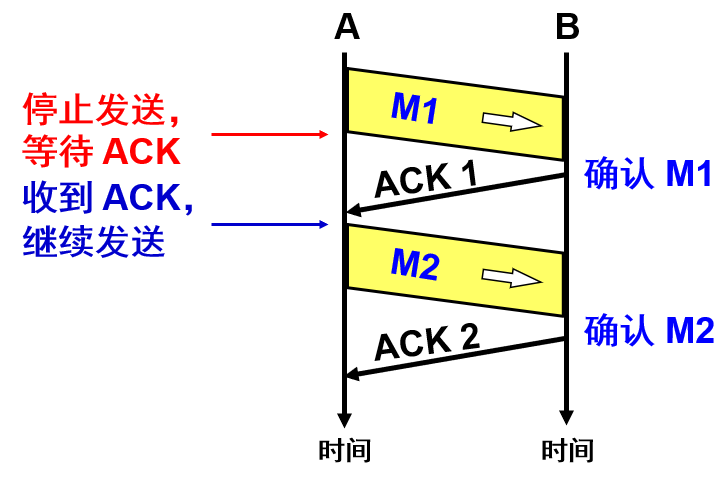
### M1出现差错的情况
- 在接收方 B 会出现两种情况：
	- B 接收 M1 时**检测出了差错**，就丢弃 M1，其他什么也不做
	- M1 在传输过程中**丢失**了，这时 B 当然什么都不知道，也什么都不做
- 在这两种情况下，**B 都不会发送任何信息**
- 保证 B 正确收到了 M1 的解决方法：超时重传
	- A 为每一个已发送的分组都设置了一个**超时计时器**
	- A 只要在超时计时器到期之前收到了相应的确认，就撤销该超时计时器，继续发送下一个分组 M2
  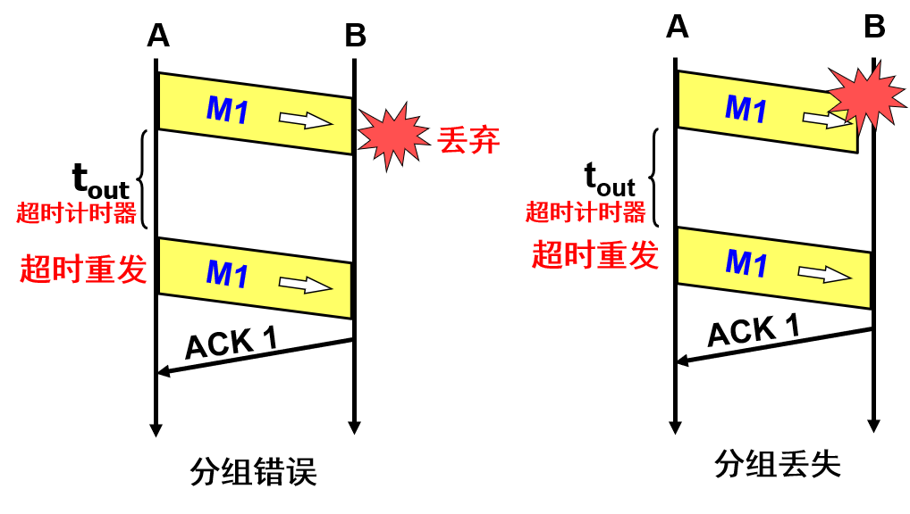
### 确认丢失和确认迟到的情况
- 确认丢失
	- 若 B 所发送的对 M1 的确认丢失了，那么 A 在设定的超时重传时间内不能收到确认，但 A 并无法知道：是自己发送的分组出错、丢失了，或者是 B 发送的确认丢失了。因此 A **在超时计时器到期后就要重传 M1**
	- 假定 B 又收到了重传的分组 M1。这时 B 应采取两个行动：
		- 第一，**丢弃这个重复的分组 M1**，不向上层交付
		- 第二，**向 A 发送确认**。不能认为已经发送过确认就不再发送，因为 A 之所以重传 M1 就表示 A 没有收到对 M1 的确认
- 确认迟到
	- 传输过程中没有出现差错，但 B 对分组 M1 的确认迟到了
	- A 会收到重复的确认。对重复的确认的处理很简单：收下后就丢弃
	- B 仍然会收到重复的 M1，并且同样要丢弃重复的 M1，并重传确认分组
  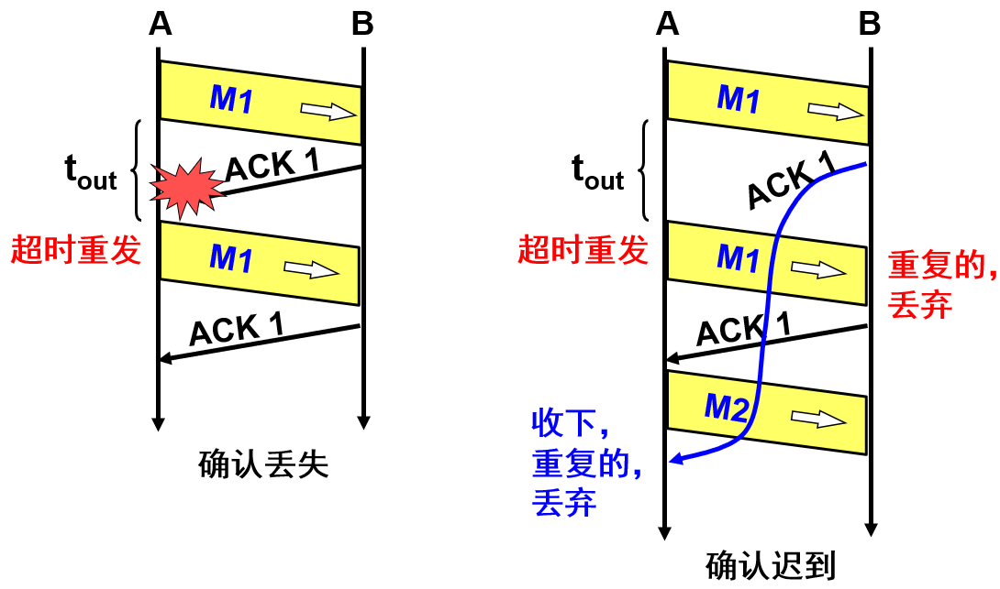
- 注意：
	- 在发送完一个分组后，必须**暂时保留已发送的分组的副本，以备重发**
	- **分组和确认分组都必须进行编号**
	- **超时计时器的重传时间应当比数据在分组传输的平均往返时间更长一些**
- 自动重传请求 ARQ
	- 使用上述的确认和重传机制，我们就可以在不可靠的传输网络上实现可靠的通信
	- 像上述的这种可靠传输协议常称为**自动重传请求 ARQ  (Automatic Repeat Request)**。意思是重传分组是自动进行的，接收方不需要请求发送方重传某个出错的分组
### 信道利用率
自动重传请求的优点是简单，缺点是信道利用率太低
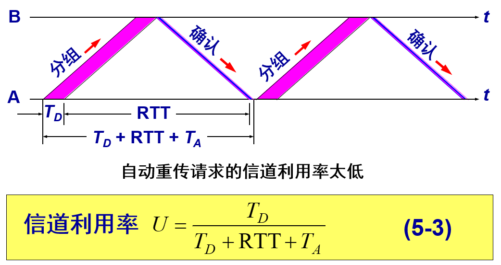
可以看出，当**往返时间 RTT 远大于分组发送时间 TD 时，信道的利用率就会非常低**，若出现重传，则对传送有用的数据信息来说，信道的利用率就还要降低

为了提高传输效率，发送方可以不使用低效率的停止等待协议，而是采用流水线传输

- 流水线传输
	- 流水线传输就是发送方可连续发送多个分组，不必每发完一个分组就停顿下来等待对方的确认。这样可使信道上一直有数据不间断地传送
	- 由于信道上一直有数据不间断地传送，这种传输方式可获得很高的信道利用率
	  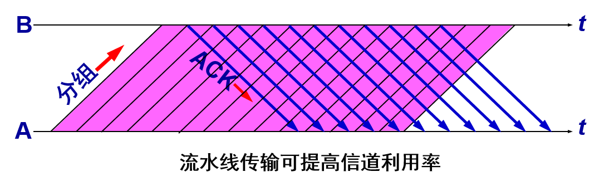
## 5.4.2  连续 ARQ 协议工作原理
- **发送方维持发送窗口**，它的意义是：位于发送窗口内的分组都可连续发送出去，而不需要等待对方的确认。这样，信道利用率就提高了
- **连续 ARQ 协议规定，发送方每收到一个确认，就把发送窗口向前滑动一个分组的位置**
  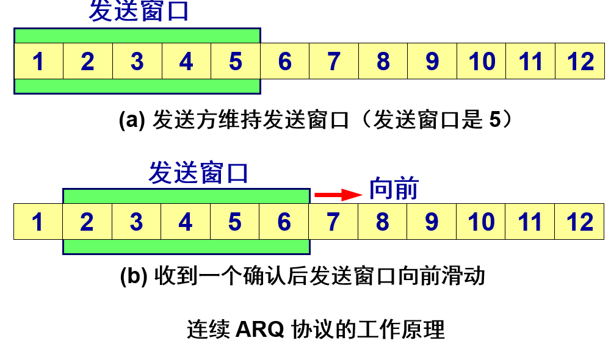
- 累积确认
	- 接收方一般采用累积确认的方式。即不必对收到的分组逐个发送确认，而是**对按序到达的最后一个分组发送确认**，这样就表示：到这个分组为止的所有分组都已正确收到了
	- 优点：容易实现
	- 缺点：不能向发送方反映出接收方已经正确收到的所有分组的信息
- Go-back-N（回退 N）
	- 如果发送方发送了前 5 个分组，而中间的第 3 个分组丢失了。这时接收方只能对前两个分组发出确认。发送方无法知道后面三个分组的下落，而只好把后面的三个分组都再重传一次
	- 这就叫做 Go-back-N（回退 N），**表示需要再退回来重传已发送过的 N 个分组**
	- 可见当通信线路质量不好时，连续 ARQ 协议会带来负面的影响
### TCP 可靠通信的具体实现
- TCP使用的就是**连续ARQ协议**
- TCP 连接的每一端都必须设有两个窗口：一个**发送窗口**和一个**接收窗口**
- TCP 的可靠传输机制用**字节的序号**进行控制
- TCP 所有的确认都是**基于序号**而不是基于报文段
- TCP 两端的四个窗口经常处于**动态变化**之中
- TCP连接的往返时间 RTT 也不是固定不变的。需要使用特定的算法估算较为合理的重传时间

# 5.5  TCP 报文段的首部格式
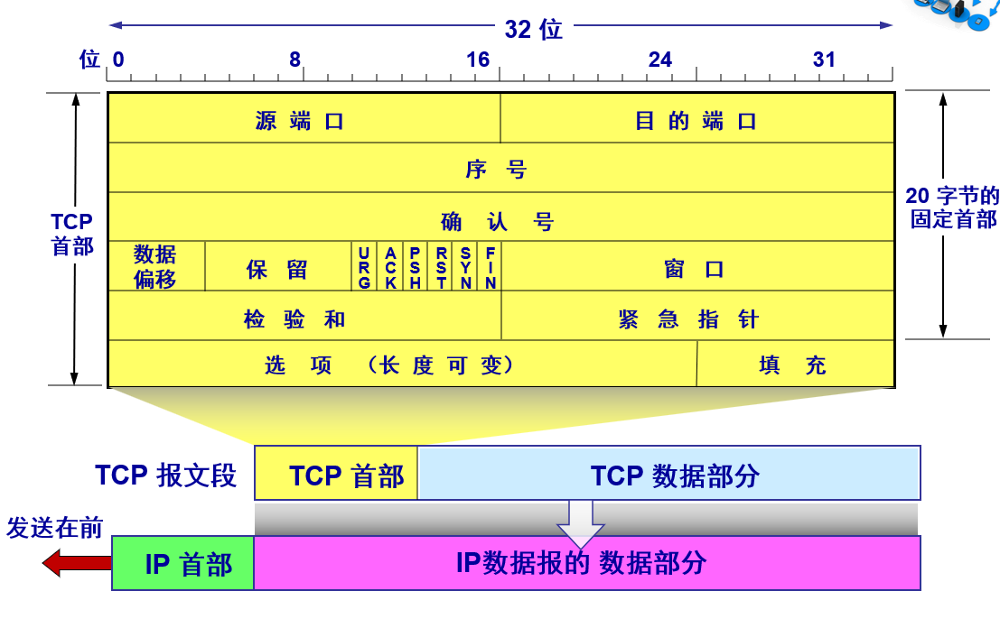
- 源端口和目的端口字段——各占 2 字节。端口是运输层与应用层的服务接口。运输层的复用和分用功能都要通过端口才能实现
- 序号字段——占 4 字节。TCP 连接中传送的报文段中的每一个字节都编上一个序号。序号字段的值则指的是本报文段所发送的数据的第一个字节的序号
- 确认号字段——占 4 字节，是接收方期望收到发送方的下一个报文段的数据的第一个字节的序号
- 数据偏移（即首部长度）——占 4 位，它指出 TCP 报文段的数据起始处距离 TCP 报文段的起始处有多远。“数据偏移”的单位是 32 位字（以 4 字节为计算单位）
- 保留字段——占 6 位，保留为今后使用，但目前应置为 0
- 紧急 URG —— 当 URG = 1 时，表明紧急指针字段有效。它告诉系统此报文段中有紧急数据，应尽快传送 (相当于高优先级的数据)
- 确认 ACK —— 只有当 ACK = 1 时确认号字段才有效。当 ACK = 0 时，确认号无效
- 推送 PSH (PuSH) —— 接收 TCP 收到 PSH = 1 的报文段，就尽快地交付接收应用进程，而不再等到整个缓存都填满了后再向上交付
- 复位 RST (ReSeT) —— 当 RST = 1 时，表明 TCP 连接中出现严重差错（如由于主机崩溃或其他原因），必须释放连接，然后再重新建立运输连接
- 同步 SYN —— 同步 SYN = 1 表示这是一个连接请求或连接接受报文
- 终止 FIN (FINish) —— 用来释放一个连接。FIN = 1 表明此报文段的发送端的数据已发送完毕，并要求释放运输连接
- 窗口字段 —— 占 2 字节，用来让对方设置发送窗口的依据，单位为字节
- 检验和 —— 占 2 字节。检验和字段检验的范围包括首部和数据这两部分。在计算检验和时，要在 TCP 报文段的前面加上 12 字节的伪首部
- 紧急指针字段 —— 占 16 位，指出在本报文段中紧急数据共有多少个字节（紧急数据放在本报文段数据的最前面）
- 选项字段 —— 长度可变。TCP 最初只规定了一种选项，即最大报文段长度 MSS。MSS 告诉对方 TCP：“我的缓存所能接收的报文段的数据字段的最大长度是 MSS 个字节
  `MSS (Maximum Segment Size)是 TCP 报文段中的数据字段的最大长度。数据字段加上 TCP 首部才等于整个的 TCP 报文段。所以，MSS是“TCP 报文段长度减去 TCP 首部长度”`
  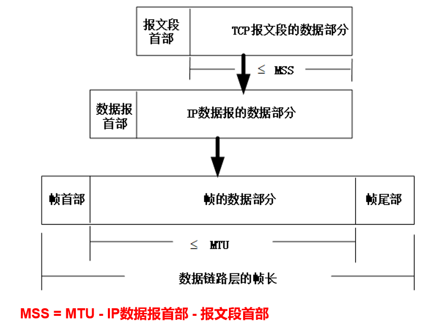
- 填充字段 —— 这是为了使整个首部长度是 4 字节的整数倍
# 5.6  TCP 可靠传输的实现
## 5.6.1  以字节为单位的滑动窗口
> TCP 的滑动窗口是以字节为单位的

现假定 A 收到了 B 发来的确认报文段，其中窗口是 20 字节，而确认号是 31（这表明 B 期望收到的下一个序号是 31，而序号 30 为止的数据已经收到了）。根据这两个数据，A 就构造出自己的发送窗口
- 发送窗口表示：在没有收到 B 的确认的情况下，A 可以连续把窗口内的数据都发送出去
- 发送窗口里面的序号表示允许发送的序号
- 显然，窗口越大，发送方就可以在收到对方确认之前连续发送更多的数据，因而可能获得更高的传输效率
  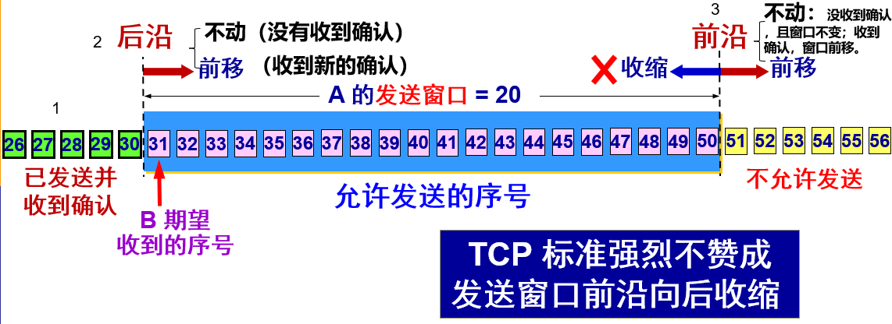
- A 发送了 11 个字节的数据
- 用指针P1 ， P2 ， P3  描述发送窗口状态：
	- P3 – P1 = A 的发送窗口（又称为通知窗口）
	- P2 – P1 = 已发送但尚未收到确认的字节数
	- P3 – P2 = 允许发送但尚未发送的字节数（又称为可用窗口）
	  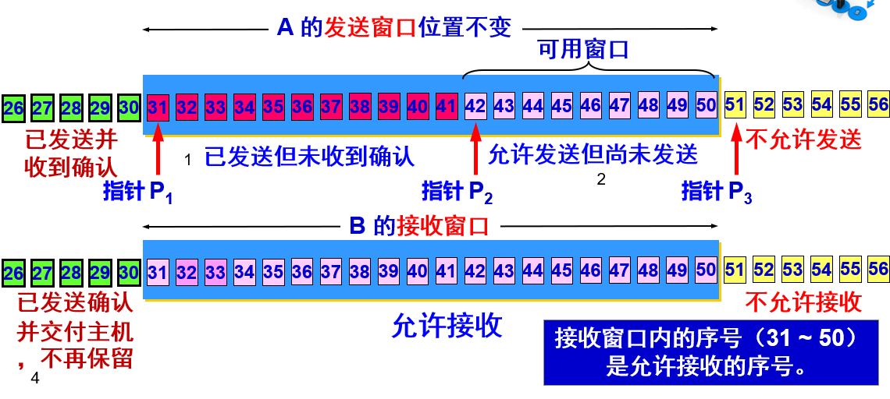
- B收到序号为33的数据，并把31~33的数据交付给主机，且向A发送新的确认号34，窗口值仍为20，A的发送窗口向前滑动
  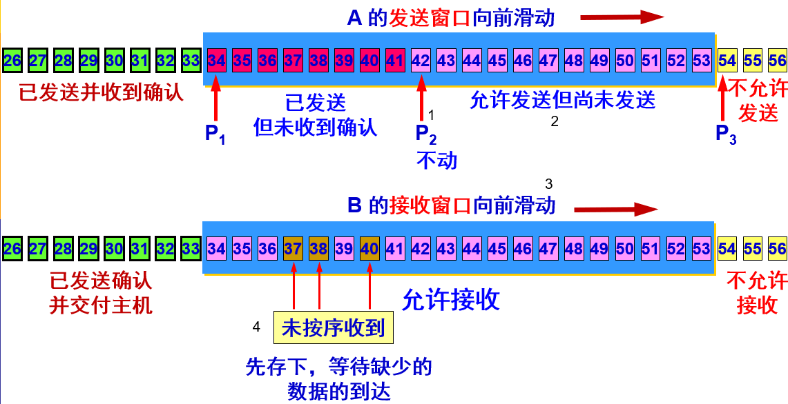
- A在继续发送完序号42~53的数据后，指针P2向前移动和P3重合。A 的发送窗口内的序号都已用完，但还没有再收到确认，必须停止发送，设置超时计时器，等待B的确认字段
  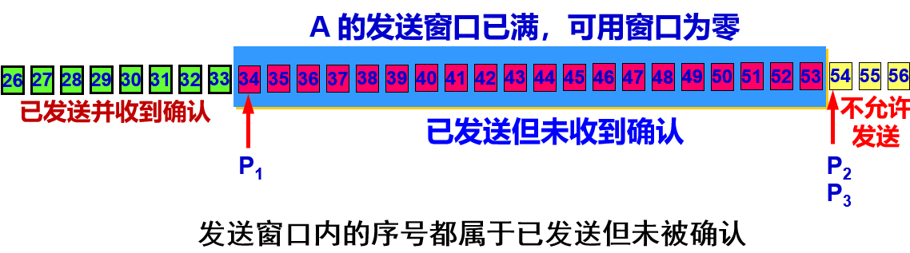
- 发送缓存和发送窗口
  发送方的应用进程把字节流写入 TCP 的发送缓存。
  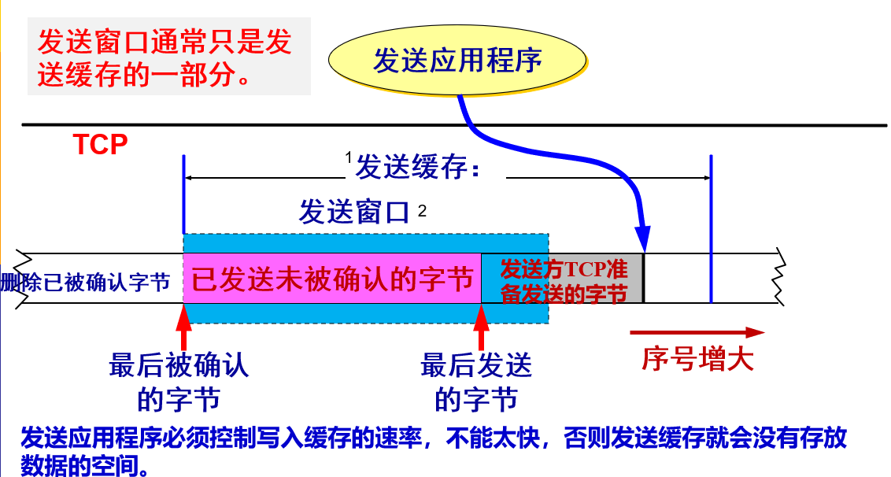
- 接收缓存和接收窗口
  接收方的应用进程从 TCP 的接收缓存中读取字节流。
  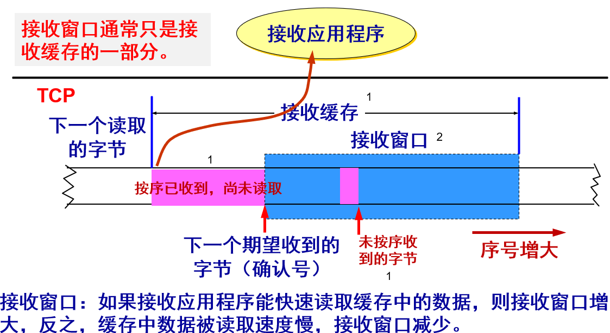
- 注意点：
	- 第一，在同一时刻，A 的发送窗口并不总是和 B 的接收窗口一样大（因为有一定的时间滞后）。此外，考虑网络拥塞的情况，A会适当减少自己的发送窗口
	- 第二，对不按序到达的数据先临时存放在接收窗口中，等到字节流中所缺少的字节收到后，再按序交付上层的应用进程
	- 第三，TCP 要求接收方必须有累积确认的功能，这样可以减小传输开销
- 接收方发送确认
	- 接收方可以在**合适的时候发送确认**，也可以在自己有数据要发送时把确认信息顺便捎带上
	- 第一，接收方不应过分推迟发送确认，TCP标准规定，**确认推迟时间不应超过0.5秒**，否则会导致发送方不必要的重传，这反而浪费了网络的资源
	- 第二，捎带确认实际上并不经常发生，因为大多数应用程序很少同时在两个方向上发送数据
## 5.6.2  超时重传时间的选择
TCP 每发送一个报文段，就对这个报文段设置一次计时器。只要计时器设置的重传时间到但还没有收到确认，就要重传这一报文段
### TCP 超时重传时间设置
如果把超时重传时间设置得太短，就会引起很多报文段的不必要的重传，使网络负荷增大。
但若把超时重传时间设置得过长，则又使网络的空闲时间增大，降低了传输效率

TCP 采用了一种自适应算法，根据记录一个报文段发出的时间，以及收到相应的确认的时间。这两个时间之差就是报文段的往返时间 RTT，进而设置超时重传时间

#### 加权平均往返时间
- TCP 保留了 RTT 的一个加权平均往返时间 $RTT_{S}$（这又称为平滑的往返时间）
- 第一次测量到 RTT 样本时，$RTT_{S}$ 值就取为所测量到的 RTT 样本值。以后每测量到一个新的 RTT 样本，就按下式重新计算一次 $RTT_{S}$
	
	$\text{新的}RTT_{S}= (1 - \alpha)\times \text{旧的}+\alpha \times \text{新的RTT样本}$
- 式中，0 $\leq$ a < 1。若 a 很接近于零，表示 RTT 值更新较慢。若选择 a 接近于 1，则表示 RTT 值更新较快
## 5.6.3  选择确认 SACK
# 5.7  TCP 的流量控制

# 5.8  TCP 的拥塞控制

# 5.9  TCP 的运输连接管理